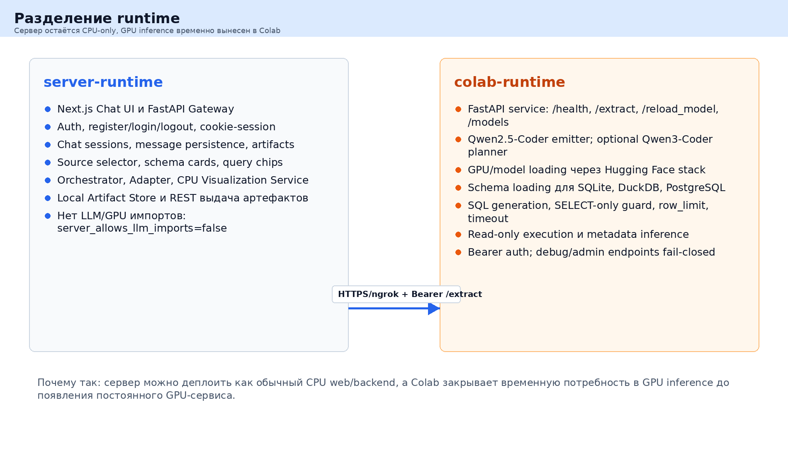
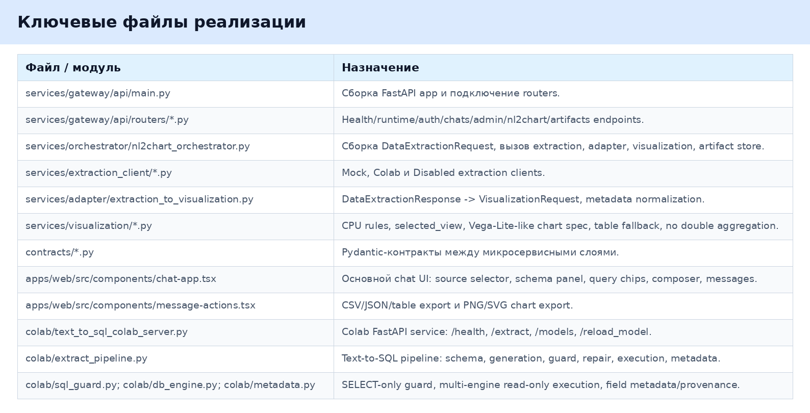
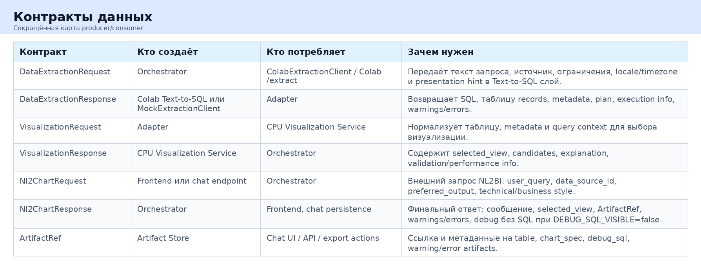
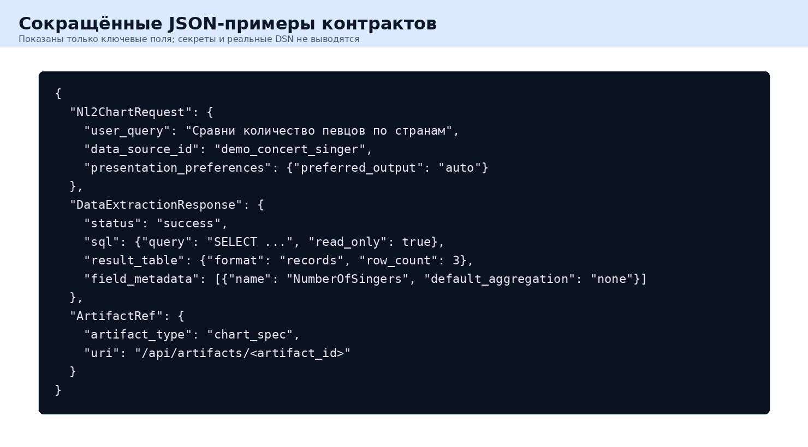
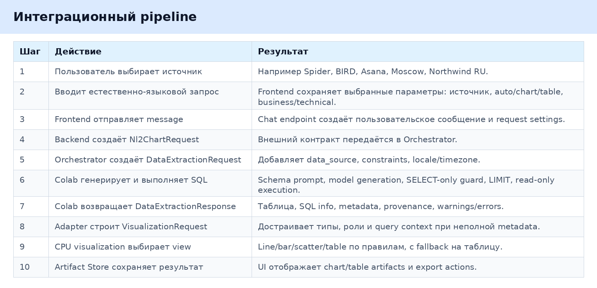
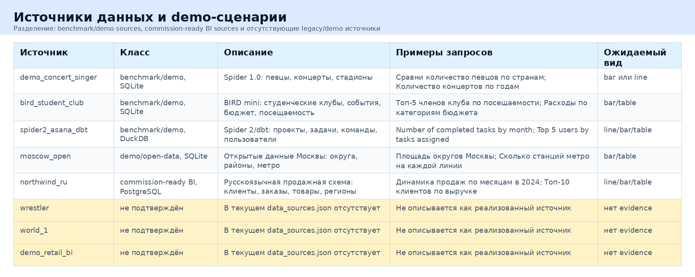

# Финальный отчёт по программной интеграции и реализации прототипа NL2BI

## 1. Краткое резюме

В рамках прототипа реализована сквозная NL2BI-система: пользователь задаёт вопрос на естественном языке, система получает данные через Text-to-SQL слой, затем строит таблицу или график через Text-to-Visualization слой и показывает результат в чат-интерфейсе.

Часть Дениса отвечает за Colab-runtime: загрузку модели Text-to-SQL, построение промпта по схеме БД, генерацию SQL, проверку SELECT-only, выполнение запроса в read-only режиме, ограничение строк, таймауты, metadata inference и защищённый FastAPI service в Colab.

Часть Петра отвечает за server-runtime: Next.js интерфейс, FastAPI gateway, авторизацию, чаты, сохранение сообщений, контракты данных, orchestrator, adapter, CPU-визуализацию, artifact store, source selector, schema cards, query chips и экспорт результатов.

Интеграция выполнена через явные контракты: `Nl2ChartRequest`, `DataExtractionRequest`, `DataExtractionResponse`, `VisualizationRequest`, `VisualizationResponse`, `ArtifactRef`. Это позволяет заменить Colab на постоянный GPU-сервис без переписывания фронтенда и визуализации.

Поддерживаются три режима извлечения: `mock` для стабильной разработки без GPU, `colab` для живого Text-to-SQL через Colab, `disabled` для fail-closed поведения, когда извлечение отключено.

Итоговый пользовательский сценарий: зарегистрироваться или войти, выбрать источник данных, выбрать режим ответа, отправить вопрос, получить таблицу и/или график, при необходимости выгрузить CSV, JSON, PNG или SVG.

Серверная часть остаётся CPU-only: LLM и GPU-зависимости не запускаются на сервере. Colab используется как временная замена production GPU inference service.

Результат прототипа: демонстрационная микросервисная NL2BI-цепочка от естественного языка до аналитического артефакта, пригодная для показа комиссии с честно указанными ограничениями.

## 2. Цель интеграции

Исходная задача состояла в объединении двух ранее раздельных направлений: Text-to-SQL и Text-to-Visualization. Пользователь не должен вручную писать SQL, выбирать поля для графика или думать о формате артефакта. Он выбирает источник данных, вводит вопрос на естественном языке, а система возвращает пригодный для анализа результат: график, таблицу или fallback-ответ с понятной ошибкой.

Прототип должен был быть пригоден не только как notebook-демо, но и как микросервисная NL2BI-система. Поэтому серверная часть вынесена в отдельный runtime с FastAPI и Next.js, а GPU-инференс временно остаётся в Colab. Такое разделение показывает будущую production-архитектуру: веб и оркестрация работают как обычный сервис, а Text-to-SQL модель может быть заменена на постоянный GPU endpoint.

## 3. Итоговая архитектура

ASCII-схема pipeline вынесена в изображение, чтобы схема не хранилась в отчёте как блок кода.

Основные компоненты:

- Web UI: Next.js чат, выбор источника, выбор режима ответа, карточки схемы, подсказки запросов, отображение таблиц и графиков, экспорт.
- FastAPI backend: единая серверная точка входа для runtime, auth, chats, artifacts, nl2chart и admin proxy.
- Auth/chat persistence: регистрация, вход, выход, cookie-session, список чатов, сообщения, привязка артефактов к ответам.
- Orchestrator: собирает `DataExtractionRequest`, вызывает extraction client, adapter, visualization service и artifact store.
- ColabExtractionClient: HTTP-клиент к Colab Text-to-SQL service с Bearer auth, таймаутами и fail-closed ошибками.
- MockExtractionClient: стабильный клиент для локальной разработки и e2e без GPU.
- Adapter: преобразует `DataExtractionResponse` в `VisualizationRequest`, достраивает metadata при неполных данных.
- CPU Visualization Service: rule-based выбор графика или таблицы, построение Vega-Lite-like spec, fallback на таблицу.
- Artifact Store: локальное сохранение table, chart_spec, warning/error и debug_sql artifacts.
- Colab Text-to-SQL service: FastAPI service в Colab, который загружает модель, строит SQL, выполняет его и возвращает `DataExtractionResponse`.

Разделение runtime:

Server-runtime не запускает LLM, не импортирует `torch`, `transformers` или `bitsandbytes`, не требует GPU и может деплоиться как обычный web/backend сервис. Это проверено CPU-only scan по `services` и `apps/web`.

Colab-runtime содержит всё, что связано с GPU: Hugging Face модель, загрузку emitter/planner, генерацию SQL и выполнение bridge-запросов. Colab выбран как временная замена production GPU inference service, потому что он даёт доступ к GPU без отдельной инфраструктуры, но имеет ограничения: URL ротируется, notebook/kernel требует ручного контроля, а доступность не гарантируется как у production-сервиса.

## 4. Server-runtime

На сервере реализованы FastAPI endpoints, Next.js UI, авторизация, чатовые сессии, message persistence, artifacts, source selector, model/GPU status, schema cards, query chips, export CSV/JSON/PNG/SVG, `/api/runtime`, `/api/nl2chart`, `/api/artifacts/{artifact_id}` и fallback modes.

Режимы извлечения:

Ключевые файлы server-runtime:

FastAPI gateway собирается в `services/gateway/api/main.py`. Основные routers находятся в `services/gateway/api/routers`: `health`, `runtime`, `auth`, `chats`, `admin`, `nl2chart`, `artifacts`.

`/api/runtime` возвращает признаки runtime: server runtime включён, backend CPU-only, extraction mode, visualization mode, artifact storage, наличие Colab URL и auth token, доступность Colab, состояние модели и флаг видимости debug SQL.

`/api/nl2chart` является прямой API-точкой для NL2BI-запроса. Chat UI обычно ходит через `/api/chats/{session_id}/messages`, где пользовательское сообщение сохраняется, затем вызывается orchestrator, затем сохраняется assistant message с artifacts.

`/api/artifacts/{artifact_id}` отдаёт сохранённый artifact. В текущем прототипе storage локальный, не production-grade.

Frontend находится в `apps/web/src`. Основной экран реализован в `apps/web/src/components/chat-app.tsx`. Экспорт CSV/JSON/PNG/SVG реализован в `apps/web/src/components/message-actions.tsx`. Vega chart renderer находится в `apps/web/src/components/vega-chart.tsx`.

Admin proxy для моделей находится в `services/gateway/api/routers/admin.py`. Сейчас он доступен аутентифицированному пользователю роли `analyst`; для multi-tenant production это нужно ужесточить до operator/admin роли.

## 5. Colab-runtime / Text-to-SQL Дениса

Colab-runtime реализован как FastAPI service, запускаемый из `colab/text_to_sql_colab_server.ipynb` и кода `colab/text_to_sql_colab_server.py`.

Реализованные endpoint-ы:

- `/health`: состояние сервиса, модели, planner, GPU, readiness demo DB и auth flags.
- `/extract`: основной endpoint Text-to-SQL, принимает `DataExtractionRequest`, возвращает `DataExtractionResponse`.
- `/reload_model`: загрузка или переключение emitter/planner модели.
- `/models`: список поддерживаемых моделей для UI model picker.
- `/debug/datasources`: диагностический endpoint, скрыт 404 при выключенном debug flag.
- `/admin/bridge_url`: bridge endpoint, скрыт 404 при выключенном bridge flag.

Базовый режим Дениса: `Qwen/Qwen2.5-Coder-7B-Instruct` с quantization `4bit` по конфигу Colab. Текущий каталог моделей также содержит emitter-варианты BF16 и planner `Qwen/Qwen3-Coder-30B-A3B-Instruct`, если VRAM позволяет. Planner загружается в отдельный слот и не должен выгружать активный emitter.

Pipeline `/extract`:

- проверяет, что модель готова;
- разрешает `data_source_id` через `demo_data/data_sources.json`;
- загружает схему SQLite, DuckDB или PostgreSQL;
- строит prompt с таблицами, колонками и foreign keys;
- генерирует SQL через модель;
- извлекает SQL из ответа модели;
- применяет SELECT-only guard;
- добавляет row limit;
- выполняет read-only запрос с timeout;
- при ошибке делает deterministic repair и один model repair pass, если разрешено;
- при пустом результате пробует repair пустого результата;
- выводит metadata по полям результата, включая типы, роли, aggregation provenance;
- возвращает `DataExtractionResponse`.

Важные защитные свойства:

- `/extract` и `/reload_model` требуют Bearer auth по умолчанию;
- токены не логируются;
- debug/admin endpoints скрыты как 404, если явно не включены;
- SQL guard запрещает mutating statements;
- SQLite открывается read-only, PostgreSQL источник используется через read-only DSN в конфигурации;
- row limit и timeout ограничивают дорогие запросы;
- bridge fail-closed: если флаг выключен, endpoint не раскрывается.

Подтверждённые evidence-файлы: `docs/e2e_results/live_colab/*`, `docs/e2e_results/final_main/README.md`, `docs/e2e_results/final_main/runtime.json`, `docs/e2e_results/final_main/nl2chart_live_response.json`, `docs/e2e_results/final_integration/summary.json`. В них зафиксированы успешный `/extract`, успешная интеграция table + chart_spec, auth-проверки и отсутствие повторной агрегации на уже агрегированном COUNT.

## 6. Text-to-Visualization / часть Петра

Text-to-Visualization часть принимает уже готовую таблицу, metadata и query context. Она не генерирует SQL и не обращается к LLM. Её задача — понять, что лучше показать пользователю: line, bar, scatter или table.

Входной слой: `services/adapter/extraction_to_visualization.py`. Adapter преобразует `DataExtractionResponse` в `VisualizationRequest`, проверяет строки и колонки, достраивает `data_type`, `semantic_role`, `allowed_aggregations`, `default_aggregation`, если Colab вернул неполные metadata.

CPU visualization находится в `services/visualization/cpu_visualization_service.py`. Сервис определяет intent запроса, группирует поля по ролям, выбирает candidates, сортирует их по score и строит selected view. Если данных недостаточно или запрос больше похож на табличный, используется table fallback.

Поддержанные варианты:

- line для временного поля и меры;
- bar для измерения по категории;
- scatter для двух мер при correlation intent или явном preferred chart type;
- table fallback для пустых, текстовых или неоднозначных результатов.

Отображение в chat UI происходит через artifacts: orchestrator всегда сохраняет table artifact и дополнительно chart_spec artifact, если selected view является графиком. Frontend берёт chart_spec и рендерит его через Vega embed.

Важный момент: если SQL уже сделал `COUNT`, `SUM`, `AVG`, визуализатор не должен агрегировать повторно. Это реализовано через metadata provenance. Colab metadata отмечает агрегированное поле как `provenance.derived=true`, указывает `provenance.aggregation`, а `default_aggregation` выставляет в `none`. Renderer проверяет эти признаки и не добавляет Vega aggregate в y-encoding. Это подтверждено unit-тестами и `docs/e2e_results/final_integration/summary.json`, где `y_aggregate_present=false`.

## 7. Контракты данных

Карта основных контрактов:

Сокращённые JSON-примеры вынесены в изображение.

`DataExtractionRequest` создаёт orchestrator. Он нужен, чтобы из внешнего запроса получить Text-to-SQL запрос с источником данных, ограничениями и presentation hint.

`DataExtractionResponse` создаёт Colab или mock client. Он нужен, чтобы вернуть не только строки результата, но и SQL info, plan, metadata, execution info, warnings и errors.

`VisualizationRequest` создаёт adapter. Он нужен, чтобы визуализация работала с нормализованной таблицей и metadata, независимо от того, насколько полным был ответ Text-to-SQL.

`VisualizationResponse` создаёт CPU Visualization Service. Он нужен, чтобы вернуть выбранный вид, candidates, explanation, quality и performance.

`Nl2ChartRequest` создаёт frontend или chat endpoint. Это внешний контракт пользовательского NL2BI-запроса.

`Nl2ChartResponse` создаёт orchestrator. Это финальный ответ для UI и chat persistence.

`ArtifactRef` создаёт artifact store. Он нужен, чтобы UI мог отдельно загрузить таблицу, chart spec, warning/error или debug artifact.

## 8. Интеграционный pipeline

Пошаговый pipeline вынесен в изображение.

Ключевая последовательность:

1. Пользователь выбирает источник.
2. Пользователь вводит запрос.
3. Frontend отправляет message в backend.
4. Backend создаёт `Nl2ChartRequest`.
5. Orchestrator создаёт `DataExtractionRequest`.
6. Colab генерирует и выполняет SQL.
7. Colab возвращает `DataExtractionResponse`.
8. Adapter строит `VisualizationRequest`.
9. CPU visualization выбирает оптимальный view.
10. Artifact store сохраняет table/chart spec, а Chat UI отображает результат.

## 9. Источники данных и демонстрационные сценарии

Текущие источники описаны в `demo_data/data_sources.json` и в frontend schema catalog. Они разделены на benchmark/demo sources и commission-ready BI source.

Benchmark/demo sources:

- `demo_concert_singer`: Spider 1.0, SQLite, каноничный benchmark про певцов, концерты и стадионы.
- `bird_student_club`: BIRD mini, SQLite, события, бюджет и посещаемость студенческого клуба.
- `spider2_asana_dbt`: Spider 2/dbt, DuckDB, задачи, проекты, команды и пользователи.
- `moscow_open`: open-data demo, SQLite, округа, районы и метро Москвы.

Commission-ready BI source:

- `northwind_ru`: PostgreSQL, русскоязычная продажная схема с клиентами, заказами, товарами, сотрудниками и регионами. Этот источник лучше подходит для комиссии, потому что ближе к реальному BI-сценарию: продажи, выручка, сегменты клиентов, менеджеры, категории товаров и динамика по датам.

`wrestler`, `world_1` и `demo_retail_bi` в текущем `demo_data/data_sources.json` не найдены. Поэтому в отчёте они не описываются как реализованные источники. Если один из этих источников будет добавлен позже, его нужно отдельно подтвердить через config, UI schema catalog и smoke evidence.

## 10. Тестирование

Таблица проверок вынесена в изображение.

Важно: live Colab smoke оценивается по последней подтверждённой рабочей версии от 2026-05-11. На момент подготовки отчёта 2026-05-12 GPU/Colab был выключен вручную, чтобы не расходовать лишние ресурсы. Поэтому текущий `colab_available=false` не трактуется как регрессия прототипа, а фиксируется как управляемое выключение inference runtime после завершения проверок.

Локально при подготовке отчёта заново выполнены:

- `python3 -m pytest -q`: 49 passed in 0.47s;
- `npm run build` в `apps/web`: успешный Next.js build;
- `npm audit` в `apps/web`: 0 vulnerabilities;
- CPU-only scan по `services` и `apps/web`: совпадений по GPU/LLM импортам не найдено.

## 11. Evidence

Сводка evidence-файлов:

Основные группы evidence:

- runtime JSON показывает режимы server-runtime, extraction mode, visualization mode и состояние Colab.
- nl2chart response показывает финальный ответ pipeline с artifacts.
- selected_view показывает тип выбранной визуализации и Vega-Lite-like spec.
- artifacts JSON показывает table и chart_spec artifacts.
- screenshots и public site smoke подтверждают пользовательский UI flow.
- smoke summaries фиксируют успешные/неуспешные состояния интеграции.
- pytest/npm outputs подтверждают локальную проверку кода.

Отдельный zip со скриншотами, где видны запросы, графики и таблицы, был сохранён локально в `/tmp/nl2bi_report_screenshots_query_visible_20260511224318/`, запакован как `/tmp/nl2bi_report_screenshots_query_visible_2026-05-12_v2.zip` и загружен на Google Drive: `https://drive.google.com/file/d/1Uaof9b_qAoZb_mivVGZ_1mGipTmHdGH9/view?usp=drivesdk`. SHA архива: `55cc076b8f2268861513fe357e4a4ef49a1e471437449a35da007592886c85d7`.

## 12. Безопасность

В прототипе не используется OpenAI API. Runtime сайта не зависит от Superset или MCP как обязательного исполняемого компонента. Серверная часть остаётся CPU-only и не запускает LLM.

Colab Text-to-SQL service защищён Bearer auth для `/extract` и `/reload_model`. Debug/admin endpoints по умолчанию скрыты и отвечают 404, если их явно не включить. Token values не логируются.

SQL guard разрешает только `SELECT` или `WITH`, запрещает mutating statements, не допускает несколько statements и добавляет row limit. Выполнение SQLite идёт через read-only подключение; Postgres источник должен использовать read-only пользователя. Запросы ограничены timeout и row limit.

Секреты не должны попадать в git: `.env` не коммитится, auth token и DSN не раскрываются в отчёте. Ngrok URL ротируется и не должен считаться постоянным production endpoint.

## 13. Ограничения

Текущий прототип не является полностью production-ready. Основные ограничения:

- Colab URL меняется при перезапуске и может стать недоступным без изменения серверной конфигурации.
- Colab не является production GPU service: kernel, модель и tunnel требуют операционного контроля.
- Локальное artifact storage не production-grade: нет полноценного ACL, retention policy и внешнего object storage.
- Visualization пока rule-based/CPU fallback; для сложных BI-сценариев нужен более сильный recommender или evaluator.
- Текущие источники в основном demo/benchmark; Spider и BIRD не являются бизнесовыми базами.
- `northwind_ru` ближе к BI-демо, но всё равно остаётся учебным/демонстрационным источником.
- Требуется дальнейшее улучшение metadata, domain docs и semantic layer.
- Admin/model switch сейчас gated только общей аутентификацией analyst; для production нужна отдельная роль оператора.
- Публичный адрес работает по HTTP; для production-like demo нужен HTTPS.

## 14. Вклад участников

Сводная таблица вклада вынесена в изображение.

Денис:

- Text-to-SQL;
- Colab service;
- model loading;
- SQL generation;
- SQL validation/execution;
- metadata inference;
- auth/security в Colab;
- smoke reports по Colab и `/extract`.

Пётр:

- server-runtime;
- frontend/chat;
- orchestrator;
- contracts;
- adapter;
- visualization;
- artifacts;
- UI/source selector/schema cards/export;
- integration testing;
- deployment/public route.

Совместно:

- контракты данных;
- runtime split;
- межсервисная интеграция;
- final smoke;
- error handling;
- demo сценарии.

## 15. Что готово к демонстрации

Демонстрационный сценарий:

1. Открыть сайт.
2. Показать регистрацию или вход новым пользователем.
3. Показать source selector и разные источники.
4. Показать GPU/model status через model picker и runtime status.
5. Выбрать источник, например `northwind_ru` или `demo_concert_singer`.
6. Отправить запрос на естественном языке.
7. Показать таблицу и график.
8. Если technical mode доступен, показать request timing; SQL скрыт при `DEBUG_SQL_VISIBLE=false`.
9. Показать export CSV/JSON/PNG/SVG.
10. Показать fallback при ошибке, пустом результате или недоступном Colab.

Готовность live-сценария оценивается по последней рабочей версии, зафиксированной в evidence от 2026-05-11. На момент подготовки отчёта публичный сайт открывается, server health отвечает, frontend build проходит, но GPU/Colab runtime намеренно выключен для экономии ресурсов. Перед живой демонстрацией нужно снова включить Colab/GPU, обновить endpoint при необходимости и повторить smoke. Если GPU не включается, используется mock mode и сохранённые screenshots как fallback.

## 16. Следующие шаги

Short-term:

- перед живой демонстрацией включить Colab/GPU, обновить endpoint при необходимости и повторить live smoke;
- добавить актуальный screenshot evidence после повторного live smoke;
- проверить все подсказки по всем источникам после обновления Colab;
- зафиксировать рабочий demo script для комиссии;
- подготовить fallback через mock mode.

Before commission:

- добавить или расширить business demo source;
- улучшить metadata и русские подписи полей;
- подготовить domain docs для `northwind_ru`;
- проверить export CSV/JSON/PNG/SVG на свежем пользователе;
- подключить HTTPS, если сайт будет показываться публично;
- ограничить admin/model switch ролью оператора.

Production-like:

- заменить Colab на persistent GPU inference service;
- перенести artifact storage в S3/Postgres;
- добавить artifact access control;
- расширить visualization recommender;
- добавить evaluation dashboard;
- добавить observability для gateway, Colab и artifact store;
- оформить автоматический smoke после каждого deploy.

## 17. Заключение

Создан интегрированный NL2BI-прототип, в котором server-runtime и Colab-runtime связаны через явные контракты и HTTP-интерфейс. Реализована end-to-end цепочка от естественно-языкового запроса до таблицы или графика в чате.

Архитектура показывает рабочее направление микросервисного развития: web/backend остаются CPU-only, Text-to-SQL может жить в отдельном GPU service, а Text-to-Visualization остаётся заменяемым CPU-компонентом. Прототип не заявляется как полностью production-ready, но уже демонстрирует ключевой пользовательский сценарий и имеет evidence по основным интеграционным проверкам.
