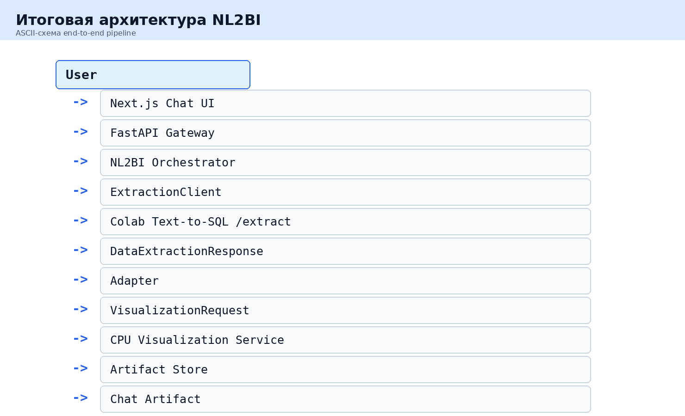
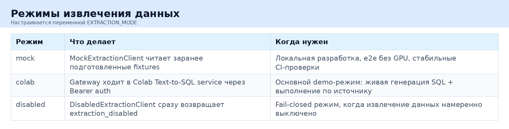
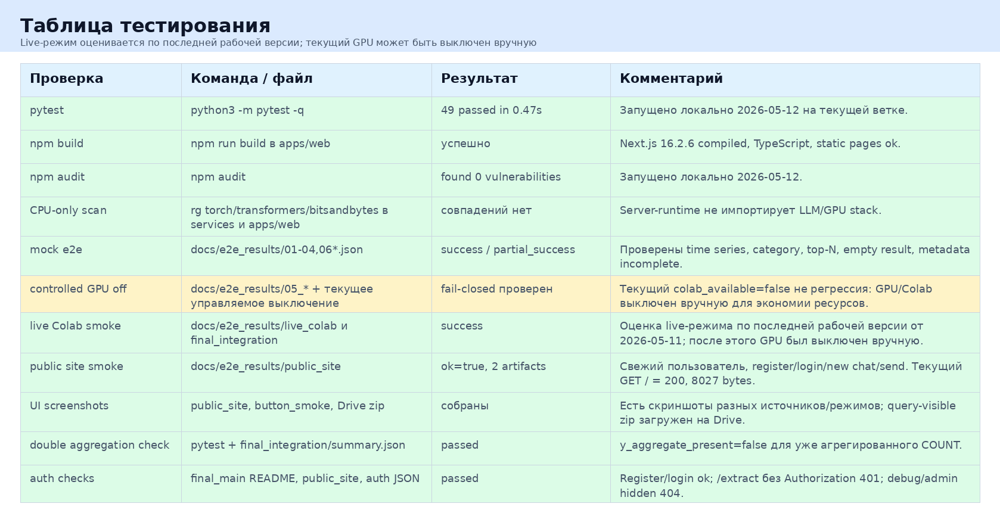

# Краткая версия финального отчёта NL2BI

Реализован интегрированный прототип NL2BI: пользователь вводит вопрос на естественном языке, выбирает источник данных, а система строит SQL, выполняет запрос и возвращает таблицу или график в чат-интерфейсе. Прототип объединяет Text-to-SQL часть Дениса и server/runtime + visualization часть Петра.

Денис реализовал Colab-runtime: FastAPI service в Colab, загрузку Text-to-SQL модели, построение prompt по схеме БД, SQL generation, SELECT-only validation, row limit, timeout, read-only execution, metadata inference и Bearer auth. Базовая модель в конфиге Colab: `Qwen/Qwen2.5-Coder-7B-Instruct` с quantization `4bit`; UI также поддерживает каталог emitter/planner моделей.

Пётр реализовал server-runtime: Next.js чат, FastAPI gateway, auth/register/login/logout, chat sessions, message persistence, contracts, orchestrator, extraction clients, adapter, CPU Visualization Service, artifact store, source selector, schema cards, query chips и export CSV/JSON/PNG/SVG.

Архитектура прототипа:

Разделение runtime сделано намеренно. Сервер не запускает LLM и не требует GPU. Colab выступает временной заменой production GPU inference service. Это позволяет показывать систему как микросервисную: frontend/backend можно деплоить отдельно, а Text-to-SQL inference later заменить на постоянный GPU endpoint.

Поддерживаются три режима:

Что подтверждено проверками:

- `python3 -m pytest -q`: 49 passed in 0.47s;
- `npm run build`: успешный Next.js build;
- `npm audit`: 0 vulnerabilities;
- CPU-only scan: server/web не импортируют GPU/LLM stack;
- historical live Colab smoke от 2026-05-11: success;
- public site smoke: fresh user, register/login/new chat/send, 2 artifacts;
- double aggregation check: `y_aggregate_present=false`;
- auth checks: `/extract` без Authorization даёт 401, debug/admin endpoints hidden 404.

Таблица проверок:

Ограничение, которое важно не скрывать: Colab/GPU runtime не держится постоянно включённым, потому что это расходует ресурсы. На момент подготовки отчёта он был выключен вручную, поэтому оценка live-режима идёт по последней подтверждённой рабочей версии от 2026-05-11. Перед живой демонстрацией нужно снова включить Colab/GPU, обновить endpoint при необходимости и повторить smoke. Если GPU не включается, используется mock mode или заранее сохранённые screenshots.

Что показывать комиссии:

- сайт с новым пользователем и пустой историей чатов;
- source selector с разными источниками;
- runtime/model status;
- запросы по `northwind_ru` как наиболее BI-похожему источнику;
- benchmark-запрос по Spider/BIRD/Asana;
- таблицу, график и export actions;
- fallback при ошибке или недоступном Colab;
- честное объяснение, что Colab временный GPU слой, а не production inference service.

Итог: создан работающий интеграционный прототип, который демонстрирует путь от естественно-языкового запроса до аналитического артефакта и показывает архитектуру дальнейшего развития в микросервисную NL2BI-систему.
