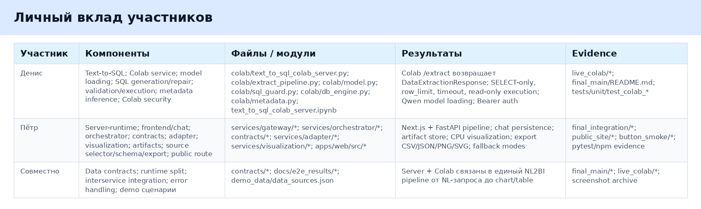

# Личный вклад участников

Сводная таблица вклада:

## Денис

Денис отвечает за Text-to-SQL слой и Colab-runtime. Его часть принимает `DataExtractionRequest`, загружает схему выбранного источника, строит prompt, запускает модель, извлекает SQL из ответа, валидирует SELECT-only, добавляет row limit, выполняет запрос в read-only режиме и возвращает `DataExtractionResponse`.

Ключевые результаты:

- Colab FastAPI service;
- `/health`, `/extract`, `/reload_model`, `/models`;
- модельный wrapper для Hugging Face моделей;
- базовая поддержка `Qwen/Qwen2.5-Coder-7B-Instruct`;
- optional planner slot;
- SQL guard;
- repair loop;
- SQLite, DuckDB, PostgreSQL execution layer;
- field metadata inference;
- Bearer auth и скрытые debug/admin endpoints.

Основные evidence: `docs/e2e_results/live_colab/*`, `docs/e2e_results/final_main/README.md`, unit-тесты `tests/unit/test_colab_*`, metadata/double aggregation проверки.

## Пётр

Пётр отвечает за server-runtime и Text-to-Visualization слой. Его часть принимает пользовательский запрос из UI, сохраняет чат, вызывает orchestrator, преобразует результат Text-to-SQL в visualization request, выбирает график или таблицу, сохраняет artifacts и отображает результат во frontend.

Ключевые результаты:

- FastAPI gateway;
- Next.js Chat UI;
- auth/register/login/logout;
- chat sessions и message persistence;
- contracts;
- `Nl2ChartOrchestrator`;
- `MockExtractionClient`, `ColabExtractionClient`, `DisabledExtractionClient`;
- adapter `DataExtractionResponse -> VisualizationRequest`;
- CPU Visualization Service;
- Vega-Lite-like chart spec generation;
- artifact store;
- source selector;
- schema cards;
- query chips;
- CSV/JSON/PNG/SVG export;
- public site smoke и UI screenshots.

Основные evidence: `docs/e2e_results/final_integration/*`, `docs/e2e_results/public_site/*`, `docs/e2e_results/button_smoke/*`, текущие `pytest`, `npm build`, `npm audit`.

## Совместно

Совместная часть — это граница между runtime-ами и контрактами. Участники согласовали, что сервер не тянет LLM/GPU зависимости, а Colab отвечает только за extraction. Интеграция построена на явных Pydantic-контрактах, поэтому Colab можно заменить постоянным GPU service без изменения UI и визуализации.

Совместные результаты:

- contracts между слоями;
- runtime split;
- interservice integration;
- error handling;
- demo scenarios;
- evidence pack;
- smoke-проверки;
- правила fallback при недоступности Colab.
