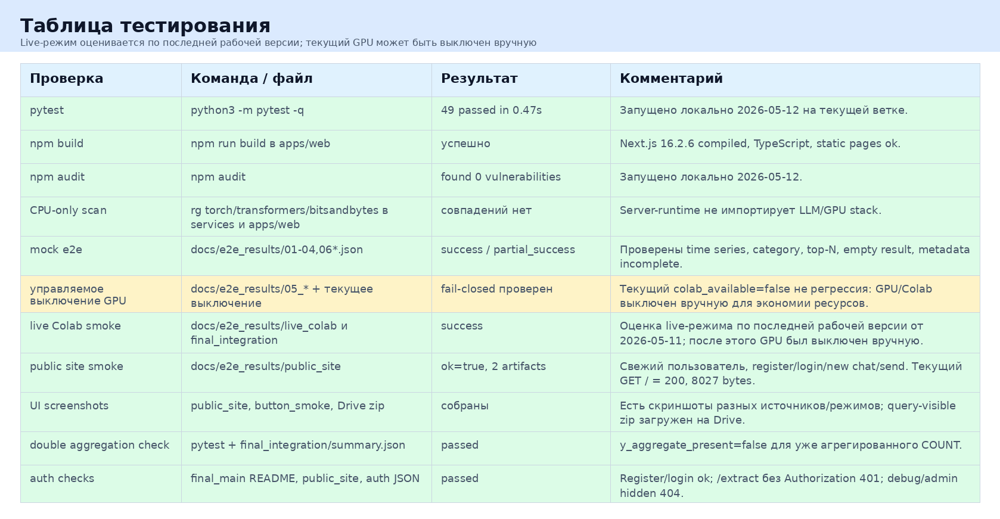
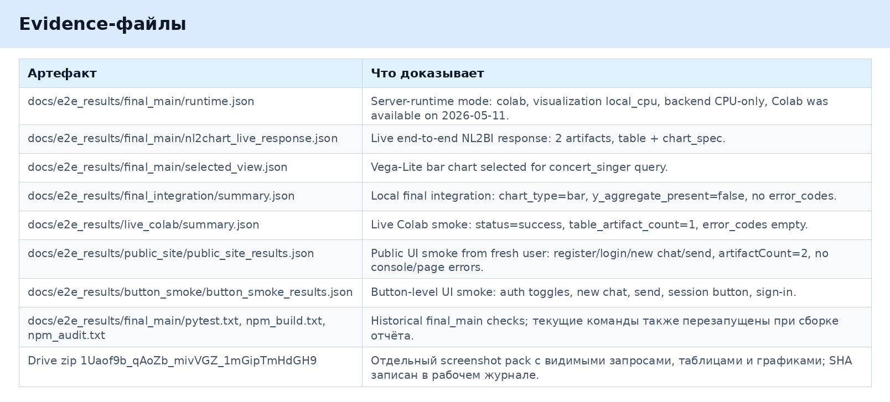

# Тестирование и evidence

## Проверки

Сводная таблица проверок:

При подготовке отчёта локально выполнены актуальные проверки на текущей ветке:

- `python3 -m pytest -q`: 49 passed in 0.47s;
- `npm run build` в `apps/web`: успешная production build сборка Next.js;
- `npm audit` в `apps/web`: 0 vulnerabilities;
- CPU-only scan по `services` и `apps/web`: совпадений по GPU/LLM импортам не найдено.

Public site root также проверен простым HTTP-запросом: `GET http://103.54.18.109/` вернул 200 и 8027 bytes.

Важно: на момент подготовки отчёта Colab/GPU runtime был выключен вручную для экономии ресурсов. Поэтому текущий `colab_available=false` не считается регрессией. Live-режим оценивается по последней подтверждённой рабочей версии от 2026-05-11, зафиксированной в `docs/e2e_results/live_colab/*` и `docs/e2e_results/final_integration/*`.

## Evidence-файлы

Сводка evidence:

Что доказывают основные группы файлов:

- `docs/e2e_results/final_main/runtime.json`: режим server-runtime, CPU-only backend, Colab mode и состояние Colab на момент фиксации.
- `docs/e2e_results/final_main/nl2chart_live_response.json`: live ответ NL2BI pipeline с table и chart_spec artifacts.
- `docs/e2e_results/final_main/selected_view.json`: выбранный график и Vega-Lite-like spec.
- `docs/e2e_results/final_integration/summary.json`: итоговая интеграция, artifact counts, chart_type, отсутствие повторной агрегации.
- `docs/e2e_results/live_colab/summary.json`: live Colab smoke без error codes.
- `docs/e2e_results/public_site/public_site_results.json`: fresh-user UI flow без старых чатов.
- `docs/e2e_results/button_smoke/button_smoke_results.json`: проверка кликабельности основных кнопок.
- `docs/e2e_results/final_main/pytest.txt`, `npm_build.txt`, `npm_audit.txt`: исторические проверки final_main; текущие проверки дополнительно перезапущены при сборке отчёта.

## Скриншоты

Скриншоты для отчёта были собраны отдельным пакетом с видимыми запросами, графиками и таблицами. Локальная папка: `/tmp/nl2bi_report_screenshots_query_visible_20260511224318/`. Архив: `/tmp/nl2bi_report_screenshots_query_visible_2026-05-12_v2.zip`. Drive-ссылка: `https://drive.google.com/file/d/1Uaof9b_qAoZb_mivVGZ_1mGipTmHdGH9/view?usp=drivesdk`. SHA: `55cc076b8f2268861513fe357e4a4ef49a1e471437449a35da007592886c85d7`.

## Тестовые выводы

Mock mode подтверждает, что server-runtime, adapter, visualization и artifacts работают без GPU. Это важно для CI и fallback.

Сценарий управляемого выключения Colab/GPU подтверждает fail-closed поведение: сервер не падает и возвращает управляемую ошибку.

Live Colab smoke подтверждает end-to-end путь через Colab на момент 2026-05-11. После этой рабочей фиксации inference runtime был намеренно остановлен для экономии ресурсов. Перед live-показом его нужно снова включить и повторить smoke.

Double aggregation check подтверждает, что уже агрегированные SQL-поля не агрегируются повторно в Vega encoding.

Auth checks подтверждают, что пользовательский UI flow работает, а Colab extraction защищён Bearer auth.
