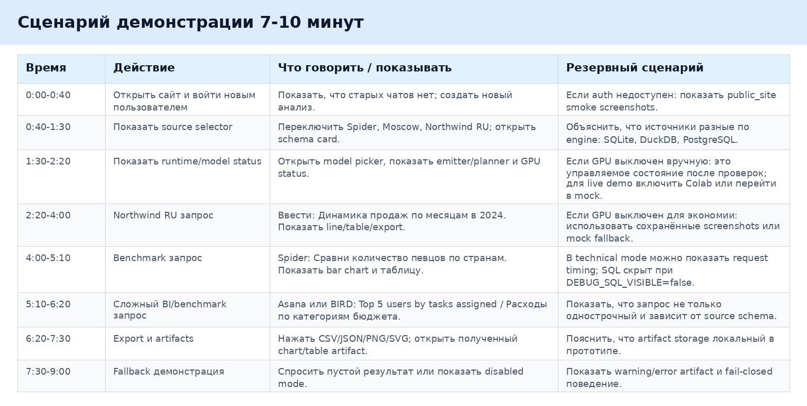

# Сценарий демонстрации для комиссии

## Общая логика

Демонстрация рассчитана на 7-10 минут. Основная цель — показать не отдельный notebook, а интегрированную NL2BI-систему: пользовательский сайт, выбор источника, runtime/model status, запрос на естественном языке, таблицу, график, export и fallback.

Сценарий:

## Что говорить

Начать стоит с тезиса: это не готовый production BI-продукт, а интеграционный прототип. Он показывает, как Text-to-SQL и Text-to-Visualization объединяются в один pipeline с явными контрактами и раздельными runtime.

Дальше показать сайт как обычный пользователь. Войти новым пользователем или зарегистрировать нового. Важно, чтобы не было старых чатов: это подтверждает сценарий fresh user.

Затем показать source selector. Объяснить, что источники разные: SQLite, DuckDB, PostgreSQL. Для комиссии лучше использовать `northwind_ru`, потому что это русскоязычная BI-схема продаж, а не только benchmark.

Показать schema card. Объяснить, что schema нужна модели Text-to-SQL для построения корректного SQL, а UI показывает пользователю, на каком источнике строится анализ.

Показать runtime/model status. Объяснить разделение: сайт и backend CPU-only, Colab временно отвечает за GPU inference.

## Какие запросы вводить

Для `northwind_ru`:

- Динамика продаж по месяцам в 2024.
- Топ-10 клиентов по выручке за 2024 год.
- Средний чек по сегментам клиентов.

Для `demo_concert_singer`:

- Сравни количество певцов по странам.
- Количество концертов по годам.
- Покажи area chart: количество концертов по годам областным графиком.
- Покажи топ-5 стадионов по вместимости.

Для `spider2_retail_dbt`:

- Top 5 product categories by revenue.
- Monthly revenue trend in 2024.
- Show a stacked bar chart of revenue by store region, split by sales channel.

Расширенный набор промптов с ожидаемыми видами графиков и уровнями сложности лежит в `docs/final_report/06_demo_prompts_for_commission.md`.

Для `bird_student_club`:

- Top 5 members by attendance count.
- Расходы по категориям бюджета.
- Сколько участников на каждом типе событий.

Для `moscow_open`:

- Площадь округов Москвы.
- Сколько станций метро на каждой линии.
- Самые загруженные станции метро.

## Что показывать на экране

Показать:

- выбранный источник;
- schema card;
- текст запроса в чате;
- ответ assistant;
- таблицу результата;
- график;
- кнопки CSV/JSON/PNG/SVG;
- source badge у сообщения;
- model picker;
- runtime status;
- fallback warning/error artifact при ошибке.

Если включён technical mode, можно показать timing. SQL в production-like режиме скрыт, если `DEBUG_SQL_VISIBLE=false`. Это полезно объяснить как элемент безопасности.

## Если Colab/GPU отключён

Если runtime показывает `colab_available=false`, сначала уточнить причину. В текущем отчётном состоянии GPU/Colab был выключен вручную, чтобы не тратить ресурсы после проверок. Это не является регрессией последней рабочей версии: live-режим подтверждён evidence от 2026-05-11. Для комиссии есть два fallback:

- переключить backend в `mock` mode и показать тот же UI flow без GPU;
- открыть заранее сохранённые screenshots из Drive-архива, где видны запросы, графики и таблицы.

Перед живой демонстрацией желательно:

- перезапустить Colab notebook;
- обновить `TEXT_TO_SQL_SERVICE_URL`;
- проверить `/api/server/runtime`;
- выполнить один smoke-запрос;
- сохранить свежий screenshot.
