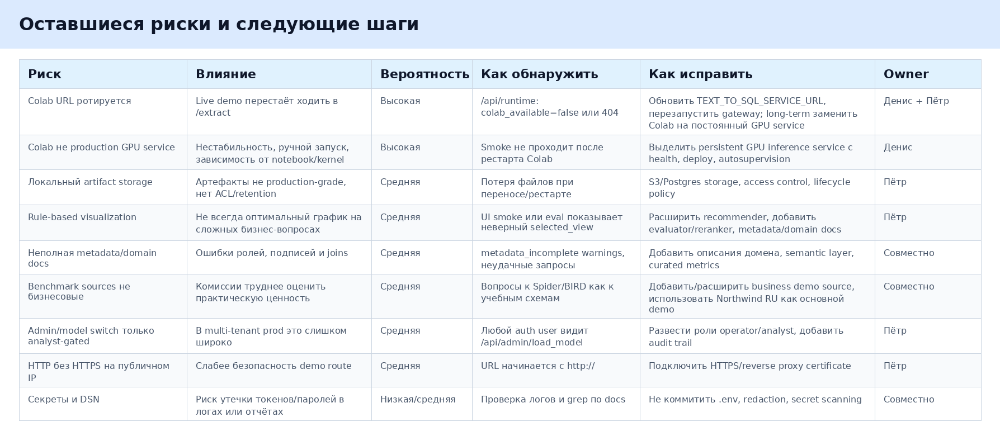

# Оставшиеся риски и следующие шаги

## Риски

Сводная таблица рисков:

Главный риск для демонстрации — нестабильность Colab URL. На момент подготовки отчёта публичный runtime доступен, но Colab health через gateway возвращает 404. Это нужно исправить до live demo: обновить Colab URL, перезапустить gateway и повторить smoke.

Второй риск — смешение демонстрационных и бизнесовых источников. Spider, BIRD и Spider2 хорошо показывают benchmark-покрытие, но комиссии проще оценивать BI-сценарий на `northwind_ru`. Поэтому для защиты лучше делать основной сценарий на Northwind RU, а benchmark sources показывать как широту подключения.

Третий риск — rule-based visualization. Текущая логика уже исправляет ряд проблем, включая месяц+год axis и double aggregation, но сложные запросы всё ещё могут требовать более сильного recommender.

## Short-term

- Обновить Colab URL в server env.
- Повторить live Colab smoke.
- Проверить `/api/server/runtime` и `/api/server/nl2chart`.
- Обновить screenshots после успешного live smoke.
- Проверить подсказки по всем источникам.
- Подготовить mock fallback.

## Before commission

- Выбрать основной demo source: `northwind_ru`.
- Подготовить 5-7 стабильных запросов для комиссии.
- Добавить domain docs и metadata hints для бизнесовых полей.
- Проверить экспорт CSV/JSON/PNG/SVG на свежем пользователе.
- Подключить HTTPS, если сайт показывается публично.
- Ограничить model switch отдельной operator/admin ролью.
- Убрать из отчётов и логов любые секреты, реальные токены и пароли.

## Production-like

- Заменить Colab на постоянный GPU inference service.
- Добавить health/readiness/liveness для GPU service.
- Перенести artifacts в S3 или Postgres-backed storage.
- Добавить artifact access control.
- Добавить evaluation dashboard по источникам, query class и chart selection.
- Расширить visualization recommender.
- Добавить observability: logs, metrics, traces.
- Настроить автоматический smoke после deploy.

## Owners

Денис: Colab-runtime, GPU/model loading, Text-to-SQL quality, SQL repair, schema loading, Colab auth.

Пётр: server-runtime, frontend, orchestrator, contracts, adapter, visualization, artifacts, public route, UI smoke.

Совместно: contracts, demo scenarios, source readiness, final smoke, error handling, report evidence.
