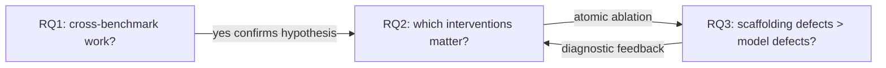

# 1.3 Исследовательские вопросы

Из общей гипотезы «scaffolding > model scale в зоне ≤30B параметров на Spider 2.0 family» в работе формулируются три исследовательских вопроса (research questions, RQ). Они структурируют все экспериментальные phase-ы и определяют, какие именно metrics измеряются для подтверждения / опровержения.

---

## RQ1: Кросс-бенчмарковая работоспособность единой архитектуры

> **Можно ли единой архитектурой агента (без бенчмарк-специфичного fine-tuning) и моделями ≤30B параметров достичь конкурентоспособного результата на пяти разнородных NL2SQL/NL2BI бенчмарках одновременно?**

«Пять разнородных» — это:
1. Spider 1.0 (SQLite, normalized schemas, single-DB),
2. BIRD (SQLite, larger schemas, external knowledge tags),
3. Spider2-Lite (BigQuery lane) — live warehouse, hundreds of tables,
4. Spider2-Lite (Snowflake lane) / Spider2-Snow — live warehouse, mixed-case identifiers,
5. Spider2-DBT — multi-file project edits, DuckDB execution.

Под «единой архитектурой» понимается:
- один общий schema linker (BM25 над live catalog),
- один общий pack builder (compact JSON-friendly schema fragment),
- один общий planner (Qwen3-Coder-30B-A3B, генерирующий structured JSON-план),
- один общий emitter (Qwen2.5-Coder-7B, рендерящий план в SQL),
- общий validator pipeline (JSON schema → AST closed-set check → engine dry-run),
- общий candidate selector.

Бенчмарк-специфичное допускается **только** в dialect handler-ах (e.g., `_snow_explain` vs `_bq_dry_run`) и в выборе candidate factory family (на Spider1/BIRD используется Family B, на Spider2-Lite-BQ — все три, на Spider2-Snow — только Family B по причине отсутствия Family A renderer-а под Snowflake dialect).

«Конкурентоспособный результат» определяется относительно публичной reference:
- Для Spider 1.0: top-3 entries на leaderboard используют closed API → нам достаточно быть в зоне «эффективно решает большинство задач», что традиционно ≥85% EX.
- Для BIRD: аналогично ≥80% EX.
- Для Spider2-Lite (BQ): зона ≥30% EX (исторически достижимая open-weight стэками).
- Для Spider2-Snow: первое publishable non-zero число для open-weight ≤30B стэка (исторически до Phase 27 — execute_ok был 0%).
- Для Spider2-DBT: матч baseline ≈ 13.2% Spider-Agent.

**Если ответ RQ1 — «да»**, это подтверждает основную гипотезу: scaffolding достаточно мощный, чтобы один и тот же agent stack давал разумные результаты в радикально разных режимах. Если — «нет, для какого-то lane разваливается», это даёт diagnostic: какой именно scaffolding-компонент не масштабируется.

**Проверяемые сигналы**:
- наличие committed pipeline кода (см. `repo/src/evaluation/`),
- метрики execution accuracy на каждом из пяти бенчмарков (см. [07_METRICS_AND_RESULTS/02_progression_table_full.md](../07_METRICS_AND_RESULTS/02_progression_table_full.md)),
- отсутствие отдельной fine-tune модели под каждый бенчмарк.

**Известный риск RQ1**: Spider1/BIRD vs Spider2 — структурно очень разные режимы (SQLite single-DB vs live warehouse multi-DB). Возможно, что один и тот же стэк формально работает на обоих, но с разной эффективностью. Конкретно — пилотное наблюдение из Phase 17-18: planner-emitter decomposition даёт ~−0.033 EX на Spider1 (joint emit лучше для простых SQL), но необходима для Spider2 (план как контракт). Этот trade-off зафиксирован, см. [05_PIPELINES/01_spider1_pipeline.md](../05_PIPELINES/01_spider1_pipeline.md).

---

## RQ2: Атрибуция вклада интервенций

> **Какие именно scaffolding-интервенции дают наибольший прирост execution accuracy при фиксированном стэке моделей? В каком порядке их следует применять, и какие из них работают только в композиции?**

Эта RQ требует **измеренного** ablation, не теоретического обсуждения. Каждая интервенция должна быть представлена как:
- (a) формулировка гипотезы, которая её мотивирует;
- (b) минимальная реализация (commit hash + diff);
- (c) пилотный эксперимент (pilot10 / pilot50);
- (d) метрический эффект (Δ EX относительно предыдущего baseline);
- (e) выводы (подтверждено / опровергнуто / частично подтверждено).

Полный набор интервенций исследован в Phase 17 – Phase 28:

| Кодовое название | Phase | Гипотеза | Δ EX | Результат |
|---|---|---|---|---|
| Schema-first ranking (BM25 over INFORMATION_SCHEMA) | Phase 18 | retrieval > raw schema dump | Lite-BQ 0% → 10% schema_valid; первый non-zero dry_run_ok | Подтверждено |
| Closed-set planning (JSON план vs free SQL) | Phase 19 | identifier hallucination — главная failure mode на Spider2 | Lite-BQ 30% schema_valid + 30% dry_run | Подтверждено |
| Identifier canonicalisation (FQN) | Phase 20-21 | unify imja identifierov | sv 50-52%, exec 42-46% bands | Частично — sv растёт, exec не двигается |
| Pack expansion + join_hints + Family C | Phase 22 | join-aware factory заменит planner на сложных JOIN | sv 50→54%, audit predicted +20pp, got +4pp | Опровергнуто (Family C почти не выбиралась) |
| GPU lock + sequential runner | Phase 23-24 | concurrent BG inference вызывает OOM | устранили OOM, FULL стали возможны | Подтверждено (orchestration) |
| A4 engine-compat rewrites (BQ) | Phase 24 | переписать SQL под BQ standard SQL | metric-neutral | Опровергнуто как self-sufficient интервенция |
| **F1 catalog grounding** (per-task BM25 + three-part + AST guard) | Phase 27 | cross-DB drift на Snow lane | sv 12.6% → 80%, exec 0.48% → 1/10 | **Подтверждено** |
| **F4 date-fn cast wrap** | Phase 28 | NUMBER/VARIANT → DATE для EXTRACT/DATE_TRUNC | становится load-bearing когда F2a выключен | Подтверждено условно |
| **F4c regex guard fallback** | Phase 28 | SQLGlot fails on LATERAL FLATTEN — fail-open вместо fail-closed | сf_bq210 проходит guard | Подтверждено |
| F2a mixed-case quoting auto-upper | Phase 28 | Snow stored UPPER, model emits lowercase | exec 1/10 → 0/10 | **Опровергнуто (catalog actually lowercase)** |

«Подтверждено» означает измеренный положительный Δ EX, **обнаруживаемый против baseline на pilot ≥10 задач**. «Опровергнуто» — отрицательный или нулевой Δ EX при ожидании положительного.

**Особо важный sub-результат RQ2**: некоторые интервенции **не имеют ROI самостоятельно**, но являются необходимым условием для другой интервенции. Это «layered effect»: например, F4 (date cast wrap) до Phase 28 revert-A показывал `wrapped_n=9` но exec=0/10 → казалось «бесполезно». После revert F2a и удаления prompt-rule «UPPERCASE columns are unquoted», F4 wraps стали load-bearing: на pilot10 v28-revert-A три новых exec_ok были именно через F4 wrap (sf_bq026 DATE, sf_bq213 VARIANT, sf_bq029 неявная YYYYMMDD-математика). Это иллюстрирует, что **measurable atomic ablation может быть некорректным методом**, если интервенция работает только в композиции.

**Проверяемые сигналы**:
- per-phase phase reports с numbers (см. [11_APPENDIX/04_full_phase_report_index.md](../11_APPENDIX/04_full_phase_report_index.md)),
- сравнительная таблица [07_METRICS_AND_RESULTS/02_progression_table_full.md](../07_METRICS_AND_RESULTS/02_progression_table_full.md),
- ablation между интервенциями на одном bench (Phase 27 v27 vs v27b vs v27c, Phase 28 full vs revert-A).

---

## RQ3: Архитектурные дефекты scaffold-а как лимитирующий фактор

> **Какие архитектурные дефекты scaffold-а лимитируют overall performance больше, чем capability моделей? Можно ли их идентифицировать без замены моделей?**

Эта RQ — **диагностическая**. В классическом NL2SQL paper-е заключение часто формулируется как «остаточные ошибки требуют более мощной модели». Мы хотим показать обратное: значительная доля остаточных ошибок — **scaffolding-level**, и они идентифицируются через анализ failure mode.

Конкретные «дефекты», измеренные в работе:

1. **Cross-DB identifier drift (Phase 26-27)**. На Spider2-Snow до Phase 27 90.2% задач эмитили three-part names с неправильным первым сегментом (catalog). Это не failure model-я понимать вопрос — это failure scaffold-а правильно ranked-ить и rendered-ить таблицы. Закрыто F1 интервенцией (см. [06_EXPERIMENTAL_PROGRESSION/03_phase27_f1_grounding.md](../06_EXPERIMENTAL_PROGRESSION/03_phase27_f1_grounding.md)).

2. **BM25 retrieval window undersized для warehouse-scale (Phase 27 side finding)**. Defaults `top_columns=80, top_tables=20` достаточны для Spider1/BIRD (≤30 таблиц/БД), но систематически пропускают нужную таблицу для Spider2-Snow (сотни таблиц/БД, тысячи столбцов). Закрыто scaling до 200/40 + per-task partitioning.

3. **Column-name hallucination (Phase 28 §6)**. Errors класса `invalid identifier '"p"."country"'` на Spider2-Snow первоначально классифицировались как «mixed-case quoting» (Phase 27 §5). Catalog probe в Phase 28 показал, что **нет колонки `country` в `PATENTS.PUBLICATIONS`**; есть `country_code`. То есть это не case mismatch, а **model выдумывает имя колонки**. Это диагностический failure scaffold-а, и его решение — **self-refine loop с EXPLAIN error feedback** (Phase 29 territory, see Future Work).

4. **F2a misclassification (Phase 28 §6)**. F2a auto-upper интервенция (Phase 28) была основана на ложной гипотезе, что Snow catalog хранит идентификаторы в UPPER case. Catalog probe показал — `37/37 columns are lowercase`. Это пример **wrong scaffold intervention из-за нерешённого scaffold diagnostic-а**.

5. **SQLGlot parser gaps on Snow LATERAL FLATTEN (Phase 28 F4c)**. SQLGlot snowflake dialect parser падает на конструкции `TABLE(LATERAL FLATTEN(INPUT => …))`. Это вызывало fail-closed в guard — реально валидный SQL отбрасывался. F4c regex fallback устраняет проблему. Это пример **scaffold tool-а имеющего dialect-specific blind spot**.

6. **Edit-format mismatch на DBT (Phase 11, Phase 31 territory)**. На Aider Polyglot benchmark (Phase 6-7) для Qwen2.5-Coder-7B документировано: diff edit-format даёт значительно лучше result чем multi-block-whole-file. На Spider2-DBT нам пришлось бы реализовать diff-based agent loop. Это — scaffold-level decision о том, как именно агент meditates изменения. Не model-level.

**Проверяемые сигналы**:
- каждый из шести дефектов имеет связанный phase report с diagnostic (см. `outputs/REPORT_PHASE*.md`),
- каждый scaffold-level fix дал измеримый Δ EX (см. RQ2),
- сравнение «model upgrade vs scaffold fix» в Phase 17 (model swap baseline): family > scale показал, что upgrade моделей внутри Coder family не давал линейного прироста.

**Главный вывод RQ3** (на основании уже закрытых phase): для текущего стэка (Coder-30B planner + Coder-7B emitter) **большая часть остаточных Spider2-Snow failure mode-ов — column/table-name hallucination и dialect runtime errors**. Эти ошибки не закрываются масштабированием моделей — нужен **F3 self-refine** (фид-бек EXPLAIN error в планировщик) или **схема enrichment** (sample values, FK metadata). Это **scaffolding-level** интервенции, не model-level.

---

## Связь между RQ1, RQ2, RQ3

- RQ1 — overarching проверка на множестве бенчмарков; если она проходит, вся гипотеза получает support.
- RQ2 — атрибуция: какие конкретные интервенции дают вклад. Это даёт **архитектурный recipe**, не общую философию.
- RQ3 — диагностический разрез: показывает, где scaffolding нужен дальше. Это **остаточный gap analysis** и направление будущей работы.

---

## Что НЕ исследуется

Чтобы оставить scope обозримым, явно отказываемся от следующих вопросов:

- **Какая лучшая модель в категории ≤30B на NL2SQL?** Мы выбрали Qwen2.5-Coder-7B + Qwen3-Coder-30B-A3B на основе Phase 17 ablation, и далее в работе фиксируем этот выбор. Сравнение между Qwen, DeepSeek-Coder, CodeS, и т.д. — отдельное исследование.
- **Универсальный schema linker** для произвольных схем. Мы оптимизируем под Spider 2.0 family — на принципиально другой схеме (e.g., temporal databases, graph databases) наши параметры могут не переноситься.
- **Fully autonomous multi-turn dialog**. Все вопросы — single-shot.
- **Cost-quality trade-off model**. Мы не считаем стоимость в $ или GPU-часах за SQL. Только qualitative — что интервенция в самой scaffold (несколько часов разработки) даёт больше Δ EX, чем апгрейд модели (multi-day тренировка + GPU расход).

---

## Ссылки на источники для этого раздела

| Утверждение | Источник |
|---|---|
| Phase 17 «family > scale» | `outputs/REPORT_PHASE17_*.md` |
| Cross-DB drift 90.2% pre-Phase-27 | `outputs/REPORT_PHASE27_F1_SNOW_GROUNDING.md` §1 |
| Catalog probe 37/37 lowercase | `outputs/REPORT_PHASE28_F2A_F4_DIALECT.md` §6 |
| Phase 27 v27/v27b/v27c ablation series | `outputs/REPORT_PHASE27_F1_SNOW_GROUNDING.md` §3 |
| F4 layered effect (только после F2a revert) | `outputs/REPORT_PHASE28_F2A_F4_DIALECT.md` §10 |

---

## Что дальше

→ [04_thesis_contributions.md](./04_thesis_contributions.md) — итоговые claims защиты, привязанные к этим трём RQ
→ [06_EXPERIMENTAL_PROGRESSION/01_early_phases_overview.md](../06_EXPERIMENTAL_PROGRESSION/01_early_phases_overview.md) — где RQ2 atomic ablations произошли
