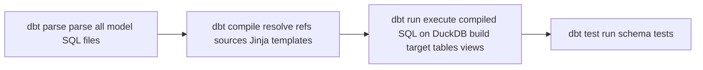

# 3.1.7 Spider2-DBT

## Краткая идентификация

| Field | Value |
|---|---|
| Sub-benchmark | **Spider2-DBT** — multi-file DBT project transformation |
| Authoring | xlang-ai / HKUST (Lei et al., ICLR 2025) |
| Engine | **DuckDB local + DBT** (dbt-duckdb adapter) |
| Размер | **68** задач |
| Task format | Per-task: full DBT project directory + natural-language instruction |
| Evaluation | **table+column comparison** против golden DuckDB output after `dbt build` |
| Leaderboard | spider2-sql.github.io (DBT split) |
| Lane мы используем | **FULL 68** (Phase 11 baseline reproduction) |

## Структурное описание

Spider2-DBT — **fundamentally different** от других Spider 2.0 lanes. Не single-SQL emission, а **multi-file edits в existing DBT-проектах**. Task input — full DBT directory (e.g., `airbnb001/`, `playbook001/`) с pre-existing `models/`, `sources.yml`, `dbt_project.yml`, `macros/`, etc. Required output — modified directory с new / changed model files such что `dbt build` produces specified output tables.

### Per-task structure

Example task `airbnb001/`:

```
airbnb001/
├── dbt_packages/
├── dbt_project.yml
├── macros/
├── models/
│   ├── agg/
│   ├── dim/
│   ├── fact/
│   ├── schema.yml
│   ├── source/
│   └── sources.yml
├── packages.yml
└── profiles.yml
```

Agent должен read existing structure (sources, models definitions, schema documentation), understand business question, и edit appropriate files (typically new `model.sql` в `models/agg/` or `models/fact/`) что after `dbt build`, output tables match gold.

### Sample task (instance_id `playbook001`)

```
NL Instruction:
"Complete the project of this database to show the metrics of each traffic
source, I believe every touchpoint в the conversion path is equally important,
please choose the most suitable attribution method."

What it tests:
- Understanding DBT project structure (где models live)
- Choosing attribution model (linear / first-touch / last-touch / position-based)
- Question interprets "every touchpoint equally important" → linear attribution
- Output: new model with linear attribution computation across conversion paths

Difficulty: hard (open-ended business decision + multi-source aggregation)
Type: DBT
```

### Sample task (`provider001`)

```
NL Instruction:
"How can I map Medicare specialties to NUCC taxonomy codes, prioritize the most
specific one, and assign a primary taxonomy code to each provider in the NPI
dataset? Additionally, how can I combine this with provider details, including
their entity type, practice location, and specialty, while checki[ng] ..."

What it tests:
- Healthcare domain reasoning (NPI = National Provider Identifier, NUCC = taxonomy)
- Multi-stage transformation: lookup table → priority ranking → join к provider details
- Multiple output tables potentially
- Understanding existing sources.yml для available data

Difficulty: very hard (domain knowledge + multi-step + multi-table)
Type: DBT
```

Source: `external_benchmarks/spider2_dbt/examples/spider2-dbt.jsonl`.

### Distribution by domain

Per task names в `examples/` directory (68 tasks):

| Domain prefix | Approx count | Example IDs |
|---|---|---|
| Marketing / advertising | ~12 | playbook001, marketo001, google_ads001 |
| E-commerce | ~10 | airbnb001-002, shopify001-002, brazilian, retail001 |
| Sports / events | ~7 | nba001, f1001-003, atp_tour001, ipl001 |
| Healthcare | ~4 | provider001, synthea001 |
| Finance | ~6 | recharge001-002, mrr001-002, quickbooks001-003, zuora001 |
| HR / workflow | ~5 | greenhouse001, lever001, workday001-002, jira001 |
| Web / tech analytics | ~6 | pendo001, intercom001, qualtrics001, twilio001, hubspot001, reddit001 |
| Other / generic | ~18 | activity001, scd001, tpch001-002, danish001, etc. |

## DBT mechanics

Standard DBT workflow:



Key concepts:

| Concept | Syntax | Purpose |
|---|---|---|
| **`{{ ref('model_name') }}`** | jinja template | Reference другой model — DBT resolves к `target.dataset.model_name` |
| **`{{ source('src_name', 'table') }}`** | jinja template | Reference external source defined в `sources.yml` |
| **Materialization** | `{{ config(materialized='table') }}` | View / table / incremental / ephemeral |
| **schema.yml** | yaml file | Documentation + tests для models |
| **`dbt build`** | CLI | Compose run + test |

## Why DBT lane structurally different

Spider2-Lite / Spider2-Snow tasks — **single SQL emit**: input (question + schema) → output (one SQL query). DBT — **multi-file edit task** akin к software engineering bug fixing:

| Lane | Task shape | Output format |
|---|---|---|
| Spider2-Lite/Snow | NL → 1 SQL string | text SQL |
| Spider2-DBT | NL → multiple file edits | filesystem state change |

This means **agent-like behavior required** для DBT: read existing files, understand structure, propose changes, validate via `dbt build`. Single-shot emit struggles because:
- Output может span 2-5 files (model.sql + schema.yml addition + occasionally sources.yml).
- Each file must be syntactically valid + collectively coherent.
- Errors require iterative debugging (compile error → fix → re-run).

## Our pipeline на Spider2-DBT (Phase 11 baseline, unchanged since)

### Configuration

- **Engine**: DuckDB local + DBT-duckdb adapter.
- **Schema source**: agent reads existing `sources.yml`, `schema.yml`, existing `models/` files.
- **Family**: B (Coder-7B multi-block emit).
- **Workflow**:
  1. Parse task instruction + project structure.
  2. Identify required output models from instruction.
  3. Emit candidate `model.sql` file(s) using Coder-7B.
  4. Try `dbt build` — if compile error, single retry с error feedback.
  5. Final check: compare output tables against gold.

### Throughput

Wall time per task: ~5-15 min (DBT compile + run cycles dominate). FULL 68 ≈ 6-12h.

## Pre-existing baseline: 13.2%

Phase 11 (`outputs/REPORT_SPIDER2_V11.md`) reproduced Spider-Agent baseline on Spider2-DBT: **9/68 task_success = 13.2%**. Unchanged через Phase 12-28 потому что:

- Phase 12-22 focused на Lite-BQ / Snow lanes.
- Phase 23-25 focused on orchestration (concurrent inference / GPU lock).
- Phase 26 handoff — DBT lane marked "matches Phase 11 baseline" — explicit non-target.
- Phase 27-28 — Snow-only interventions, no DBT pipeline changes.

**Implication**: DBT lane represents **bench's structural challenge**, не scaffolding-fixable in our current pipeline shape.

## Spider2-DBT leaderboard (cutoff May 2026)

Source: research dossier `outputs/REPORT_PHASE27_RESEARCHER_STRATEGY.md` §3.

| Rank | Method | Score | Backbone | Notes |
|---|---|---|---|---|
| 1 | **Databao Agent** (JetBrains) | **58.82%** | not disclosed | Closed; methodology blog: up-front DB overview + restricted tool surface + verifier gate |
| 2 | SignalPilot Agent | 51.56% | not disclosed | closed |
| 3 | Shadowfax-DBT-Agent + GPT-5 | 41.18% | GPT-5 | partial reproducibility |
| 4 | Spider-Agent-Extended + GPT-5 | 39.71% | GPT-5 | extended scaffold (Spider-Agent +) |
| 8 | Spider-Agent + Claude-3.7-Sonnet | 14.70% | Claude-3.7 | xlang-ai/Spider2 baseline + Claude |
| 9 | Spider-Agent + o1-preview | 13.24% | o1-preview | xlang-ai/Spider2 baseline + o1 |
| **Наш v18 stack** | — | **13.2%** | 30B planner + 7B emitter | **matches Spider-Agent ceiling** |

### Critical observation: Spider-Agent ceiling

Per research dossier §3 and analysis: **vanilla Spider-Agent scaffold caps near 14.7% regardless of backbone model class**. Spider-Agent + Claude-3.7 14.70%, + o1-preview 13.24%, + наш 13.2% — all clustered. Above 25% — different scaffold (Databao, SignalPilot, Shadowfax — proprietary modifications).

Databao blog Feb 2026 (jetbrains.com/databao): *"We made it smarter not by replacing the model, but by changing the environment around it"* — direct evidence что scaffold > model class на этом lane.

**Phase 31 target** (out of scope для current thesis): scaffold redesign — multi-block whole-file emit + read-before-write + staged verifier loop. Estimated band 25-32% based on Databao precedent.

## Position interpretation

Наш 13.2% — **тот же baseline что Spider-Agent с любой closed-API LLM**. Это significant data point:
- Confirms scaffold > model class on DBT lane (echoing Databao finding).
- Justifies Phase 31 scaffold redesign direction.
- Demonstrates open-weight ≤30B reaches **same ceiling** как Spider-Agent + Claude-3.7-Sonnet (24.50% Snow scaffold, 14.7% DBT scaffold). Bottleneck — scaffold, не model.

## Crit edit-format limitation

Per research dossier §4 aider Polyglot finding:
*"Qwen2.5-Coder-7B drops ~30% accuracy on Polyglot benchmark when forced into diff vs whole-file format on files <200 LOC."*

Implication: наш Phase 11 / Phase 26 DBT pipeline does **diff-patch** edits primarily. This **systematically underperforms** whole-file emit для small DBT files (most DBT models <200 LOC). Phase 31 redesign — switch к **multi-block whole-file emit** (entire `model.sql` regenerated per task) — directly addresses this gap.

## Failure pattern analysis (Phase 11 baseline)

Из baseline runs:

| Failure class | Approx share |
|---|---|
| Compile error (missing source / undefined ref) | ~30% |
| Runtime DuckDB error (type mismatch / column not exist) | ~25% |
| Output table missing | ~20% |
| Output table present, but column mismatch с gold | ~15% |
| Output table column match но row data mismatch | ~10% |

## Положение в landscape

Spider2-DBT — **уникально среди NL2BI bench-ов**. Не single-SQL bench, а **transformation engineering task** на DBT-проектах. Closest equivalent — **SWE-bench** для DBT-specific code generation.

**Сильные стороны**:
- Reflects **real warehouse transformation work** — data engineers spend most time here, не на ad-hoc SQL.
- Multi-file edits test agent capability holistically (not just SQL gen).
- DuckDB local execution makes evaluation cheap и fast.

**Слабые стороны**:
- 68 задач — relatively small sample (vs Spider2-Snow 547).
- DuckDB rather than production warehouses (real DBT typically targets Snow / BQ / Postgres).
- Open-ended business decisions ("most suitable attribution method") — subjective evaluation.

## Cross-references

- Pipeline detail: [05_PIPELINES/05_spider2_dbt_pipeline.md](../05_PIPELINES/05_spider2_dbt_pipeline.md)
- Phase 11 baseline reproduction: [06_EXPERIMENTAL_PROGRESSION/01_early_phases_overview.md](../06_EXPERIMENTAL_PROGRESSION/01_early_phases_overview.md)
- Agentic frameworks (Databao, Spider-Agent, SWE-agent): [02_RELATED_WORK/04_agentic_frameworks_for_dbt.md](../02_RELATED_WORK/04_agentic_frameworks_for_dbt.md)
- Models discussion (Coder-7B aider limit): [04_ARCHITECTURE/02_models_qwen3_qwen2.5.md](../04_ARCHITECTURE/02_models_qwen3_qwen2.5.md)
- Spider2 overview: [03_spider2_overview.md](./03_spider2_overview.md)
- Comparative table: [08_comparative_table.md](./08_comparative_table.md)
- DBT analysis: [09_RESULTS_ANALYSIS/04_spider2_dbt_analysis.md](../09_RESULTS_ANALYSIS/04_spider2_dbt_analysis.md)

## Источники

| Утверждение | Источник |
|---|---|
| 68 DBT tasks | `external_benchmarks/spider2_dbt/examples/spider2-dbt.jsonl` line count |
| Sample tasks playbook001 / provider001 | same jsonl lines 1-2 |
| Phase 11 baseline 9/68 = 13.2% | `outputs/REPORT_SPIDER2_V11.md`; `outputs/REPORT_PHASE26_RESEARCHER_HANDOFF.md` §1 |
| Databao 58.82% | research dossier §3 |
| Spider-Agent ceiling ~14.7% | research dossier §3 evidence |
| Coder-7B diff-patch 30% drop | research dossier §4 aider |
| DBT mechanics | dbt docs (docs.getdbt.com) |
