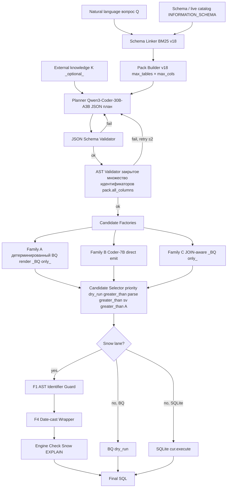

# 3.2.1 Архитектура агента — обзор единого стэка

## Главный тезис раздела

В работе используется **единая архитектура агента** (single architecture), применяемая ко всем пяти бенчмаркам (Spider 1.0 / BIRD / Spider2-Lite-BQ / Spider2-Snow / Spider2-DBT) без переключения core-логики. Lane-specific вариации локализованы в трёх точно очерченных местах:

1. **Engine validator** (`_bq_dry_run` vs `_snow_explain` vs `sqlite cur.execute`),
2. **Candidate factory mix** (Family A/C — только BQ; Family B — везде),
3. **Dialect post-processors** (`snow_identifier_guard_v27.py` + `snow_dialect_fixer_v28.py` — только Snow; v24 engine-compat rewrites — только BQ).

Всё остальное — schema linker, pack builder, planner-emitter decomposition, validators-suite, candidate selector, runner orchestration — общее. Это и есть техническое содержание Claim 1 защиты (см. [01_INTRODUCTION/04_thesis_contributions.md](../01_INTRODUCTION/04_thesis_contributions.md)).

## High-level pipeline

**Linear walkthrough (одна задача за раз):**

1. Schema linker получает вопрос $Q$ и live catalog (или packaged tables.json для Spider1/BIRD), возвращает top-K hits (column-level → table-level), упорядоченных BM25-score-ом.
2. Pack builder группирует hits по `(db, schema, table)`, выбирает top-$N$ таблиц, для каждой — top-$M$ колонок (по vary lane: 8×22 для Spider1/BIRD, 10×22 для Snow, 8×22-30 для BQ); создаёт compact JSON-friendly pack с side-channel `all_columns` per table для AST validator.
3. Planner (Qwen3-Coder-30B-A3B, BF16, ~60 GB VRAM) получает (pack, $Q$, $K$) и эмитит **plan-JSON** — структурированное описание SQL без самого SQL (выбранные tables, columns, metrics, filters, grouping, sorting). См. [05_planner_emitter_decomposition.md](./05_planner_emitter_decomposition.md) для полной спецификации формата.
4. JSON Schema Validator проверяет structural compliance plan-JSON.
5. AST Validator (наша имплементация на SQLGlot) проверяет, что каждый идентификатор в plan-JSON присутствует в `pack.all_columns`. Если не присутствует → один retry с feedback prompt (выявленные missing identifiers возвращаются в planner с инструкцией «выбери из <pack cols>»).
6. Candidate factories — три семейства (см. [06_candidate_factories_family_abc.md](./06_candidate_factories_family_abc.md)) — производят SQL-кандидаты. Family A применима только на BQ lane (deterministic renderer от plan-JSON в BQ Standard SQL); Family B — emitter Qwen2.5-Coder-7B на (plan, pack); Family C — JOIN-aware factory, тоже BQ-only (на Snow не реализована — это deferred Phase 30 territory).
7. Candidate selector ([08_candidate_selector.md](./08_candidate_selector.md)) выбирает финального кандидата по приоритету `dry_run_ok ≻ parse_ok ≻ schema_valid ≻ Family A tie-break`.
8. **Snow-only post-processing** (см. [09_dialect_handlers_f1_f4.md](./09_dialect_handlers_f1_f4.md)):
   - **F1 AST Identifier Guard**: walk SQL AST, reject если any `exp.Table.catalog ∉ {task_db}`; auto-fill missing catalog. Если SQLGlot fails to parse — **F4c regex fallback** возвращает SQL unchanged (pass-through to EXPLAIN).
   - **F4 Date-Cast Wrapper**: walk AST, оборачивает `exp.Column` внутри `Extract`/`TimestampTrunc`/`DateAdd`/etc. с `data_type ∈ {NUMBER*, VARIANT}` в `TO_DATE(TO_VARCHAR(x), 'YYYYMMDD')` или `x::DATE`.
9. Engine check — финальная валидация на real engine (BQ dry_run, Snow EXPLAIN, или SQLite execute). Возвращает `(ok: bool, error_class: str, error_msg: str)` для accounting.

Полная диаграмма с lane-specific branches — в [11_full_pipeline_diagram.md](./11_full_pipeline_diagram.md).

## Что shared, что lane-specific

| Компонент | Spider 1.0 | BIRD | Lite-BQ | Snow | DBT |
|---|---|---|---|---|---|
| **Schema linker BM25 (`schema_linking_v18.py`)** | shared | shared | shared | shared (+ per-task partitioning Phase 27) | not used — agent reads project files |
| **Pack builder (`schema_pack_builder_v18.py`)** | shared | shared | shared | shared (+ three-part rendering Phase 27, col:TYPE Phase 28) | not used — DBT context export |
| **Planner Qwen3-Coder-30B-A3B** | shared | shared | shared | shared | shared (с DBT-specific prompt) |
| **Emitter Qwen2.5-Coder-7B** | shared | shared | shared | shared | shared (multi-block emit для DBT) |
| **JSON Schema Validator** | shared | shared | shared | shared | not applicable — file edits |
| **AST Validator** (`_snow_schema_valid_ast`) | shared | shared | shared | shared (+ task_db catalog cols relaxation Phase 27) | not applicable |
| **Family A factory** | **not used** | not used | **used** | not implemented (Phase 30 territory) | not applicable |
| **Family B factory** | **used** (primary) | used (primary) | used | **used (only)** | shared (multi-block whole-file emit) |
| **Family C factory** | not used | not used | used (rarely chosen) | not implemented | not applicable |
| **Engine validator** | `sqlite3.cur.execute` | `sqlite3.cur.execute` | `BQ client.query(dry_run=True)` | `Snowflake EXPLAIN` | `dbt build` + table compare |
| **F1 AST guard** (Phase 27) | not used | not used | not used | **used** | not applicable |
| **F4 date-cast wrap** (Phase 28) | not used | not used | not used | **used** | not applicable |
| **F4c regex fallback** (Phase 28) | not used | not used | not used | **used** | not applicable |
| **v24 engine-compat rewrites** | not used | not used | **used** | not used | not applicable |

«Shared» — без модификации; «used» — активная компонента pipeline для этого lane.

## Принципы дизайна

### 1. Closed-set planning

Все три бенчмарка Spider 2.0 family (BQ/Snow/DBT) демонстрируют **идентифайер hallucination** как доминирующую failure mode на free SQL emission. План фиксирует **выбранные таблицы и колонки** и validator проверяет, что они лежат в pack — это **значительное снижение** error rate класса schema_invalid. Подробно — [05_planner_emitter_decomposition.md](./05_planner_emitter_decomposition.md).

### 2. Two models, two roles

Planner reasoning over schema (требует широкого context window и сильного reasoning) и emitter mechanical SQL generation (mechanical task, 7B Coder достаточно) разделены. Это **нетривиальное решение** — joint emit моделями 30B+ в литературе показывает иногда не худшие результаты, особенно на простых бенчмарках. Но на Spider 2.0 family decomposition необходим (план — это контракт, который мы можем валидировать против схемы, прежде чем тратить compute на эмиссию). См. [02_models_qwen3_qwen2.5.md](./02_models_qwen3_qwen2.5.md).

### 3. Layered validation

Три независимых валидатора (JSON schema → AST closed-set → engine dry_run) каждый ловит different class failures:
- JSON schema → structural malformation (rare),
- AST closed-set → identifier hallucination (dominant),
- engine dry_run → dialect runtime errors (NUMBER cast, LATERAL FLATTEN parse, unknown function).

Подробно — [07_validators_json_ast_engine.md](./07_validators_json_ast_engine.md).

### 4. Multi-candidate + tiebreak selector

Несколько factories производят SQL, selector выбирает лучшего. Это echoes идею **multi-path reasoning** в CHASE-SQL [Pourreza et al., ICLR 2025, arXiv 2410.01943] — но мы не тренируем preference-optimized selector (3-7B classifier как в CHASE-SQL), а используем priority order. Trade-off очевидный: проще, но менее адаптивно. Для bench-ов, где Family B доминирует (Spider 1.0, BIRD, Snow), это не блокирующее ограничение. См. [08_candidate_selector.md](./08_candidate_selector.md).

### 5. Live catalogs over packaged schemas

Spider 2.0 поставляет packaged `schemas.json` для каждого DB, но они не содержат точные имена колонок и data types — в особенности для Snow databases, где имена хранятся в lowercase quoted form (см. catalog probe finding в [06_EXPERIMENTAL_PROGRESSION/04_phase28_f2a_regression_and_revert.md](../06_EXPERIMENTAL_PROGRESSION/04_phase28_f2a_regression_and_revert.md)). Поэтому мы делаем единичный snapshot `INFORMATION_SCHEMA.COLUMNS` для каждого DB и используем его как ground truth: 587K columns для Snow, 428K columns для BQ. См. [03_schema_linker_v18_bm25.md](./03_schema_linker_v18_bm25.md).

### 6. Per-task partitioning (Phase 27 F1)

Critical для Snow lane: global BM25 над 587K-column catalog leaks competitor catalogs (cross-DB drift, 90.2% pre-Phase-27). Решение — для каждой задачи берётся subset catalog с `c.db.upper() == task_db.upper()`, и BM25 строится над этим subset (типично 5K-50K columns). Это **architectural fix**, не hyperparameter — encoded в `_phase27_snow_runner.py`. См. [03_schema_linker_v18_bm25.md](./03_schema_linker_v18_bm25.md).

## Архитектурные альтернативы, которые рассматривались и отвергнуты

### A1. Single-model joint emit (без decomposition)
Альтернатива: давать planner-у весь pack и эмитить SQL напрямую за один шаг. Был benchmark-обусловленным дефолтом в Phase 1-16 (когда использовалась одна модель Qwen-Coder). Отвергнуто в Phase 17-18 после observation, что free SQL emission на Spider 2.0 family даёт ~0% executable из-за identifier hallucination. Closed-set planning + validator-feedback retry — **минимально необходимая интервенция** для не-нулевого EX.

### A2. Single-step retrieval + LLM rerank (no separate schema linker)
Альтернатива: dump весь schema в planner context, дать модели выбрать relevant tables. Не масштабируется на Snow (587K columns не помещается ни в один доступный context window). BM25 ranking — необходимый external retriever.

### A3. Dense retrieval (BGE / E5 / ColBERT) вместо BM25
Альтернатива: использовать embedding-модель для retrieval. В литературе достижимый recall сравним с BM25 при тщательной calibration (см. [Maamari et al., arXiv 2408.07702, "The Death of Schema Linking?"] — argues BM25 sufficient at top-K=30). Не рассмотрено для production deployment из-за дополнительных compute requirements (embedding model + index storage). См. [02_RELATED_WORK/05_schema_linking_approaches.md](../02_RELATED_WORK/05_schema_linking_approaches.md).

### A4. Fine-tune Coder-7B на Spider1/BIRD train set
Альтернатива: SFT эмиттера. Отвергнуто принципиально (constraint работы — no SFT). Известный результат CodeS-15B fine-tuned даёт 84.9% на Spider1 dev, но на Spider2-Lite — 0.73% (transferability failure), см. research dossier section 4.

### A5. Multi-agent framework (CHESS / MAC-SQL style)
Альтернатива: separate agents (decomposer, schema linker, refiner) coordinating через messages. CHESS [Talaei et al., arXiv 2405.16755] и MAC-SQL [Wang et al., COLING 2025, arXiv 2312.11242] показывают значительные lift на Spider1/BIRD. Наша архитектура — **single-pass pipeline**, не agent loop. Это сознательное упрощение: упрощает orchestration и отладку. Phase 29 F3 self-refine — **минимальное** расширение в сторону agent-style (одна self-refine на schema_invalid signal); полный multi-agent заложен в Phase 31+.

## Где Phase 27 F1 и Phase 28 F4/F4c вошли в архитектуру

Phase 27 F1 и Phase 28 F4/F4c — это не отдельные components, а **patches к нескольким shared components**:

| Phase | Что добавлено | Куда |
|---|---|---|
| Phase 27 F1 | per-task partitioning by TABLE_CATALOG | `schema_linking_v18.SchemaLinker.__init__` (per-task subset) |
| Phase 27 F1 | three-part name rendering for Snow | `schema_pack_builder_v18.pack_to_planner_prompt` |
| Phase 27 F1 | AST Identifier Guard | new module `snow_identifier_guard_v27.py` |
| Phase 27 F1 | PK/FK heuristic injection | `_inject_pk_fk` в `_phase27_snow_runner.py` |
| Phase 27 F1 | retrieval window scaling (Snow) | params в `_phase27_snow_runner.py` |
| Phase 27 F1 | validator relaxation (Snow) | extra_allowed_cols arg в `_snow_schema_valid_ast` |
| Phase 28 F4 | NUMBER/VARIANT date cast wrap | new module `snow_dialect_fixer_v28.py` |
| Phase 28 F4c | regex fallback on SQLGlot parse error | `snow_identifier_guard_v27._regex_catalog_leak_check` |
| Phase 28 (closure) | periodic file close+reopen | `_phase27_snow_runner.py` (Drive FUSE sync) |
| Phase 28 (closure) | resume scaffolding | `_phase27_snow_runner.py` (read existing predictions, skip done iids) |

Это иллюстрирует **layered architecture** в действии: F1 и F4/F4c добавляют функциональность поверх shared core, не переписывая её.

## Уровень compute и timing

Все runs выполнялись на **Google Colab Pro+ A100 80 GB** (1 GPU на kernel). Параллелизация — через multiple Colab kernels (S1/S2/S3), не GPU sharding.

| Phase / lane | Wall time на 1 задачу | Models на VRAM |
|---|---|---|
| Spider 1.0 / BIRD (SQLite) | ~30-60s | Coder-7B emitter only (no planner — direct emit) для simple lane; full stack ~150s |
| Spider2-Lite-BQ | ~90-150s | full stack ~76 GB VRAM |
| Spider2-Snow | ~70-120s | full stack ~76 GB VRAM |
| Spider2-DBT | ~5-15 min per task (multi-file edits) | full stack |

Throughput Snow lane: ~0.7-0.8 tasks/min. FULL 547 ≈ 10-12h wall. См. [10_execution_engines.md](./10_execution_engines.md) для детального discussion timings.

## Ссылки

- Детальный планирование/эмиссию-decomposition в [05_planner_emitter_decomposition.md](./05_planner_emitter_decomposition.md)
- Полная Mermaid диаграмма с lane-specific branches в [11_full_pipeline_diagram.md](./11_full_pipeline_diagram.md)
- Spider 2.0 challenges и почему они motivate этот architecture в [01_INTRODUCTION/01_problem_statement.md](../01_INTRODUCTION/01_problem_statement.md) §1.1.4
- Implementation details schema linker в [08_CUSTOM_TOOLS/02_schema_linker_v18.md](../08_CUSTOM_TOOLS/02_schema_linker_v18.md)
- Implementation details pack builder в [08_CUSTOM_TOOLS/01_schema_pack_builder_v18.md](../08_CUSTOM_TOOLS/01_schema_pack_builder_v18.md)

## Источники для этого раздела

| Утверждение | Источник |
|---|---|
| Single architecture применяется ко всем 5 бенчмаркам | `outputs/REPORT_PHASE26_RESEARCHER_HANDOFF.md` §2 "Architecture used" |
| Phase 27 F1 = per-task partition + three-part names + AST guard | `outputs/REPORT_PHASE27_F1_SNOW_GROUNDING.md` §2 |
| Phase 28 F4 + F4c | `outputs/REPORT_PHASE28_F2A_F4_DIALECT.md` §2 |
| BM25 sufficient at top-K=30 | Maamari et al., arXiv 2408.07702 — research dossier section 4 |
| CodeS-15B SFT — 84.9% Spider1, 0.73% Spider2-Lite | `outputs/REPORT_PHASE27_RESEARCHER_STRATEGY.md` §4 |
| Identifier hallucination dominant на Spider2 | `outputs/REPORT_PHASE28_F2A_F4_DIALECT.md` §10 per-task table |
