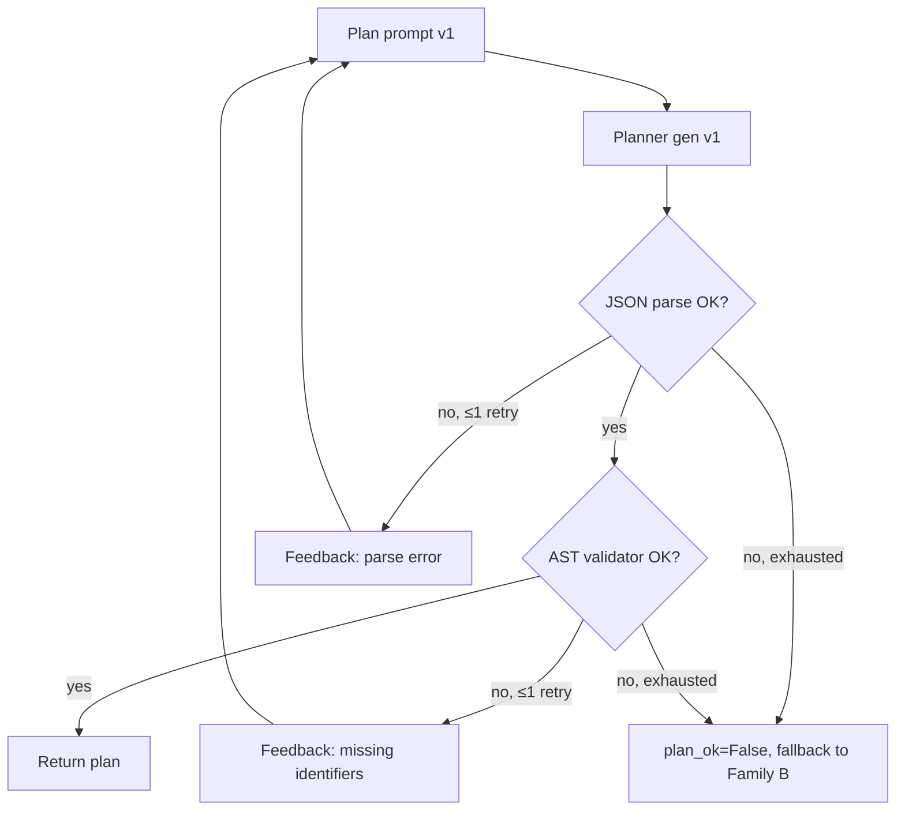

# 3.2.5 Декомпозиция Planner ↔ Emitter

## Главный тезис

Архитектура использует **two-stage decomposition**: сначала **planner** (Qwen3-Coder-30B-A3B) производит **structured JSON plan**, потом **emitter** (Qwen2.5-Coder-7B) рендерит SQL по плану + pack. Между ними — **JSON Schema Validator** + **AST closed-set validator** + **one-shot feedback retry**, превращающие plan в проверяемый контракт.

Эта декомпозиция — **необходимое условие** для не-нулевого EX на Spider 2.0 family. Free SQL emission один-моделью даёт ~0% executable на Spider2-Lite-BQ и Spider2-Snow до Phase 17-18, потому что доминирующая failure mode — **identifier hallucination**: модель выдаёт column / table имя которого нет в схеме. Plan-JSON фиксирует выбор identifier-ов **до** генерации SQL, позволяя validator-у отклонить нелегитимные выборы и запросить переплан.

На Spider 1.0 / BIRD decomposition даёт **−0.033 EX** (small regression) — эти бенчмарки достаточно простые, что direct emit лучше; план overkill. На Spider 2.0 family decomposition необходим. Это **lane-specific trade-off**, и мы документируем его, не унифицируем.

## Plan-JSON формат

Schema плана определена в `repo/src/evaluation/structured_plan_v18.py` (используется JSON Schema validation):

```json
{
  "selected_database": "PATENTS",
  "selected_schema": "PATENTS",
  "selected_tables": ["PUBLICATIONS", "DISCLOSURES_13"],
  "selected_columns": ["family_id", "publication_number", "country_code", "grant_date"],
  "metrics": [
    {"label": "active_assignees", "expr": "COUNT(DISTINCT assignee_harmonized)"}
  ],
  "filters": [
    {"expr": "grant_date BETWEEN 2010 AND 2018", "explanation": "..."}
  ],
  "time_constraints": ["2010-2018"],
  "grouping": ["country_code", "year"],
  "sorting": [{"expr": "active_assignees", "dir": "desc"}],
  "limit": null,
  "ambiguity_points": [
    "task didn't specify whether to include withdrawn applications"
  ],
  "expected_shape": "one row per (country, year) with active assignee count"
}
```

Ключевые поля:

| Field | Type | Mandatory | Purpose |
|---|---|---|---|
| `selected_database` | str | yes | Project / catalog name (must be in pack.databases) |
| `selected_schema` | str | yes | Dataset / schema name (must be in pack.databases[*].schemas) |
| `selected_tables` | list[str] | yes | Bare table names или wildcard family base |
| `selected_columns` | list[str] | yes | Column names или struct paths |
| `metrics` | list[dict] | optional | Aggregated metric expressions |
| `filters` | list[dict] | optional | WHERE-clauses |
| `time_constraints` | list[str] | optional | Free-form date ranges |
| `grouping` | list[str] | optional | GROUP BY expressions |
| `sorting` | list[dict] | optional | ORDER BY expressions |
| `limit` | int / null | optional | LIMIT clause |
| `ambiguity_points` | list[str] | optional | Disambiguation notes — diagnostic only |
| `expected_shape` | str | optional | Description of expected output |

Все identifier-fields (`selected_tables`, `selected_columns`, expressions в metrics/filters/etc.) — должны лежать в `pack.tables[*]` либо быть wildcard family base. Это **closed-set constraint**.

## Planner prompt

Полная prompt rendered через `schema_pack_builder_v18.pack_to_planner_prompt(pack, question, external_knowledge)`. Структура:

```
You are an extractive SQL planner. Answer ONLY in JSON.
Lane: {snow | lite_snow | bq}.
{Spider2 alias: PATENTS}     ← только для Snow lane

Available identifiers (closed set; do NOT introduce any others):
  - `PATENTS.PATENTS.PUBLICATIONS` columns=[publication_number:TEXT, family_id:TEXT, ...]
  - `PATENTS.PATENTS.DISCLOSURES_13` columns=[serial_cleaned:TEXT, ...]
  - ... up to max_tables tables

Wildcard table families (prefer these over individual date shards;
use _TABLE_SUFFIX BETWEEN 'YYYYMMDD' AND 'YYYYMMDD'):
  - `BQ-project.dataset.events_*`  (sample: events_20231215)

External knowledge:
{K если предоставлено}

Snowflake SQL rules: (только для Snow lane)
- ALWAYS use three-part identifiers: DATABASE.SCHEMA.TABLE.
- Available database: PATENTS.
- ...

Question: {Q}

Return ONE JSON object with this shape:
{ "selected_database": "...", ... }
RULES:
- Every identifier in selected_tables, selected_columns, ... MUST appear under one of the listed tables OR be a wildcard family base name.
- ...
- Output JSON only. No prose, no fences.
```

## Validator pipeline

После planner output — three-stage validation:

### 1. JSON Schema Validator

Парсит planner output как JSON. Если parse fails или required fields missing — feedback prompt:

```
Your previous response failed JSON parse: {error}.
Please re-emit valid JSON matching the required schema.
```

Один retry с этим feedback. Если retry тоже fails — `plan_ok = False`, task попадает в Family B direct-emit path (planner-less fallback).

### 2. AST Closed-Set Validator

Парсит SQL-like portions plan-JSON (metrics, filters expressions) через SQLGlot и checks:

```python
def validate_plan(plan, pack):
    # 1. selected_tables ⊆ pack.tables[*].table
    # 2. selected_columns ⊆ ⋃ pack.tables[*].all_columns (with field_path support)
    # 3. expressions parse cleanly
    # 4. identifiers in expressions also ⊆ pack
    # Return Validation(ok, reasons=[list of failures])
```

Если fails:

```
Validation failed: column 'foo' not found in any of the listed tables.
Available columns: [family_id, publication_number, ...].
Please re-emit valid JSON.
```

Один retry. Если retry тоже fails — `plan_ok = False`, fallback в Family B direct-emit.

### 3. Engine Validator

После SQL generation (см. [06_candidate_factories_family_abc.md](./06_candidate_factories_family_abc.md)) — финальная engine check: dry_run / EXPLAIN / execute. Уже SQL-level, не plan-level.

Все три validator describe в [07_validators_json_ast_engine.md](./07_validators_json_ast_engine.md).

## Cost decomposition vs direct emit

Phase 17 ablation (см. memory `spider2_phase17_findings.md` и Phase 18 v18 evaluation runs):

| Bench | Direct emit (Coder-7B) | Plan→Emit (30B planner + 7B emitter) | Δ |
|---|---|---|---|
| Spider 1.0 dev | ~94.0% EX | ~93.7% EX | −0.033 EX |
| BIRD mini-dev | ~91% EX | ~90.4% EX | small negative |
| BIRD FULL dev | ~88-89% EX | 87.9% EX | flat or small negative |
| Spider2-Lite-BQ pilot10 (Phase 17) | 5/10 (Coder-7B) | similar | flat (early phase) |
| Spider2-Lite-BQ pilot10 (Phase 19) | n/a | 3/10 schema_valid + 3/10 dry_run | first non-zero |
| Spider2-Snow pilot10 (Phase 17-26) | ~0% | ~0% | both fail на cross-DB drift, fixed Phase 27 |

**Главный вывод**: decomposition cost ≈ −3% EX на простых SQLite-based bench-ах, mandatory benefit (non-zero EX) на Spider 2.0 family.

**Hypothesis for trade-off**: на Spider 1.0 / BIRD задачи в среднем — 1-2 table joins, simple WHERE clauses, normalized schema. Coder-7B уже близок к Bayes-optimal на этом — добавление planner вносит lossy translation step (plan → SQL re-emit) что иногда теряет detail. На Spider 2.0 schemas сложные, identifier hallucination доминирует — planner-decomposition нужен.

**Mitigation идея** (NOT реализованная — Phase 30 territory): **complexity router**, который оценивает «сложно ли это» по эвристикам (n_tables в pack, nature of question, presence of JOINs / aggregations) и переключает между direct-emit и plan→emit. Не реализован — обоснованное упрощение, поскольку direct-emit для Spider1/BIRD легко руками bypass-ить (Family B без planner output).

## Feedback retry mechanism

Полный flowchart:



Hardcoded `max_attempts=2` в `_v18_plan` (см. `tools/remote_scripts/_phase27_snow_runner.py:_v18_plan` lines 301-315).

```python
def _v18_plan(prompt, pack, max_attempts=2):
    last_plan = None; last_val = None
    cur = prompt
    for attempt in range(1, max_attempts + 1):
        raw = _gen_planner(cur)
        try: cand = sp.parse_plan(raw)
        except Exception: continue
        v = sp.validate_plan(cand, pack)
        last_plan = cand; last_val = v
        if v.ok:
            return {'plan': cand, 'validation': v, 'raw': raw, 'attempts': attempt}
        if attempt < max_attempts:
            cur = sp._retry_prompt(prompt, v.reasons, cand)
    return {'plan': last_plan, 'validation': last_val, 'raw': '', 'attempts': max_attempts}
```

## Emitter prompt

После plan validation — emitter получает Direct prompt (для Snow lane, см. `tools/remote_scripts/_phase27_snow_runner.py:_snow_direct_prompt`):

```
You are a SQL expert. Write a single Snowflake SQL query.
Use ONLY tables/columns from the schema below.

Snowflake rules:
- ALWAYS three-part identifiers: PATENTS.SCHEMA.TABLE
- Available database for this query: PATENTS.
- Do NOT reference any other database.
- Quote mixed-case identifiers: "ParticipantBarcode".
- Use LATERAL FLATTEN(INPUT => col), NOT UNNEST.
- Use IFF(c,a,b) or CASE WHEN. QUALIFY for window-row filter.
- Date arithmetic on non-DATE columns requires explicit cast:
  NUMBER (e.g. YYYYMMDD int) -> TO_DATE(TO_VARCHAR(col), 'YYYYMMDD')
  VARIANT -> col::DATE; JSON path: col:field::DATE
  Column types are shown as col:TYPE after each name in the schema below.

Schema:
  PATENTS.PATENTS.PUBLICATIONS: family_id:TEXT, publication_number:TEXT, ...

Question: {Q}

Return only SQL inside ```sql ... ``` block.
```

Note: emitter prompt **не получает plan-JSON напрямую**. План валидирован, и emitter получает тот же pack + question + dialect rules. Этот pattern (план → re-emit от того же pack) — **simplification**, упрощает orchestration but loses information from plan structure.

Альтернативный design (NOT used): emitter получает plan-JSON и рендерит SQL вокруг него (template substitution). Это approach Family A (`spider2_candidate_factory_v18.py`), но только для BQ; для Snow / SQLite не реализован. См. [06_candidate_factories_family_abc.md](./06_candidate_factories_family_abc.md).

## SQL extraction

Emitter output — free-form text. Extraction через `_extract_sql`:

```python
def _extract_sql(raw):
    # Find ```sql ... ``` block
    m = re.search(r'```sql\s*(.*?)\s*```', raw, re.IGNORECASE | re.DOTALL)
    if m: return m.group(1).strip()
    # Fallback: ``` ... ```
    m = re.search(r'```\s*(.*?)\s*```', raw, re.DOTALL)
    if m: return m.group(1).strip()
    # Last resort: SELECT ... ;
    m = re.search(r'(SELECT.+?;)', raw, re.IGNORECASE | re.DOTALL)
    if m: return m.group(1).strip()
    return raw.strip()
```

Robust к различным emitter output formats. Empirically Qwen2.5-Coder-7B consistently выдаёт `` ```sql `` block.

## Связь с literature

Наш подход — **single-pass plan-then-emit**, ближе всего к:

- **DTS-SQL** [Pourreza & Rafiei, EMNLP-F 2024, arXiv 2402.01117] — two-stage decomposition (schema linking → SQL gen) для small LLMs. Achieves 79.9% на Spider 1.0 с CodeLlama-13B fine-tuned. Confirms что decomposition помогает small models (наш emitter — 7B).

- **MAC-SQL** [Wang et al., COLING 2025, arXiv 2312.11242] — multi-agent с decomposer + selector + refiner agents. Более сложный setup, но same general idea: plan-then-execute pattern.

- **DIN-SQL** [Pourreza & Rafiei, NeurIPS 2023, arXiv 2304.11015] — decomposed in-context learning. Ablation finding: *"decomposed CoT hurts easy queries"* — это same observation что наш −0.033 EX на Spider 1.0.

**Где мы отличаемся** от DIN-SQL/DTS-SQL: они используют один LLM для обеих стадий (typically GPT-4 в DIN-SQL, fine-tuned CodeLlama в DTS-SQL). Мы используем **разные модели** для planner (30B) и emitter (7B), потому что задачи разные (reasoning vs mechanical generation) и compute budget разный (planner runs on prompt, emitter runs on output длина).

## Limitations

### L1. Single retry — может не быть достаточно
`max_attempts=2` фиксировано. На сложных задачах одного retry feedback недостаточно. ReFoRCE-style multi-round refinement (Phase 29 F3 territory) — natural extension.

### L2. Plan information loss
Emitter не видит plan-JSON; получает тот же pack + question. Plan information lossy. Family A factory (BQ-only) использует plan напрямую — но дав плану full execution path, мы теряем generality. Trade-off проявляется на BQ lane: Family A vs Family B output sometimes сильно different для одной задачи.

### L3. JSON Schema validation — structure, не semantics
JSON validator не понимает, что `metrics.expr` должен быть valid SQL expression. AST validator парсит expression через SQLGlot — но иногда expressions, валидные для SQLGlot dialect (`'bq'`), не валидны для production engine (специфичный BQ Standard SQL extension). Engine validator финально catches это, но wastes compute на entire emit cycle.

### L4. No complexity router
Phase 1-17 default — direct emit. Phase 18+ — plan→emit. Никакой dynamic routing. Перенос между approaches — manual code edit. Это **acceptable** для thesis scope, но не для production.

## Cross-references

- Implementation планировщика: [08_CUSTOM_TOOLS/04_validators_suite.md](../08_CUSTOM_TOOLS/04_validators_suite.md)
- Family A/B/C details: [06_candidate_factories_family_abc.md](./06_candidate_factories_family_abc.md)
- Models specifics: [02_models_qwen3_qwen2.5.md](./02_models_qwen3_qwen2.5.md)
- Phase 18 closed-set planning intro: [06_EXPERIMENTAL_PROGRESSION/01_early_phases_overview.md](../06_EXPERIMENTAL_PROGRESSION/01_early_phases_overview.md)
- Phase 27 changes к planner prompt (three-part names): [06_EXPERIMENTAL_PROGRESSION/03_phase27_f1_grounding.md](../06_EXPERIMENTAL_PROGRESSION/03_phase27_f1_grounding.md)
- DTS-SQL / MAC-SQL / DIN-SQL: [02_RELATED_WORK/02_sota_systems_2024_2026.md](../02_RELATED_WORK/02_sota_systems_2024_2026.md)

## Источники

| Утверждение | Источник |
|---|---|
| Plan-JSON schema | `repo/src/evaluation/structured_plan_v18.py` |
| `_v18_plan` retry logic | `tools/remote_scripts/_phase27_snow_runner.py` lines 301-315 |
| Direct emit prompt (Snow) | `tools/remote_scripts/_phase27_snow_runner.py` lines 220-259 |
| `_extract_sql` | `tools/remote_scripts/_phase27_snow_runner.py` lines 78-93 |
| −0.033 EX cost on Spider 1.0 | memory `spider2_phase17_findings.md`; `outputs/REPORT_PHASE26_RESEARCHER_HANDOFF.md` §3 |
| DIN-SQL «decomposed CoT hurts easy queries» | Pourreza & Rafiei, NeurIPS 2023, arXiv 2304.11015 |
| DTS-SQL two-stage decomposition | Pourreza & Rafiei, EMNLP-F 2024, arXiv 2402.01117 |
| MAC-SQL multi-agent | Wang et al., COLING 2025, arXiv 2312.11242 |
