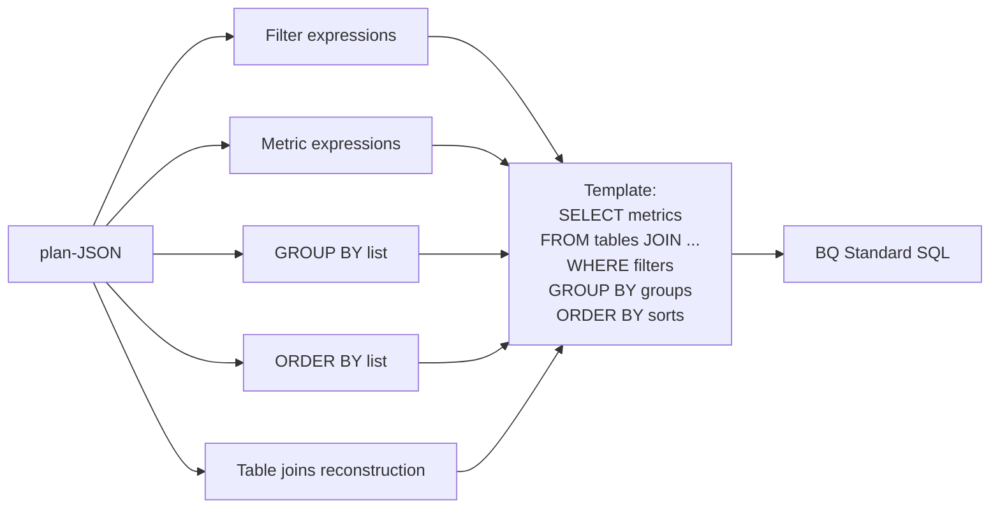
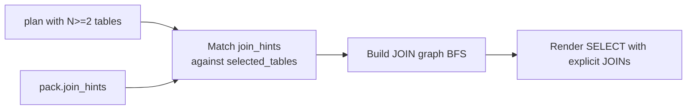

# 3.2.6 Candidate Factories — Family A / B / C

## Главный тезис

После того, как planner успешно построил plan-JSON, pipeline производит **set SQL-кандидатов** через **candidate factories** — модули, каждый из которых рендерит plan-JSON + pack в SQL по своей стратегии. Затем `candidate_selector_v18` выбирает финальный SQL по приоритетной схеме (`dry_run_ok ≻ parse_ok ≻ schema_valid ≻ Family A tie-break`).

Три семейства:

| Family | Strategy | Lane availability | Typical role |
|---|---|---|---|
| **Family A** | Деterministic template rendering plan-JSON → BQ Standard SQL | **BQ only** | Primary candidate на Lite-BQ lane; ensures BQ-specific syntax |
| **Family B** | Direct LLM emit (Coder-7B) с pack + question prompt | **All lanes** | Universal fallback; primary на Spider1/BIRD/Snow lanes (где Family A не реализован) |
| **Family C** | JOIN-aware deterministic factory с FK inference из `pack.join_hints` | **BQ only** | Activated на multi-table queries; rarely chosen by selector |

Семейства **не взаимоисключающие** — на BQ lane все три производят кандидата, selector выбирает best. На Snow lane — только Family B. На Spider1/BIRD — только Family B (planner вообще можно bypass, см. [05_PIPELINES/01_spider1_pipeline.md](../05_PIPELINES/01_spider1_pipeline.md)).

Файл реализации: `repo/src/evaluation/spider2_candidate_factory_v18.py` (~700+ lines, lots of BQ-specific renderer code).

## Family A: Deterministic BQ Render

### Strategy

Plan-JSON → BQ Standard SQL via **rule-based template substitution**. Не использует LLM на этой стадии. Идея: planner уже сделал все semantic decisions; SQL — mechanical formatting.

Pseudo-flowchart:



### Особенности рендера (BQ-specific)

- **Three-part name rendering**: `project.dataset.table`. Используется `pack.alias` если присутствует, иначе `pack.tables[0].db`.
- **Wildcard table support**: если `selected_tables` содержит wildcard family (`events_*`), рендер использует `_TABLE_SUFFIX BETWEEN`.
- **Nested column path** (struct-typed BQ columns): `hits.product.productRevenue` → `t1.hits.product.productRevenue` после alias substitution.
- **UNNEST для arrays**: BQ array iteration через `UNNEST(table.array_col) AS x`.
- **Date literals**: `DATE '2023-12-15'`, не `'2023-12-15'` (без cast — BQ строгая на типах).

### v24 engine-compat rewrites (Phase 24)

Phase 24 добавил A4 layer — **engine-compatibility post-processor** для Family A output. Перед dry_run, SQL проходит через `_apply_v24_rewrites`:

```python
# v24 rewrites (BQ only):
# 1. ARRAY_CONTAINS(arr, val) → EXISTS (SELECT 1 FROM UNNEST(arr) AS x WHERE x = val)
# 2. NTH(arr, n) → arr[OFFSET(n-1)]
# 3. Multi-level UNNEST flattening (LATERAL nested → SAFE_OFFSET)
# 4. Nested aggregate flag (refuses if AGG inside AGG)
# 5. Window + GROUP BY incompatibility flag
# 6. AND-on-int wrap (BQ requires BOOL не int)
```

Phase 24 closure (`outputs/REPORT_SPIDER2_PHASE24_LITE_BQ.md`) показал: A4 rewrites — **metric-neutral на pilot50 v24** (sv 54% / exec 44%, same as v22 pre-rewrites). Это интервенция без ROI на ours test set, но **legitimate insurance** на FULL — некоторые individual задачи могли бы упасть на ARRAY_CONTAINS без rewrite.

### Code excerpt (упрощённо)

```python
# spider2_candidate_factory_v18.py:render_family_a (simplified)
def render_family_a(plan, pack):
    db = plan['selected_database']
    schema = plan['selected_schema']
    tables = plan['selected_tables']
    cols = plan['selected_columns']
    metrics = plan.get('metrics', [])
    filters = plan.get('filters', [])
    grouping = plan.get('grouping', [])
    sorting = plan.get('sorting', [])
    limit = plan.get('limit')

    # Render SELECT clause
    select_parts = []
    for c in cols: select_parts.append(c)
    for m in metrics: select_parts.append(f"{m['expr']} AS {m['label']}")
    
    # Render FROM clause (single-table or simple INNER JOIN)
    from_clause = render_from(tables, pack)
    
    # Render WHERE, GROUP BY, ORDER BY, LIMIT
    where_clause = ' AND '.join(f['expr'] for f in filters)
    group_clause = ', '.join(grouping)
    order_clause = ', '.join(f"{s['expr']} {s['dir']}" for s in sorting)
    
    sql = f"SELECT {', '.join(select_parts)}\nFROM {from_clause}"
    if where_clause: sql += f"\nWHERE {where_clause}"
    if group_clause: sql += f"\nGROUP BY {group_clause}"
    if order_clause: sql += f"\nORDER BY {order_clause}"
    if limit: sql += f"\nLIMIT {limit}"
    
    return sql
```

Full implementation — 200+ lines including wildcard handling, nested column resolution, JOIN ON reconstruction. См. [08_CUSTOM_TOOLS/03_candidate_factories.md](../08_CUSTOM_TOOLS/03_candidate_factories.md).

### Trade-offs Family A

| Pro | Con |
|---|---|
| Deterministic (reproducible) | Cannot handle queries with subqueries / window functions (template rigid) |
| Fast (no LLM call) | Limited expressiveness — many BQ queries require ad-hoc SQL гибкость |
| Always produces BQ-specific syntax | Lane-specific (BQ only; Snow renderer not implemented) |
| Plan-faithful (no information loss) | Plan must be very detailed; if planner missed something, Family A can't recover |

### Почему Family A не существует для Snow

Реализовать `render_family_a_snow` потребовало бы Snowflake-specific templates: `LATERAL FLATTEN`, `IFF` vs `IIF`, `QUALIFY`, JSON path syntax (`payload:user.name::STRING`), VARIANT handling. Это **не trivial**, и не реализовано — deferred Phase 30 territory.

Альтернатива на Snow lane — Family B alone. Phase 28 closure (4/10 exec на pilot10 v28-revert-A) показал, что Family B + F1 grounding + F4 wrap достаточны для **первого publishable Snow number**. Family A Snow остаётся как future optimization.

## Family B: Direct LLM Emit

### Strategy

Эмиттер Qwen2.5-Coder-7B принимает (pack, question, plan-JSON) и эмитит SQL за один LLM call.

На Snow lane (`tools/remote_scripts/_phase27_snow_runner.py:_snow_direct_prompt`) prompt используется без plan-JSON (только pack + question + dialect rules) — это упрощение, теряющее plan information, но и не имеющее information leakage из plan-JSON в SQL. На BQ lane Family B получает plan-JSON в prompt в качестве hint.

### Преимущества

- **Universal**: работает на всех lanes (Spider1/BIRD/BQ/Snow).
- **Flexible**: эмиттер может производить сложные SQL constructions (subqueries, CTEs, window functions, complex JOINs).
- **No template maintenance**: не нужно поддерживать deterministic renderer per dialect.

### Недостатки

- **Non-deterministic**: temperature ~0.3, но всё ещё некоторая variation.
- **Identifier hallucination risk**: SQL может содержать references на columns не в pack.
- **Slow**: ~10-30s per emit на Coder-7B (vs Family A — <100ms).

### Использование

- **Spider 1.0 / BIRD**: Family B — единственный (planner вообще можно bypass).
- **Spider2-Lite-BQ**: Family A primary, Family B fallback / multi-candidate.
- **Spider2-Snow**: Family B only.
- **Spider2-DBT**: Family B multi-block emit (Coder-7B emits целые files; затем agent applies diffs).

## Family C: JOIN-aware Deterministic

### Strategy

Variant Family A, **специально для multi-table queries**. Использует `pack.join_hints` для inference JOIN-key пар.



### Inference logic

```python
def find_join_path(tables, join_hints):
    # BFS over join_hints edges
    edges = [(h['left_table'], h['right_table'], h.get('on'))
             for h in join_hints]
    # Find spanning tree connecting all `tables`
    # If multiple paths possible, prefer one with `fk_like_naming` reason over `shared_column_name_with_key_shape`
    ...
```

### Empirical observation Phase 22 audit

Phase 22 (`outputs/REPORT_SPIDER2_V22.md`) ввёл Family C с **predicted +20pp EX** на pilot50 Lite-BQ. Actual delta: +4pp. Главная причина: **Family C почти не выбирается selector-ом**, потому что её candidate often fails AST validator (join hints — heuristic, не perfect FK metadata — generates expressions with random shared columns как JOIN ON). Selector predicates `dry_run_ok ≻ parse_ok ≻ schema_valid` — Family C output на schema_invalid с join_on column не в pack drops в selector ordering.

**Phase 30 territory** — replace heuristic join hints с real FK inference (e.g., parse PK/FK metadata из catalog когда доступен; BFS over real edges, не just heuristic edges). См. [09_RESULTS_ANALYSIS/06_failure_analysis_remaining.md](../09_RESULTS_ANALYSIS/06_failure_analysis_remaining.md).

### Когда Family C полезен

На задачах с 3+ JOINs где join graph не очевиден из question text. Family B emitter может пропустить JOIN (хотя оба table в plan); Family C deterministically ensures JOIN присутствует.

## Selector integration

После factories produced (3 candidates на BQ, 1 на Snow / Spider1 / BIRD), candidate_selector_v18 (см. [08_candidate_selector.md](./08_candidate_selector.md)) выбирает финального.

Priority (нативно на BQ):
1. `dry_run_ok` (на dry_run без error)
2. `parse_ok` + dry_run_fail (parses, но dry_run reports error)
3. `schema_valid` + parse_fail (AST validator pass, но SQLGlot не парсит — unusual case)
4. Family A tie-break (если equal qualities, prefer Family A для consistency)

## Multi-candidate scoring vs preference-learned

Наш подход — **простой priority order**, не trained ranker.

| Approach | Pro | Con |
|---|---|---|
| **Простой priority (ours)** | Trivial implement, reproducible, no training data needed | Cannot learn task-specific preferences |
| **Self-consistency voting (DAIL-SQL)** | Improves Spider1 ~0.4%, BIRD ~1% per research dossier | Requires multiple LLM calls на task |
| **Trained ranker (CHASE-SQL)** | +3-5 EX над simple voting | Requires labeled selection data (which candidate produced correct execution) |

CHASE-SQL [Pourreza et al., ICLR 2025, arXiv 2410.01943] trains 7B selector model that outperforms voting by 3-5 EX. Для нашего research scope это **out of scope** (additional training data + compute), но direction для future work.

## Cross-references

- Implementation details: [08_CUSTOM_TOOLS/03_candidate_factories.md](../08_CUSTOM_TOOLS/03_candidate_factories.md)
- Selector logic: [08_candidate_selector.md](./08_candidate_selector.md)
- Phase 22 introduction Family C: [06_EXPERIMENTAL_PROGRESSION/01_early_phases_overview.md](../06_EXPERIMENTAL_PROGRESSION/01_early_phases_overview.md)
- Phase 24 v24 engine-compat rewrites: same file
- Snow F4 wrap (post-Family-B): [09_dialect_handlers_f1_f4.md](./09_dialect_handlers_f1_f4.md)
- BQ-specific dialect handling: [05_PIPELINES/03_spider2_lite_bq_pipeline.md](../05_PIPELINES/03_spider2_lite_bq_pipeline.md)
- DBT multi-block emit: [05_PIPELINES/05_spider2_dbt_pipeline.md](../05_PIPELINES/05_spider2_dbt_pipeline.md)
- Self-consistency / CHASE-SQL alternatives: [02_RELATED_WORK/02_sota_systems_2024_2026.md](../02_RELATED_WORK/02_sota_systems_2024_2026.md)

## Источники

| Утверждение | Источник |
|---|---|
| Family A/B/C structural | `outputs/REPORT_PHASE26_RESEARCHER_HANDOFF.md` §2 |
| Phase 24 A4 engine-compat rewrites metric-neutral | `outputs/REPORT_SPIDER2_PHASE24_LITE_BQ.md` |
| Phase 22 Family C +4pp not +20pp | `outputs/REPORT_SPIDER2_V22.md`; memory `spider2_phase22_findings.md` |
| Family A reconfigurable structure | `repo/src/evaluation/spider2_candidate_factory_v18.py` |
| CHASE-SQL trained selector +3-5 EX | research dossier §4 |
| DAIL-SQL self-consistency +0.4 Spider1 / +1 BIRD | research dossier §4 |
