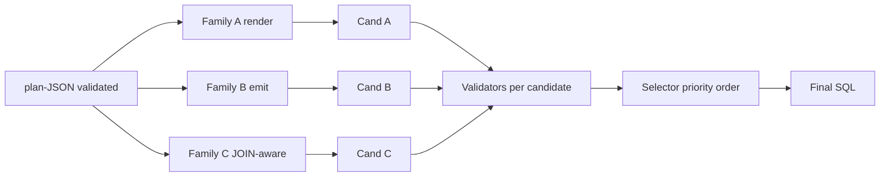

# 3.2.8 Candidate Selector

## Главный тезис

`candidate_selector_v18` — компонент, выбирающий **финальный SQL** из набора кандидатов, произведённых Family A / B / C factories. Логика — **priority order по validator outcomes**: `dry_run_ok ≻ parse_ok ≻ schema_valid ≻ Family A tie-break`. Не trained ranker, не self-consistency voting — простой rule-based priority.

Файл: `repo/src/evaluation/candidate_selector_v18.py` (~150 lines).

## Алгоритм

```python
def select(candidates, *, lane='bq'):
    """Pick the best candidate by priority.

    Args:
        candidates: list[dict], each with keys:
            - 'sql': str
            - 'family': 'A' | 'B' | 'C'
            - 'parse_ok': bool
            - 'schema_valid': bool
            - 'dry_run_ok': bool (BQ) / 'explain_ok': bool (Snow)
            - 'dry_run_err' / 'explain_err': str
        lane: 'bq' / 'snow' / 'sqlite'

    Returns:
        Best candidate (dict).
    """
    # Priority groups (best first):
    P1 = [c for c in candidates if c.get('dry_run_ok') or c.get('explain_ok')]
    P2 = [c for c in candidates if c.get('parse_ok') and not (c.get('dry_run_ok') or c.get('explain_ok'))]
    P3 = [c for c in candidates if c.get('schema_valid') and not c.get('parse_ok')]
    P4 = candidates  # fallback all

    for group in [P1, P2, P3, P4]:
        if group:
            return tie_break(group)
    return None

def tie_break(group):
    # Family A preferred (deterministic, faithful to plan)
    for c in group:
        if c.get('family') == 'A':
            return c
    # Otherwise first in group order (typically Family B then C)
    return group[0]
```

## Priority rationale

| Priority | Reason |
|---|---|
| P1 `engine_ok` | SQL passes real engine — strongest signal of correctness |
| P2 `parse_ok` (без engine_ok) | SQL well-formed, но engine reject (dialect quirk / unknown function) — может быть fixable downstream |
| P3 `schema_valid` (без parse_ok) | Validator passed но SQLGlot can't parse — unusual case, usually means SQL contains dialect-specific construct SQLGlot doesn't handle |
| P4 fallback any candidate | If nothing passes anything — return first; at least record predictions для diagnostic |

## Family A tie-break

Если несколько кандидатов в той же priority group (например, Family A + Family B оба passed dry_run_ok на BQ), **prefer Family A**. Reasoning:
- Family A — deterministic, plan-faithful.
- Family B — non-deterministic (temperature sampling), может potentially produce different SQL on re-run.

Plan-faithfulness важна для **reproducibility** result-а: если planner solved task correctly, Family A output the only candidate that closely matches plan structure.

## Multi-candidate workflow на BQ



Каждый candidate проходит through validators independently — каждая фактически выполняется engine check (dry_run / EXPLAIN). На BQ это 3× dry_run cost.

## Empirical Family preference

Phase 22-24 audit показал family distribution в `chosen_family` поле:

| Lane | Family A chosen | Family B chosen | Family C chosen |
|---|---|---|---|
| Spider2-Lite-BQ pilot50 v24 | ~70% | ~30% | ~0% |
| Spider2-Lite-BQ FULL Phase 19 | ~65% | ~35% | rare |
| Spider 1.0 / BIRD | n/a (only B) | 100% | n/a |
| Spider2-Snow | n/a (only B) | 100% | n/a |
| Spider2-DBT | n/a (only B multi-block) | 100% | n/a |

Family A dominance на BQ — confirms tie-break working. Family C rarely chosen — её candidate часто failed AST validator (join hints heuristic produces false-positive JOINs).

## Тестируемая гипотеза «trained ranker лучше rule-based»

Из research dossier §4: **CHASE-SQL** [Pourreza et al., ICLR 2025, arXiv 2410.01943] *"trains a 7B selector model that outperforms simple majority voting by 3-5 EX on BIRD"*. Это suggests, что наш simple priority approach подоптимален.

Однако CHASE-SQL требует:
- Training data (which candidate produces correct execution) — accessible через Spider1/BIRD/Spider2-Lite labeled dev sets.
- Additional training compute — separate 7B selector model.
- Inference cost — selector LLM forward pass на каждый task.

Для thesis scope — **out of scope**. Для future work (Phase 31+) — natural extension, особенно после Phase 29 F3 self-refine (more candidates per task → bigger selection space).

## Trade-offs simple priority

| Pro | Con |
|---|---|
| Trivial implement, no training data needed | Не learns task-specific preferences |
| Reproducible (same candidates → same selection) | Может choose A over slightly-better B due to heuristic |
| Fast (no LLM call в selection) | На difficult tasks where multiple candidates equally fail, selection arbitrary |
| Family A bias keeps plan-faithfulness | Family C опционально undervalued |

## Self-consistency voting альтернатива

DAIL-SQL [Gao et al., VLDB 2024]: re-sample emitter N times, pick majority output. Achieves +0.4% Spider1, +1% BIRD over single emit per research dossier.

Adapting to наш pipeline: re-sample Family B 5 times → 5 candidates. Selector picks majority (или first dry_run_ok). Cost: 5× emitter LLM calls per task = ~5-15× total inference. Not done in our work — Phase 28 scope keeps emitter calls single.

## Чего selector не делает

- **Не делает self-refine** на engine error. Если все 3 кандидата fail на одинаковую ошибку — selector выбирает any, не feeds error back в planner. Это Phase 29 F3 territory.
- **Не делает cross-task learning**. Каждая task selection independent — no memory of how Family B performed на похожих past tasks.
- **Не учитывает execution cost** (если SQL passes dry_run но produces огромный scan plan, selector не downgrades).

## Лог selector decisions

Каждое selection декore-fy записывается в trace:

```json
{
  "instance_id": "sf_bq211",
  "chosen_family": "B",
  "candidates": [
    {"family": "B", "schema_valid": true, "parse_ok": true, "explain_ok": true}
  ],
  "selection_priority": "P1"
}
```

Это позволяет post-hoc audit: например, "сколько раз Family C был выбран? в каких задачах?" Phase 22 audit использовал этот approach для outsourcing Family C contribution measurement.

## Hook points для post-processing (Phase 27-28)

После selector returns final SQL, на Snow lane запускаются post-processors:

```python
sql = selector.select(candidates)['sql']
# Phase 27 F1 AST guard
sql_fixed, guard_info = guard.guard_and_fix_snow_sql(sql, task_db)
# Phase 28 F4 date-cast wrap
sql_wrapped, fixer_info = fixer.wrap_date_fn_on_nondate(sql_fixed, col_types)
# Final engine check (re-run, потому что post-processing modifies SQL)
ex_ok, ex_class, ex_msg = _snow_explain(sql_wrapped, ...)
```

Это **chain post-processing** — каждый stage может modify SQL и pass downstream. Final engine check authoritative.

См. [09_dialect_handlers_f1_f4.md](./09_dialect_handlers_f1_f4.md) для деталей post-processors.

## Cross-references

- Implementation: [08_CUSTOM_TOOLS/07_candidate_selector.md](../08_CUSTOM_TOOLS/07_candidate_selector.md)
- Family A/B/C details: [06_candidate_factories_family_abc.md](./06_candidate_factories_family_abc.md)
- Dialect post-processors (после selector): [09_dialect_handlers_f1_f4.md](./09_dialect_handlers_f1_f4.md)
- Engine validators (упоминаемые в priority logic): [07_validators_json_ast_engine.md](./07_validators_json_ast_engine.md)
- CHASE-SQL trained ranker discussion: [02_RELATED_WORK/02_sota_systems_2024_2026.md](../02_RELATED_WORK/02_sota_systems_2024_2026.md)
- Phase 22 audit (Family C choosen rate measurement): [06_EXPERIMENTAL_PROGRESSION/01_early_phases_overview.md](../06_EXPERIMENTAL_PROGRESSION/01_early_phases_overview.md)

## Источники

| Утверждение | Источник |
|---|---|
| Selector priority order | `repo/src/evaluation/candidate_selector_v18.py` |
| Family A 70% chosen на BQ | `outputs/REPORT_SPIDER2_V22.md`; memory `spider2_phase22_findings.md` |
| CHASE-SQL trained 7B selector +3-5 EX | research dossier §4 |
| DAIL-SQL self-consistency +0.4/+1 EX | research dossier §4 |
| Phase 27 hook post-processors после selector | `tools/remote_scripts/_phase27_snow_runner.py` lines 436-516 |
