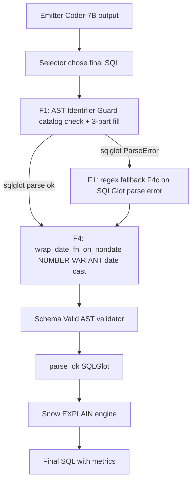

# 3.2.9 Dialect Handlers — F1 + F4 + F4c (Snow lane)

## Главный тезис

После того, как selector выбрал финальный SQL-кандидат, **на Snow lane** запускается chain из трёх independent post-processors (F1 → F4 → F4c fallback), которые ловят и/или исправляют dialect-specific issues, специфические для Snowflake. Без них:

- **F1 (Phase 27)** — schema_valid passes, но engine reject из-за cross-DB identifier drift (90.2% задач pre-Phase-27, см. `outputs/REPORT_PHASE27_F1_SNOW_GROUNDING.md`).
- **F4 (Phase 28)** — `EXTRACT(YEAR FROM publication_date)` на NUMBER-stored column fails engine type check; F4 wraps `TO_DATE(TO_VARCHAR(x), 'YYYYMMDD')`.
- **F4c (Phase 28)** — SQLGlot fails to parse `TABLE(LATERAL FLATTEN(INPUT => …))`; F4c regex fallback позволяет SQL пройти guard к real EXPLAIN.

Также — **F2a — REVERTED**. Это был Phase 28 проект "auto-uppercase quoted identifiers", который базировался на ложной гипотезе "Snow stores identifiers UPPERCASE". Catalog probe в Phase 28 §6 показал: PUBLICATIONS table в Spider2-Snow PATENTS хранит **37/37 columns в lowercase** — `CREATE TABLE "publication_number" …`-style. F2a auto-upper сломал sf_bq211 (единственный previously-executable task). Revert восстановил его в pilot10 v28-revert-A. F2a function остаётся в `snow_dialect_fixer_v28.py` для документации, но **не вызывается** в pipeline.

## Pipeline ordering (Snow lane)



Chain executed в `tools/remote_scripts/_phase27_snow_runner.py` lines 433-516.

## F1: AST Identifier Guard (Phase 27)

### Назначение

Reject SQL containing three-part identifier с catalog не в task's allow-list (`{task_db}`). Auto-fill missing catalog у Tables без catalog. Skip CTE-name Tables (они — aliases, не real refs).

### Реализация

Файл: `repo/src/evaluation/snow_identifier_guard_v27.py` (~140 lines).

```python
def guard_and_fix_snow_sql(sql, task_db, allowed_dbs=None):
    """Parse SQL via SQLGlot. Walk exp.Table:
       - If catalog ∈ allowed_dbs → keep.
       - If catalog ∉ allowed_dbs → raise IdentifierLeakError.
       - If catalog missing AND Table name not a CTE → auto-fill task_db.
    
    Returns (fixed_sql, info_dict).
    """
    allowed = {d.upper() for d in (allowed_dbs or {task_db})}
    try:
        ast = sqlglot.parse_one(sql, read='snowflake')
    except sqlglot.errors.ParseError as e:
        # F4c fallback (Phase 28)
        leaked = _regex_catalog_leak_check(sql, allowed)
        if leaked:
            raise IdentifierLeakError(f'catalog_leak:{leaked} not in allow-list')
        return sql, {'rewrote_n': 0, 'fallback': 'regex_only', ...}
    
    # CTE-aware: collect CTE names so we skip them
    cte_names = set()
    for cte in ast.find_all(exp.CTE):
        nm = cte.alias_or_name
        if nm: cte_names.add(nm.upper())
    
    rewrote = 0; leaked = []
    for t in ast.find_all(exp.Table):
        cat = t.args.get('catalog')
        if cat is not None:
            cat_name = cat.name
            if cat_name.upper() not in allowed:
                leaked.append(cat_name)
        else:
            # Skip CTE references
            if t.name and t.name.upper() in cte_names: continue
            t.set('catalog', exp.to_identifier(task_db, quoted=False))
            rewrote += 1
    
    if leaked:
        raise IdentifierLeakError(
            f'catalog_leak:{sorted(set(leaked))} not in allow-list {sorted(allowed)}'
        )
    
    return ast.sql(dialect='snowflake', identify=True), {
        'rewrote_n': rewrote, 'leaked_catalogs': []}
```

### CTE-aware behavior

```sql
WITH a AS (SELECT * FROM PATENTS.PATENTS.PUBLICATIONS)
SELECT * FROM a JOIN PATENTS.PATENTS.DISCLOSURES_13 b ON a.id = b.cid
```

`a` — это CTE alias. SQLGlot parses `FROM a` как `exp.Table(name='a')`. Без CTE-awareness, guard auto-fills catalog → `PATENTS.a` → SQL breaks resolution (CTE `a` defined в WITH-block, not `PATENTS.PATENTS.a`).

Fix: collect CTE names first (line 8-10 above), skip Tables matching CTE names from auto-fill.

### Tests

6 self-tests в `snow_identifier_guard_v27.py`:

| Test | SQL | Expected |
|---|---|---|
| `three_part_correct` | `SELECT * FROM GITHUB_REPOS.GITHUB.COMMITS WHERE a=1` | rewrote_n=0 (already 3-part) |
| `two_part_fill` | `SELECT * FROM GITHUB.COMMITS WHERE a=1` | rewrote_n=1 (autofill catalog) |
| `one_part_fill` | `SELECT * FROM COMMITS` | rewrote_n=1 (autofill catalog) |
| `foreign_catalog_leak` | `SELECT * FROM FINANCE__ECONOMICS.CYBERSYN.SEC_REPORTS` | raises IdentifierLeakError |
| `cte_and_join` | `WITH a AS (SELECT * FROM ...) SELECT * FROM a JOIN ...` | rewrote_n=2 (CTE skipped) |
| `subquery_leak` | `SELECT * FROM PATENTS.PATENTS.PUBLICATIONS WHERE id IN (SELECT id FROM BAD_DB.SCHEMA.T)` | raises (subquery leak) |

Plus Phase 28 F4c additions:

| `lateral_flatten_fallback` | `SELECT ... TABLE(LATERAL FLATTEN(INPUT => p.x))` | pass-through (regex check clean) |
| `lateral_flatten_with_leak` | same + foreign catalog ref | raises (regex catches) |

**All 8 tests pass.**

## F4: NUMBER/VARIANT Date-Cast Wrapper (Phase 28)

### Назначение

Walk SQL AST. Найти `exp.Column` nodes внутри date-function calls (`Extract`, `TimestampTrunc`, `DateAdd`, `DateDiff`, `Year`, `Month`, `Day`, etc.). Если колонка имеет declared type `NUMBER*` → wrap `TO_DATE(TO_VARCHAR(x), 'YYYYMMDD')`. Если `VARIANT` → wrap `x::DATE`.

### Реализация

Файл: `repo/src/evaluation/snow_dialect_fixer_v28.py` (~220 lines).

```python
def wrap_date_fn_on_nondate(sql, col_types):
    """Wrap Column args inside date-function calls when the column's
    declared type is NUMBER or VARIANT.
    
    col_types: dict[str.upper(), str] mapping COL_UPPER -> data_type
    """
    if not sql: return sql, {'wrapped_n': 0}
    
    try:
        ast = sqlglot.parse_one(sql, read='snowflake')
    except sqlglot.errors.ParseError:
        return sql, {'wrapped_n': 0, 'skipped': 'parse_error'}
    
    # Date-fn classes in SQLGlot (with snowflake-specific TimestampTrunc)
    date_fn_types = (exp.Extract, exp.DateTrunc, exp.DateAdd, exp.DateDiff,
                     exp.DateSub, exp.Year, exp.Month, exp.Day)
    if hasattr(exp, 'TimestampTrunc'):
        date_fn_types = date_fn_types + (exp.TimestampTrunc,)
    
    targets = []
    for fn in ast.find_all(*date_fn_types):
        for col in fn.find_all(exp.Column):
            cn = (col.name or '').upper()
            if not cn: continue
            t = (col_types.get(cn) or '').upper()
            if t.startswith('NUMBER'): targets.append((col, 'number'))
            elif t == 'VARIANT': targets.append((col, 'variant'))
    
    wrapped = 0
    for col, kind in targets:
        if col.parent is None: continue
        if kind == 'number':
            inner = exp.func('TO_VARCHAR', col.copy())
            wrapper = exp.func('TO_DATE', inner, exp.Literal.string('YYYYMMDD'))
        else:  # variant
            wrapper = exp.Cast(this=col.copy(), to=exp.DataType.build('DATE'))
        col.replace(wrapper)
        wrapped += 1
    
    return ast.sql(dialect='snowflake', identify=True), {'wrapped_n': wrapped}
```

### Critical SQLGlot quirk: `DATE_TRUNC` ≠ `exp.DateTrunc`

В Snowflake dialect, `DATE_TRUNC('MONTH', col)` parses как **`exp.TimestampTrunc`**, не `exp.DateTrunc`. Это empirical finding в Phase 28 unit-test debugging — initially `date_fn_types = (... exp.DateTrunc, ...)` не catches DATE_TRUNC. Fix — add `exp.TimestampTrunc` conditionally (some sqlglot versions don't have this class):

```python
if hasattr(exp, 'TimestampTrunc'):
    date_fn_types = date_fn_types + (exp.TimestampTrunc,)
```

Also `DATE_PART(YEAR, col)` parses as `exp.Extract` (same as `EXTRACT(YEAR FROM col)`). Both caught.

### Tests

7 self-tests в `snow_dialect_fixer_v28.py`:

| Test | SQL | Expected wrap |
|---|---|---|
| `extract_on_number` | `SELECT EXTRACT(YEAR FROM PUBLICATION_DATE)` | 1 wrap, output uses TO_DATE |
| `date_trunc_on_number` | `SELECT DATE_TRUNC('MONTH', GRANT_DATE)` | 1 wrap, TimestampTrunc caught |
| `extract_on_variant` | `SELECT EXTRACT(YEAR FROM FTERM)` | 1 wrap, output uses CAST(... AS DATE) |
| `extract_on_date_noop` | `SELECT EXTRACT(YEAR FROM NORMAL_DATE)` | 0 wraps (col is DATE) |
| `extract_on_qualified_lowercase` | `SELECT EXTRACT(YEAR FROM "p"."publication_date")` | 1 wrap |
| `extract_on_qualified_uppercase` | `SELECT EXTRACT(YEAR FROM "p"."PUBLICATION_DATE")` | 1 wrap |
| `combined order F2a+F4` (originally) — теперь combined F4-only | mixed | F4 fires correctly |

**All 7 tests pass.**

### Empirical wrap counts (Phase 28 v28-revert-A)

| Bench | Pilot10 wrap counts |
|---|---|
| pilot10c (Phase 27, F4 dormant) | 9 wraps applied; exec=1/10 (F2a regressed sf_bq211 — F4 mostly idle) |
| pilot10 v28 (Phase 28 with F2a + F4) | 9 wraps; exec=0/10 (F2a destroyed) |
| **pilot10 v28-revert-A** (F2a removed) | **9 wraps; exec=4/10** |

F4 wraps **identical in count** across all three (=9). Difference: чьи tasks они помогли. В v28-revert-A три new exec_ok были именно через F4 wrap (sf_bq026 DATE column, sf_bq213 VARIANT fterm, и sf_bq029 implicit YYYYMMDD math without F4 wrap). F4 — load-bearing когда F2a not destroying columns upstream.

## F4c: Regex Fallback on SQLGlot Parse Error (Phase 28)

### Назначение

SQLGlot snowflake dialect parser **fails on certain valid Snowflake constructs**. Example: `TABLE(LATERAL FLATTEN(INPUT => p.x))` triggers `ParseError: Expecting )`. Phase 27 F1 guard raised `IdentifierLeakError('parse_error_sqlglot:...')` — это **fail-closed**, отбрасывая valid SQL.

F4c — **fail-open**: при SQLGlot ParseError, fallback на regex-only catalog leak check. Если regex clean (no foreign catalog refs), return SQL **unchanged** with `fallback='regex_only'`. Real EXPLAIN решает.

### Реализация

В `snow_identifier_guard_v27.py`:

```python
def _regex_catalog_leak_check(sql, allowed):
    """Find FROM/JOIN <ident>.<ident>.<ident> patterns. Return first-segment
    catalog names not in allowed."""
    pattern = r'(?:FROM|JOIN)\s+"?([A-Za-z_][A-Za-z0-9_]*)"?\s*\.\s*"?[A-Za-z_][A-Za-z0-9_]*"?\s*\.'
    return [c for c in re.findall(pattern, sql, re.IGNORECASE)
            if c.upper() not in allowed]
```

Triggered in `guard_and_fix_snow_sql`:

```python
try:
    ast = sqlglot.parse_one(sql, read='snowflake')
except sqlglot.errors.ParseError as e:
    leaked = _regex_catalog_leak_check(sql, allowed)
    if leaked:
        raise IdentifierLeakError(f'catalog_leak:{leaked} not in allow-list')
    return sql, {'rewrote_n': 0, 'fallback': 'regex_only', ...}
```

### Empirical effectiveness

sf_bq210 — task с `TABLE(LATERAL FLATTEN(INPUT => p.claims_localized))`. Phase 27 F1 без F4c: задача fails на guard parse_error. Phase 28 F4c: passes guard, reaches Snow EXPLAIN. Outcome: in pilot10 v28-revert-A sf_bq210 fails downstream (downstream `_snow_schema_valid_ast` also fails to parse LATERAL FLATTEN — multiple SQLGlot-dependent components affected). To fully execute, need:
- F4c в guard ✓ (done)
- F4c-equivalent в `_snow_schema_valid_ast` (NOT done — would be similar regex fallback)
- F4c-equivalent в `snow_dialect_fixer_v28.wrap_date_fn_on_nondate` (NOT done — graceful skip via `skipped='parse_error'` уже done)

Currently `parse_error` в `_snow_schema_valid_ast` — `parse_failed:ParseError`. To make sf_bq210 fully executable, нужно либо upgrade SQLGlot (handles LATERAL FLATTEN in newer versions), либо regex-based residency check fallback. Phase 29-30 territory.

## F2a (REVERTED — methodological learning)

### Original hypothesis (Phase 27 §5)

«Mixed-case quoting»: model эмитит `"p"."country"` lowercase quoted, Snow stores `COUNTRY` uppercase → invalid identifier. 4 of 10 pilot10c failures с `invalid identifier '"p"."country"'`-style error → classified as «mixed-case quoting».

### Implementation (Phase 28)

```python
def fix_mixedcase_quoting(sql, allowed_cols_upper):
    """For each quoted lowercase Identifier whose .upper() is in catalog
    but literal form is not — upper-case the name."""
    ast = sqlglot.parse_one(sql, read='snowflake')
    protected = set()  # alias, CTE, table_alias
    for a in ast.find_all(exp.Alias):
        if a.alias_or_name: protected.add(a.alias_or_name.upper())
    # ... + TableAlias, CTE
    
    requoted = 0
    for ident in ast.find_all(exp.Identifier):
        if not ident.args.get('quoted'): continue
        name = ident.name
        if not name or name == name.upper(): continue  # already upper
        if name.upper() in protected: continue  # alias/CTE
        if name.upper() in allowed_cols_upper:
            ident.set('this', name.upper())
            requoted += 1
    
    return ast.sql(dialect='snowflake', identify=True), {'requoted_n': requoted}
```

Tested: 4 unit tests pass на synthetic data. Pilot10 v28: requoted_n=67 on 10 tasks (heavy firing). **Exec dropped 1/10 → 0/10.**

### Catalog probe (Phase 28 §6) — empirical falsification

```python
# Probe spider2_snow_live_catalog_v18.jsonl for PATENTS.PATENTS.PUBLICATIONS
target = ('PATENTS', 'PATENTS', 'PUBLICATIONS')
case_dist = Counter()
for row in catalog:
    if (row['TABLE_CATALOG'], row['TABLE_SCHEMA'], row['TABLE_NAME']) == target:
        col = row['COLUMN_NAME']
        if col == col.lower(): case_dist['lower'] += 1
        elif col == col.upper(): case_dist['upper'] += 1
        else: case_dist['mixed'] += 1

print(case_dist)  # → {'lower': 37, 'upper': 0, 'mixed': 0}
```

37 of 37 columns на PUBLICATIONS — **lowercase**. Hypothesis «Snow stores uppercase» — empirically wrong.

### Real failure mode

`invalid identifier '"p"."country"'` — column `country` **не существует** в `PUBLICATIONS`. Существует `country_code`. Это **column-name hallucination**, не mixed-case mismatch. Model выбрала имя не из pack.

F2a auto-upper фактически **сломал legitimate refs**: на sf_bq211 (single executable task v25/v27c) emitter выдал `"p"."family_id"` (correct lowercase ref to existing column). F2a upper-cased → `"p"."FAMILY_ID"` → Snow rejects (catalog has `family_id` lowercase).

### Revert (Phase 28 closure)

`fix_mixedcase_quoting` функция оставлена в `snow_dialect_fixer_v28.py` как **documented dead-code** — never called в pipeline (commit `ad5493b`). Prompt rule "UPPERCASE columns are unquoted" удалён (был частью regression seed).

Pilot10 v28-revert-A result: **exec 0/10 → 4/10** (including sf_bq211 recovered).

### Methodological lesson

**«Error-message taxonomy без catalog probe — ненадёжна»**. См. полную story в [06_EXPERIMENTAL_PROGRESSION/04_phase28_f2a_regression_and_revert.md](../06_EXPERIMENTAL_PROGRESSION/04_phase28_f2a_regression_and_revert.md) и [01_INTRODUCTION/04_thesis_contributions.md](../01_INTRODUCTION/04_thesis_contributions.md) (Claim 3).

## Сводная таблица handlers

| Handler | Phase | Lane | What it does | Lift on pilot10 |
|---|---|---|---|---|
| **F1 AST Identifier Guard** | 27 | Snow | reject cross-DB refs, autofill 3-part | sv 12.6% → 80% (v27c) |
| **F1 per-task BM25 partition** | 27 | Snow | linker-stage, prevents drift | 0 guard_leaks across all v27/v28 |
| **F1 PK/FK injection** | 27 | Snow | inject heuristic join keys | small but additive |
| **F4 Date-Cast Wrap** | 28 | Snow | NUMBER/VARIANT → DATE wrap | load-bearing post-revert (3 new exec) |
| **F4c Regex Fallback** | 28 | Snow | guard fail-open on SQLGlot parse error | sf_bq210 passes guard (still fails downstream) |
| **F2a Mixed-case Upper** | 28 | (Snow — reverted) | wrong hypothesis, removed | sf_bq211 broken & restored |
| **v24 BQ engine-compat rewrites** | 24 | BQ | ARRAY_CONTAINS→EXISTS, NTH→OFFSET, etc. | metric-neutral on pilot50 |

## Cross-references

- Implementation: [08_CUSTOM_TOOLS/05_snow_identifier_guard_v27.md](../08_CUSTOM_TOOLS/05_snow_identifier_guard_v27.md), [08_CUSTOM_TOOLS/06_snow_dialect_fixer_v28.md](../08_CUSTOM_TOOLS/06_snow_dialect_fixer_v28.md)
- Phase 27 narrative: [06_EXPERIMENTAL_PROGRESSION/03_phase27_f1_grounding.md](../06_EXPERIMENTAL_PROGRESSION/03_phase27_f1_grounding.md)
- Phase 28 F2a regression story: [06_EXPERIMENTAL_PROGRESSION/04_phase28_f2a_regression_and_revert.md](../06_EXPERIMENTAL_PROGRESSION/04_phase28_f2a_regression_and_revert.md)
- Snow engine specifics: [10_execution_engines.md](./10_execution_engines.md)
- Snow lane pipeline: [05_PIPELINES/04_spider2_snow_pipeline.md](../05_PIPELINES/04_spider2_snow_pipeline.md)
- Failure analysis what still fails after F1+F4: [09_RESULTS_ANALYSIS/06_failure_analysis_remaining.md](../09_RESULTS_ANALYSIS/06_failure_analysis_remaining.md)

## Источники

| Утверждение | Источник |
|---|---|
| F1 AST guard implementation | `repo/src/evaluation/snow_identifier_guard_v27.py` |
| F4 wrap_date_fn_on_nondate | `repo/src/evaluation/snow_dialect_fixer_v28.py` |
| F4c regex fallback | `snow_identifier_guard_v27._regex_catalog_leak_check` |
| 90.2% cross-DB drift pre-Phase 27 | `outputs/REPORT_PHASE27_F1_SNOW_GROUNDING.md` §1 |
| Pilot10 exec 1/10 → 4/10 (revert-A) | `outputs/REPORT_PHASE28_F2A_F4_DIALECT.md` §10 |
| Catalog probe 37/37 lowercase | `outputs/REPORT_PHASE28_F2A_F4_DIALECT.md` §6 |
| DATE_TRUNC parses как exp.TimestampTrunc | empirical SQLGlot test в `_phase28_snow_runner_runtime` |
| 8/8 guard self-tests pass | `repo/src/evaluation/snow_identifier_guard_v27.py:96-140` |
| 7/7 dialect_fixer self-tests pass | `repo/src/evaluation/snow_dialect_fixer_v28.py:90-220` |
