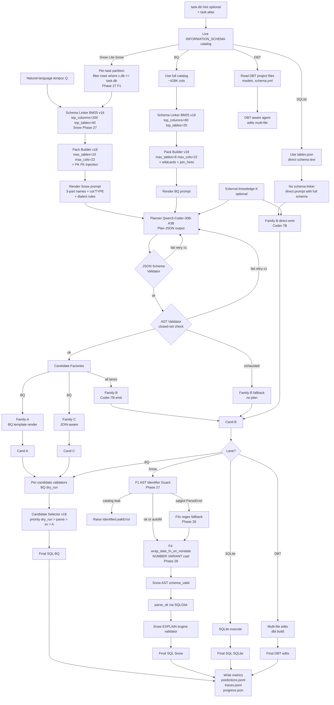
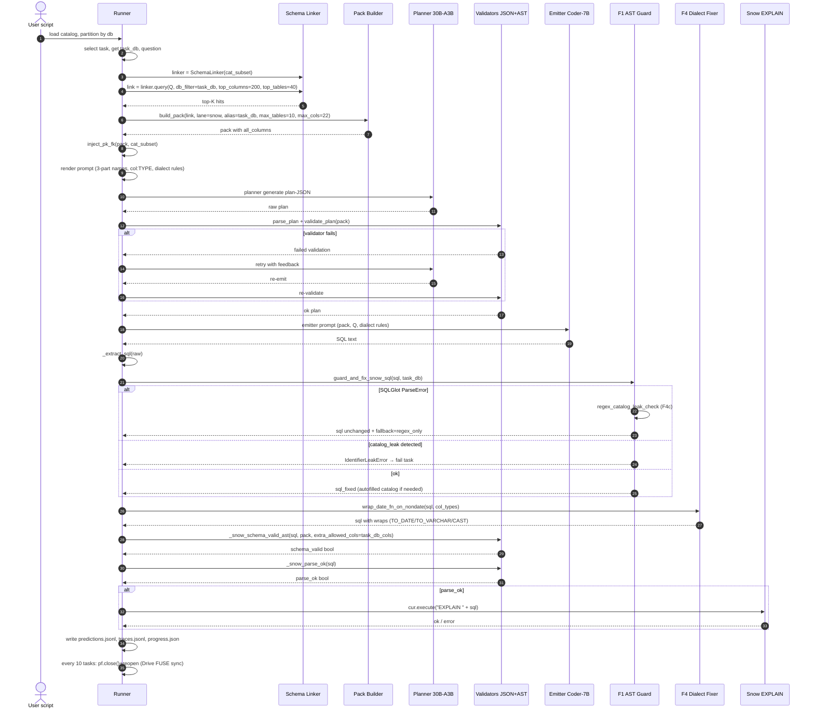
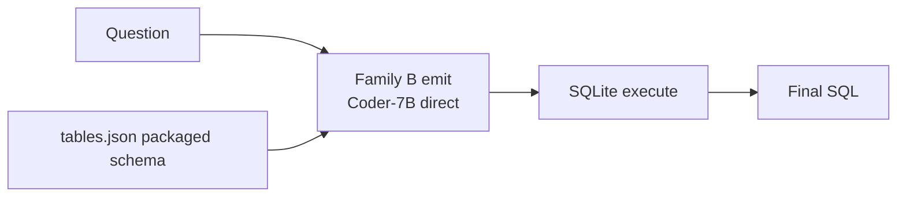
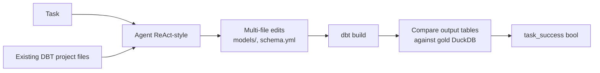

# 3.2.11 Полная диаграмма pipeline

Этот файл собирает all architectural pieces в один общий flow с lane-specific branches. Используется как primary reference figure в защитной презентации и в основном тексте ВКР.

## Master flowchart

## Sequence diagram — single task на Snow lane (после Phase 28)

## Lane-specific shortcuts

### Spider 1.0 / BIRD shortcut path

Никакого planner-а, никакого validator-а в режиме fast-path. Использовалось в Phase 1-17. Дав 94% / 88% EX без оверхеда planner-а.

После Phase 18 — added planner option (закрытое-set planning), но измеренный `-0.033 EX` cost — direct emit достаточен на этих бенчмарках.

### Spider2-DBT path

Совершенно другая архитектура — нет single-SQL emit. Phase 31 territory для replacing this stack with Databao-style scaffold (см. research dossier §4).

## End-to-end timing breakdown (Snow lane single task)

| Stage | Wall time |
|---|---|
| Catalog partition (per-task BM25 build) | ~50-300ms |
| BM25 query | ~10-50ms |
| Pack build + PK/FK inject | ~5-20ms |
| Render prompts | <5ms |
| **Planner LLM call** | **~60-90s** |
| JSON/AST validate | <50ms |
| (если retry) re-planner | +60s |
| **Emitter LLM call** | **~10-30s** |
| F1 guard + F4 wrap + AST validate | <100ms |
| **Snow EXPLAIN** | **~0.5-2s** |
| Write trace + predictions + progress | <100ms |
| **Total per task** | **~70-150s** |

Throughput: ~0.7-0.8 tasks/min. FULL 547 ≈ 11-13h wall.

## Component sizes (LOC)

| Component | File | Approx LOC |
|---|---|---|
| Schema linker v18 | `repo/src/evaluation/schema_linking_v18.py` | ~600 |
| Pack builder v18 | `repo/src/evaluation/schema_pack_builder_v18.py` | ~310 |
| Candidate factories | `repo/src/evaluation/spider2_candidate_factory_v18.py` | ~700+ |
| Candidate selector | `repo/src/evaluation/candidate_selector_v18.py` | ~150 |
| Structured plan + validator | `repo/src/evaluation/structured_plan_v18.py` | ~200 |
| Snow Identifier Guard (F1+F4c) | `repo/src/evaluation/snow_identifier_guard_v27.py` | ~140 |
| Snow Dialect Fixer (F4) | `repo/src/evaluation/snow_dialect_fixer_v28.py` | ~220 |
| Snow Runner (orchestration) | `tools/remote_scripts/_phase27_snow_runner.py` | ~620 |
| Model registry | `repo/src/evaluation/model_registry_v17.py` | (n/a measured) |
| **Total** | | **~3000+ LOC** |

## Phase mapping к components

| Phase | Что добавлено / изменено |
|---|---|
| Phase 17 | Model swap pilot10 — selected Coder family for emit |
| Phase 18 | Live catalogs + BM25 schema linker v18 + pack builder v18 + closed-set planner |
| Phase 19 | v18.1 repair sprint (7 patches на BQ pipeline) |
| Phase 20-21 | Identifier canonicalisation (FQN) — shared между lanes |
| Phase 22 | A1+A2+A3 — pack `all_columns`, join_hints, Family C |
| Phase 23 | FULL diagnostic blocked (GPU contention) — orchestration lesson |
| Phase 24 | Sequential runner + GPU lock + A4 BQ engine-compat rewrites |
| Phase 25 | Spider2-Snow FULL baseline (no methodological change) |
| Phase 26 | Researcher handoff (consolidated metrics + architecture description) |
| Phase 27 | F1 Snow grounding: per-task partition + 3-part rendering + AST guard + PK/FK injection + retrieval window |
| Phase 28 | F2a (REVERTED) + F4 date-cast wrap + F4c regex fallback + resume scaffolding + periodic flush |

## Cross-references

Все компоненты подробно покрыты в:
- [04_ARCHITECTURE/02_models_qwen3_qwen2.5.md](./02_models_qwen3_qwen2.5.md)
- [04_ARCHITECTURE/03_schema_linker_v18_bm25.md](./03_schema_linker_v18_bm25.md)
- [04_ARCHITECTURE/04_pack_builder_v18.md](./04_pack_builder_v18.md)
- [04_ARCHITECTURE/05_planner_emitter_decomposition.md](./05_planner_emitter_decomposition.md)
- [04_ARCHITECTURE/06_candidate_factories_family_abc.md](./06_candidate_factories_family_abc.md)
- [04_ARCHITECTURE/07_validators_json_ast_engine.md](./07_validators_json_ast_engine.md)
- [04_ARCHITECTURE/08_candidate_selector.md](./08_candidate_selector.md)
- [04_ARCHITECTURE/09_dialect_handlers_f1_f4.md](./09_dialect_handlers_f1_f4.md)
- [04_ARCHITECTURE/10_execution_engines.md](./10_execution_engines.md)
- Per-lane pipeline details: [05_PIPELINES/](../05_PIPELINES/)
- Implementation details per tool: [08_CUSTOM_TOOLS/](../08_CUSTOM_TOOLS/)

## Источники

| Утверждение | Источник |
|---|---|
| Component LOC counts | Direct reading of files в `repo/src/evaluation/` and `tools/remote_scripts/` |
| Phase mapping summary | `outputs/REPORT_PHASE26_RESEARCHER_HANDOFF.md` § "Phase progression"; phase reports индексированные в [11_APPENDIX/04_full_phase_report_index.md](../11_APPENDIX/04_full_phase_report_index.md) |
| Per-stage timing breakdown | `tools/remote_scripts/_phase27_snow_runner.py` wall_sec counter; pilot10 traces |
| Throughput ~0.7-0.8 tasks/min | Phase 28 FULL S1 in-flight measurement (108 tasks в 132 min observed runtime) |
