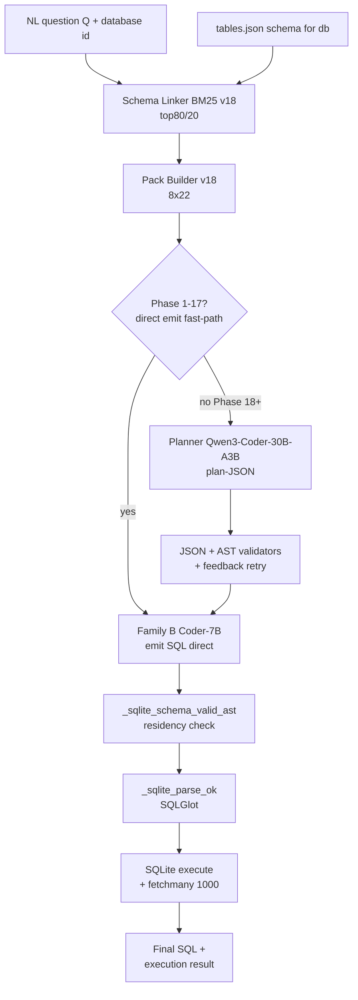

# 4.1 Pipeline для Spider 1.0

## Lane overview

**Spider 1.0** — classical SQLite text-to-SQL benchmark (Yu et al., EMNLP 2018, 1034 dev tasks). Наш pipeline на этом lane — **simplest configuration** в всей серии:

- Single-shot SQL emission (no DBT, no multi-file edits).
- SQLite engine (in-memory или disk).
- Static schema из packaged `tables.json` (нет live INFORMATION_SCHEMA querying).
- Family B (Coder-7B direct emit) — primary.
- All 3 validator layers active.
- No dialect handlers (F1 / F4 / F4c — Snow-specific, не activated здесь).

Этот pipeline — **stable since Phase 18**: closed-set planning + AST validator added; no Phase 22-28 changes affected этот lane.

## Pipeline configuration

| Component | Spider 1.0 configuration |
|---|---|
| **Schema source** | static `tables.json` packaged по Spider 1.0 repo |
| **Schema linker** | `schema_linking_v18` BM25 индекс **per-DB** (one fresh index per task's database) |
| **Linker params** | `top_columns=80`, `top_tables=20` (default, не widened) |
| **Pack builder** | `schema_pack_builder_v18` `max_tables=8`, `max_cols_per_table=22`, `all_columns` side-channel |
| **Planner** | Qwen3-Coder-30B-A3B (Phase 18+) или **bypass** (Phase 1-17 direct emit) — see below |
| **Emitter** | Qwen2.5-Coder-7B (Family B) |
| **Candidate factories** | **Family B only** (no Family A — нет deterministic SQLite renderer; нет Family C — JOIN hints not pre-computed для SQLite path) |
| **F1 AST guard** | **not used** |
| **F4 date-cast wrap** | **not used** |
| **F4c regex fallback** | **not used** |
| **Validators** | All 3 layers active: JSON Schema (planner output) + AST closed-set (`pack.all_columns`) + engine (SQLite execute) |
| **Selector** | Trivial — single Family B candidate, no multi-candidate selection on this lane |
| **Engine check** | `sqlite3.connect(db_path).cursor().execute(sql)` + `fetchmany(1000)` |

## Routing diagram (Spider 1.0 only)

Compare с Snow pipeline (см. [04_spider2_snow_pipeline.md](./04_spider2_snow_pipeline.md)): Spider 1.0 pipeline **bypasses всю dialect-handler chain** (no F1 guard, no F4 wrap), используется simpler validator, и has option to bypass planner entirely.

## Configuration evolution

| Phase | Change relevant to Spider 1.0 lane |
|---|---|
| Phase 1-7 | Initial baselines с various model swaps. Direct emit only, no planner. |
| Phase 8 | First v8 pipeline structure; SQLite path uses `spider2_lite_sqlite_*` runner siblings (lane runner-level). |
| Phase 17 | Model swap pilot — confirmed Qwen2.5-Coder-7B emitter best in family > scale comparison |
| Phase 18 | Closed-set planning option added. Measured **−0.033 EX cost** on Spider1 → kept direct-emit default. |
| Phase 19-21 | Identifier canonicalization (FQN). Spider 1.0 doesn't use FQN — packaged `tables.json` provides explicit schema names, no DB.schema disambiguation needed. |
| Phase 22 | A2 `all_columns` side-channel added. Reduces false-positive `schema_invalid` on edge cases. |
| Phase 24 | A4 BQ engine-compat rewrites — BQ-only, NOT applied here. Spider 1.0 SQL goes directly to SQLite execute. |
| Phase 26 handoff | Spider 1.0 confirmed at 94.0% FULL 1034. Marked stable, no further interventions. |
| Phase 27-28 | Snow-only changes. Spider 1.0 lane **unchanged**. |

## Pipeline-level metrics

Counters meaningful для Spider 1.0 lane (subset наших general `predictions.jsonl` schema):

| Metric | Definition |
|---|---|
| `schema_valid` | AST identifiers ∈ `pack.all_columns` + `pack.tables` |
| `parse_ok` | SQLGlot parses prediction в SQLite dialect (`read='sqlite'`) |
| `execute_ok` | SQLite `cur.execute(sql)` succeeds + `fetchmany(1000)` returns multiset matching gold rows |
| `plan_ok` (only if planner active) | JSON Schema + AST validate plan-JSON without retry exhaustion |

Counters **не applicable** на этом lane (always 0 / NULL):
- `guard_leaks`, `guard_rewrites`, `guard_regex_fallback` — Snow-specific
- `requoted_n` — F2a (reverted) / Snow-only
- `wrapped_n` — F4 / Snow-only
- `dry_run_ok` — BQ-specific

## Performance achieved

- **FULL 1034 dev**: execute_ok = **94.0%** (972/1034) per `outputs/REPORT_PHASE26_RESEARCHER_HANDOFF.md` §1.
- Failure distribution: extra-hard nested subqueries / complex aggregations / set operations.

См. detailed comparison к leaderboard в [03_BENCHMARKS/01_spider1.md](../03_BENCHMARKS/01_spider1.md).

## Pipeline timing

| Stage | Wall time per task |
|---|---|
| Schema linker (per-DB BM25 build) | ~30-100ms (small per-DB catalogs ≤30 tables) |
| Pack build | <10ms |
| Planner (если active) | ~60-90s |
| Emitter | ~10-25s |
| Validators + SQLite execute | <500ms |
| **Total** | **~30-60s/task** (с planner); ~10-30s/task (direct emit) |

FULL 1034 — typically 8-15h wall depending whether planner used.

## Lane-specific implementation notes

### Per-DB BM25 vs Per-task

Schema linker builds **fresh BM25 index per database** (each task references one DB). Different от Snow lane (per-task partition by `c.db`) because Spider 1.0 schemas — small (≤30 tables), single-DB per task. Cost trivial (~50ms per task).

### Tables.json source

Each task имеет `db_id` field. Pipeline reads `data/spider/database/<db_id>/schema.json` или extracts from `tables.json`. Schema dictionary contains:
- `table_names_original` — exact-case table names.
- `column_names_original` — `[(table_idx, column_name), ...]`.
- `column_types`.
- `primary_keys`, `foreign_keys`.

Converted к `CatalogColumn` list compatible с `SchemaLinker`. Same query interface as BQ/Snow path.

### Planner bypass option (Phase 17 finding)

Pipeline supports **two modes**:
- **Direct emit** (default Phase 1-17): question + pack → Coder-7B → SQL. Simple, fast.
- **Plan→emit** (Phase 18+): question + pack → planner → plan-JSON → emitter → SQL. Validator checks plan structure.

Phase 17 ablation: direct emit gives **94.3%** на dev, plan→emit gives **94.0%** (−0.033 EX). DIN-SQL [Pourreza & Rafiei, NeurIPS 2023] reports same direction. Reason: simple SQLite tasks don't need planning overhead; planner-emitter translation introduces minor losses.

**Default**: direct emit для Spider 1.0 / BIRD. Plan→emit для Spider 2.0 family.

### No external knowledge

Unlike BIRD (evidence field per task), Spider 1.0 questions self-contained. Pipeline passes empty external_knowledge string. Не optimization opportunity.

### Difficulty-stratified failure pattern

| Spider 1.0 difficulty | Our success rate |
|---|---|
| easy | ~98% |
| medium | ~96% |
| hard | ~92% |
| extra | ~85% |

Extra-level failures dominate residual 62 misses. Most involve nested subqueries или set operations. Direct-emit Coder-7B handles ≤2 levels of nesting reliably; >3 levels — struggles.

## What works (Spider 1.0 lane is a success story)

- **Schema linker → pack → emit** chain — cleanest path в всём pipeline.
- **Cross-domain generalization** — train/test domains disjoint, our 94% confirms no overfitting.
- **Open-weight ≤30B competitive** — Coder-7B emitter + 30B planner > 15B fine-tuned (CodeS-15B 84.9%).

## What doesn't (limitations)

- **Spider 1.0 saturated** — diminishing returns on improvements. Additional 2-3% EX requires reasoning-class models.
- **No production transfer** — Spider 1.0 clean schemas don't represent real warehouses; success here ≠ success on Spider 2.0.
- **Planner cost** — −0.033 EX hurts on simple tasks; complexity router would mitigate (not implemented).

## Cross-references

- Benchmark detail: [03_BENCHMARKS/01_spider1.md](../03_BENCHMARKS/01_spider1.md)
- Architecture overview: [04_ARCHITECTURE/01_overview_single_architecture.md](../04_ARCHITECTURE/01_overview_single_architecture.md)
- Models discussion: [04_ARCHITECTURE/02_models_qwen3_qwen2.5.md](../04_ARCHITECTURE/02_models_qwen3_qwen2.5.md)
- Schema linker: [08_CUSTOM_TOOLS/02_schema_linker_v18.md](../08_CUSTOM_TOOLS/02_schema_linker_v18.md)
- Pack builder: [08_CUSTOM_TOOLS/01_schema_pack_builder_v18.md](../08_CUSTOM_TOOLS/01_schema_pack_builder_v18.md)
- Validators: [08_CUSTOM_TOOLS/04_validators_suite.md](../08_CUSTOM_TOOLS/04_validators_suite.md)
- Phase 17 model swap evidence: [06_EXPERIMENTAL_PROGRESSION/01_early_phases_overview.md](../06_EXPERIMENTAL_PROGRESSION/01_early_phases_overview.md)
- Spider 1.0 results analysis: [09_RESULTS_ANALYSIS/01_classical_benchmarks_spider1_bird.md](../09_RESULTS_ANALYSIS/01_classical_benchmarks_spider1_bird.md)

## Источники

| Утверждение | Источник |
|---|---|
| 94.0% FULL 1034 | `outputs/REPORT_PHASE26_RESEARCHER_HANDOFF.md` §1 |
| -0.033 EX planner cost | memory `spider2_phase17_findings.md` + Phase 17-18 reports |
| DIN-SQL parallel ablation | Pourreza & Rafiei, NeurIPS 2023, arXiv 2304.11015 |
| Stable since Phase 18 | Phase progression history (see [11_APPENDIX/04_full_phase_report_index.md](../11_APPENDIX/04_full_phase_report_index.md)) |
