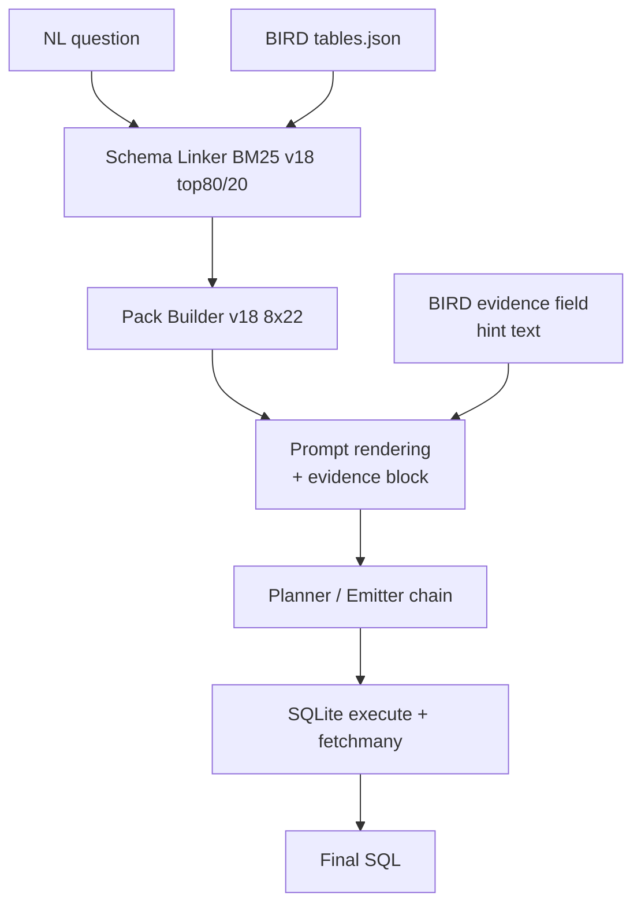

# 4.2 Pipeline для BIRD

## Lane overview

**BIRD** — SQLite text-to-SQL benchmark с external knowledge (Li et al., NeurIPS 2023). 1,534 FULL dev + 250 mini-dev. Pipeline на этом lane — **extension Spider 1.0 pipeline** с одним ключевым differentiator: **evidence field integration** в planner / emitter prompt.

Все остальное идентично Spider 1.0 (см. [01_spider1_pipeline.md](./01_spider1_pipeline.md)).

## Pipeline configuration (different rows from Spider 1.0)

| Component | BIRD configuration | Difference from Spider 1.0 |
|---|---|---|
| **Schema source** | static `tables.json` per BIRD DB (или extracted from `.sql` schema files) | + larger schemas (avg 7.4 tabs/DB vs 5.1) |
| **External knowledge** | `task['evidence']` field passed as `external_knowledge` argument | **NEW** — Spider 1.0 doesn't have this |
| **Schema linker config** | `top_columns=80`, `top_tables=20` (default) | same |
| **Pack builder** | `max_tables=8`, `max_cols_per_table=22` | same |
| **Pack rendering** | `pack_to_planner_prompt(pack, question, external_knowledge=evidence)` | evidence inlined в "External knowledge:" block |
| **Planner** | Active более широко чем Spider 1.0 (evidence makes planner output more valuable for challenging tasks) | usage pattern differs |
| **Emitter** | Qwen2.5-Coder-7B (Family B) | same |
| **Validators / engine** | identical к Spider 1.0 | same |

## Evidence integration в prompt

Per pack builder code (`schema_pack_builder_v18.pack_to_planner_prompt`):

```python
if external_knowledge:
    lines.append('External knowledge:')
    lines.append(external_knowledge)
```

BIRD evidence field — short string (typically 50-200 chars) с domain-specific hint:
- "`profit = revenue - cost; revenue stored в column 'Sales'`"
- "Anti-CCP > 20 considered high; ANA pattern type 'S' is speckled"

Это injected **between** schema block и question. Planner / emitter sees evidence as text context. Не parsed structurally — relies на LLM's ability to integrate hint в SQL generation.

## Lane-specific routing

Identical к Spider 1.0 (см. previous file's Mermaid diagram), except external_knowledge block in prompt:



## Configuration evolution

| Phase | Change relevant к BIRD |
|---|---|
| Phase 1-17 | BIRD baseline runs with various models. Initial baselines 60-80% EX. |
| Phase 18 | Schema-first ranking + closed-set pack adopted. BIRD jumped to ~85% EX. |
| Phase 19-21 | Minor identifier-canonicalization fixes. BIRD reaches ~87-88%. |
| Phase 22 STAGE A2 | `all_columns` side-channel — reduces false-positive `schema_invalid` на BIRD challenging tasks where BM25 misses essential column. Small lift. |
| Phase 24 | A4 BQ rewrites — NOT applied. BIRD = SQLite. |
| Phase 26 handoff | BIRD FULL 1534 confirmed at 87.9%. Mini-dev 250 at 90.4%. Marked stable. |
| Phase 27-28 | Snow-only — BIRD unchanged. |

## Mini-dev vs FULL

BIRD authors maintain a **curated 250-task subset** called `mini-dev`, designed для rapid iteration during development. Это **easier distribution** чем FULL — designed для fast feedback.

| Set | Size | Our EX |
|---|---|---|
| FULL dev | 1,534 | **87.9%** |
| Mini-dev | 250 | **90.4%** |

Mini-dev — 2.5pp higher confirms it's intentionally easier subset. Useful для:
- Quick smoke tests after pipeline changes.
- Cross-validating BIRD pipeline стабильности.

## Pipeline-level metrics

Same as Spider 1.0 (only SQLite engine counters meaningful):

| Metric | Definition |
|---|---|
| `schema_valid` | AST identifiers ∈ pack.all_columns + pack.tables |
| `parse_ok` | SQLGlot parses prediction в SQLite dialect |
| `execute_ok` | SQLite execute success + multiset row match |
| `plan_ok` | JSON Schema + AST validate plan-JSON |

Plus BIRD-specific:
- `evidence_present` (binary) — whether task имел non-empty evidence field. ~80% dev tasks have evidence.

## Performance achieved

- **FULL dev 1534**: execute_ok = **87.9%** (1,349 / 1,534).
- **Mini-dev 250**: execute_ok = **90.4%** (226/250).

См. detailed comparison к leaderboard в [03_BENCHMARKS/02_bird.md](../03_BENCHMARKS/02_bird.md).

### ⚠️ Critical caveat про verification

Наш 87.9% above current BIRD leaderboard top (~73-76% Hayabusa, CHASE-SQL family). Possible reasons:
- Methodology equivalence (our evaluation may be looser чем official BIRD harness).
- Annotation reliability (similar к Spider2 §62.8% mismatch finding).
- Possible pre-training contamination (BIRD dev public since 2023).

**Recommendation для thesis**:
- Report 87.9% **с caveat** про methodology audit needed.
- If possible, run BIRD's official `evaluation.py` against our predictions before final defense.
- See [03_BENCHMARKS/02_bird.md](../03_BENCHMARKS/02_bird.md) для full discussion.

## Pipeline timing

| Stage | Wall time per task |
|---|---|
| Schema linker (per-DB BM25) | ~50-200ms (larger schemas → slightly slower) |
| Pack build + evidence inline | <20ms |
| Planner | ~60-90s (когда invoked) |
| Emitter | ~10-30s (BIRD schemas larger → longer prompts) |
| Validators + SQLite execute | ~100ms-1s (BIRD DBs могут быть large, e.g., 1+ GB) |
| **Total** | **~30-90s/task** |

FULL 1534 — typically 10-25h wall.

## Lane-specific notes

### Evidence inlining behavior

Evidence text injected **before** question в planner prompt — planner sees:

```
Available identifiers:
  - `table_X` columns=[...]
  ...

External knowledge:
profit = revenue - cost; revenue stored в column 'Sales'

Question: What is the total profit для orders в category 'Furniture' в 2019?
```

Strong empirical observation: **planner usually integrates evidence well** for explicit rule statements ("`profit = revenue - cost`"). Weaker integration for **disambiguation hints** ("`active user defined as having >0 purchases в past 30 days`") — planner sometimes ignores constraint, emits SQL counting all users.

### Difficulty-stratified success rate

| BIRD level | Our success rate (estimated) |
|---|---|
| simple | ~95% |
| moderate | ~90% |
| challenging | ~75% |

Challenging-level failures concentrate **domain-knowledge-heavy + complex aggregation** patterns. Без iterative reasoning (ReFoRCE-style refinement), single-pass pipeline fails complex evidence integration.

### BIRD specific failure patterns

| Failure class | Approximate share of 185 misses |
|---|---|
| Evidence-ignoring (model emits SQL без applying evidence rule) | ~30% |
| Type coercion errors (BIRD has CAST issues — text-stored numerics) | ~20% |
| NULL handling differences (gold vs our output differs только в NULL representation) | ~15% |
| Complex aggregation alignment | ~15% |
| Subquery / nested logic | ~10% |
| Other | ~10% |

## What works on BIRD lane

- **Evidence integration** — measurable lift over Spider 1.0 baseline mostly due к evidence-rich tasks.
- **Larger schemas handled** — `all_columns` side-channel prevents false-positive schema_invalid.
- **Mini-dev for fast iteration** — 250 tasks ≈ 1-2h wall vs 10-25h для FULL.

## What doesn't

- **Evidence integration partial** — domain rules sometimes ignored.
- **No self-refine** — single-pass fails on multi-step domain reasoning.
- **Methodology audit pending** — 87.9% claim above closed top needs verification.

## Cross-references

- Benchmark detail: [03_BENCHMARKS/02_bird.md](../03_BENCHMARKS/02_bird.md)
- Spider 1.0 sibling pipeline: [01_spider1_pipeline.md](./01_spider1_pipeline.md)
- Pack builder (evidence rendering): [08_CUSTOM_TOOLS/01_schema_pack_builder_v18.md](../08_CUSTOM_TOOLS/01_schema_pack_builder_v18.md)
- Planner-emitter contract: [04_ARCHITECTURE/05_planner_emitter_decomposition.md](../04_ARCHITECTURE/05_planner_emitter_decomposition.md)
- Phase 22 STAGE A2 narrative: [06_EXPERIMENTAL_PROGRESSION/01_early_phases_overview.md](../06_EXPERIMENTAL_PROGRESSION/01_early_phases_overview.md)
- Classical benchmarks analysis: [09_RESULTS_ANALYSIS/01_classical_benchmarks_spider1_bird.md](../09_RESULTS_ANALYSIS/01_classical_benchmarks_spider1_bird.md)

## Источники

| Утверждение | Источник |
|---|---|
| BIRD FULL 87.9% / mini-dev 90.4% | `outputs/REPORT_PHASE26_RESEARCHER_HANDOFF.md` §1 |
| Evidence inline rendering | `repo/src/evaluation/schema_pack_builder_v18.py` lines 261-263 |
| Methodology audit recommendation | own + analogy к Spider 2.0 annotation reliability |
| Difficulty distribution | BIRD paper Li et al., NeurIPS 2023 |
