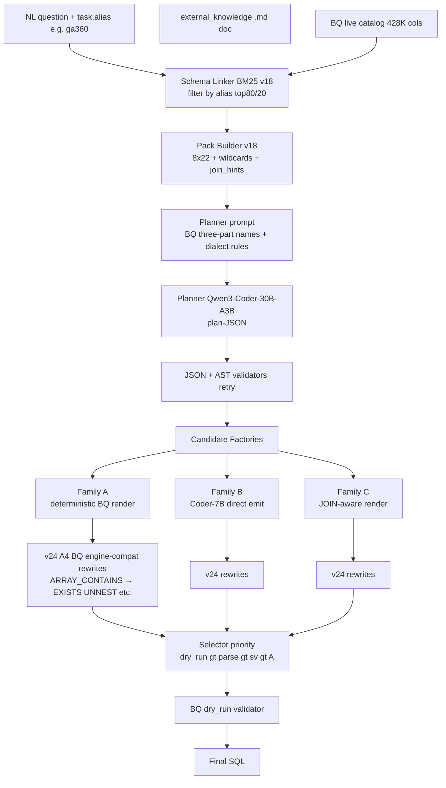

# 4.3 Pipeline для Spider2-Lite (BigQuery split)

## Lane overview

**Spider2-Lite-BQ** — BigQuery public-dataset NL-to-SQL benchmark (~205 BQ-specific задач). Pipeline на этом lane — **самый sophisticated на момент Phase 22-24** (до Phase 27-28 Snow interventions): live INFORMATION_SCHEMA catalog (~428K cols), three candidate factories (A/B/C), v24 engine-compat rewrites, BQ dry_run validation.

Конфигурация **stable since Phase 24**. Phase 25-28 не touched этот lane (приоритет shifted to Snow grounding).

## Pipeline configuration

| Component | Spider2-Lite-BQ configuration |
|---|---|
| **Schema source** | live `INFORMATION_SCHEMA.COLUMNS` snapshot → `outputs/cache/spider2_bq_live_catalog_v18.jsonl` (~428K cols) |
| **Catalog harvested via** | Phase 18 tooling (`tools/harvest_bq_live_catalog_v18.py`) |
| **Schema linker** | `schema_linking_v18` BM25, **NOT partitioned by db** (BQ Spider2 tasks tagged via `task.alias`; linker filters via `alias_filter`) |
| **Linker params** | `top_columns=80`, `top_tables=20` (**NOT widened** — Phase 27 widening applied to Snow lane only) |
| **Pack builder** | `max_tables=8`, `max_cols_per_table=22`, wildcards + `join_hints` + `all_columns` side-channel |
| **Pack rendering** | BQ three-part naming `project.dataset.table` |
| **Planner** | Qwen3-Coder-30B-A3B (active) |
| **Emitter** | Qwen2.5-Coder-7B (Family B parallel candidate) |
| **Candidate factories** | **A** (deterministic BQ render via `sql_renderer_v18.render_bq`) + **B** (Coder-7B emit) + **C** (JOIN-aware, активно если pack has join_hints) |
| **Phase 24 A4 engine-compat rewrites** | active: `ARRAY_CONTAINS → EXISTS UNNEST`, `NTH → array OFFSET`, multi-level UNNEST flattening, nested aggregate flag, window+GROUP BY incompatibility flag, AND-on-int wrap |
| **F1 AST guard** | **not used** (Snow-specific) |
| **F4 date-cast wrap** | **not used** (Snow-specific) |
| **F4c regex fallback** | **not used** |
| **Validators** | All 3: JSON Schema + AST closed-set (`candidate_selector_v18.schema_valid_against_pack`) + engine dry_run |
| **Selector** | `candidate_selector_v18.select` — priority order `dry_run_ok ≻ parse_ok ≻ schema_valid ≻ Family A tie-break` |
| **Engine check** | `BQ client.query(sql, dry_run=True)` (free, full type+name resolution) |

## Routing diagram (Spider2-Lite-BQ)

## Configuration evolution

| Phase | Change relevant to Lite-BQ |
|---|---|
| Phase 8-13 | Initial BQ pipeline (v8-v13). Direct emit Coder-7B with packaged schema info. 0-2% EX. |
| Phase 16 | First constrained-identifier repair attempts. BQ schema_valid 0→1, no exec lift. |
| Phase 17 | Model swap pilot10. Confirmed Coder-7B emitter best для BQ. |
| **Phase 18** | **v18 stack: live catalog + BM25 linker + closed-set plan + AST validator**. First non-zero `dry_run_ok` (1/10 pilot10). |
| Phase 19 | v18.1 repair sprint — 7 patches (AST-aware residency replaces regex, BQ project hyphen fix, wildcard regex tightening). pilot10 → 3/10 schema_valid + 3/10 dry_run. |
| Phase 20-21 | STAGE A1 — identifier canonicalization. plan_validation_ok 42→54%, но `chosen_schema_valid` flat. Concluded gap is engine-compat (ARRAY_EXISTS, NTH, multi-CTE), not FQN. |
| **Phase 22** | **STAGE A1+A2+A3 — pack `all_columns` + `join_hints` + Family C**. sv 50→54%; A3 Family C **rarely chosen** (false-positive joins). |
| Phase 23 | Concurrent BG inference OOM на A100. BQ FULL 14/205 partial. Phase 23 = orchestration lesson, not BQ-specific. |
| **Phase 24** | **Sequential runner + GPU lock + A4 engine-compat rewrites**. v24 reproduced v22 exactly (sv 54%, exec 44%). A4 metric-neutral на pilot50. |
| Phase 25 | Spider2-Snow FULL baseline focus. Lite-BQ marked stable at 34.6%. |
| Phase 26 | Researcher handoff. Lite-BQ confirmed 34.6% EX. |
| Phase 27-28 | **Snow-only**. Lite-BQ unchanged. |

## Pipeline-level metrics

| Metric | Definition | Counter |
|---|---|---|
| `schema_valid` | AST identifiers ∈ pack (residency check via `candidate_selector_v18.schema_valid_against_pack`) | `n_sv` |
| `parse_ok` | SQLGlot parses in BQ dialect | `n_parse` |
| `dry_run_ok` | BQ `client.query(dry_run=True)` returns без exception | `n_dry_run` |
| `chosen_family` | Which Family (A/B/C) selector picked | per-task в trace |
| `execute_ok` | for FULL evaluation — real BQ execute с multiset match (via Spider 2.0 official harness post-pipeline) | `n_exec` |

Counters **NOT applicable** (Snow-only):
- `guard_leaks`, `guard_rewrites`, `guard_regex_fallback`, `requoted_n`, `wrapped_n`

## Performance achieved

- **Pilot50 v24**: schema_valid = 54%, dry_run_ok = 44%, exec = 34-44% (audit-stable bands)
- **FULL 205 projection (Phase 25-26)**: execute_ok ≈ **34.6%** (71/205)

См. detailed comparison к leaderboard в [03_BENCHMARKS/04_spider2_lite_bq.md](../03_BENCHMARKS/04_spider2_lite_bq.md):
- Above LinkAlign + DeepSeek-R1 (33.09% на full Lite).
- Below AutoLink + DeepSeek-R1 (52.28%) и ReFoRCE + o3 (55.21% на full Lite).
- Phase 29-30 plan: F3 self-refine + F2 JOIN-graph + F4 BQ post-processor → target 52-58% band.

## Pipeline timing

| Stage | Wall time per task |
|---|---|
| Schema linker BM25 query | ~50-200ms (catalog 428K cols, но top80 efficient) |
| Pack build + wildcards + join_hints | ~50-100ms |
| Planner (active) | ~60-90s |
| Emitter | ~10-25s |
| Family A deterministic render | <50ms |
| Family C JOIN-aware render | ~20-100ms |
| v24 A4 rewrites (per candidate) | <50ms |
| AST validators (per candidate) | ~50-200ms |
| BQ dry_run (per candidate) | ~1-3s × 3 candidates = ~3-9s |
| **Total** | **~90-150s/task** |

Multi-candidate validation (3 dry_runs per task) — dominant network roundtrip cost. FULL 205 ≈ 6-9h wall.

## Lane-specific implementation notes

### Live catalog vs packaged schema

BQ public datasets имеют detailed `INFORMATION_SCHEMA.COLUMNS` с descriptions, data types, nested STRUCT support. Static schema export incomplete (Spider 2.0 repo's `schemas.json` лacks descriptions for many datasets). **Live catalog is significantly richer** — direct enabler для Phase 18 jump к non-zero exec.

### v24 A4 rewrites — metric-neutral, but legitimate

Phase 24 introduced `bigquery_engine_compat_v24.py` (267 LOC). Six rewrite categories:

1. `ARRAY_CONTAINS(arr, val)` → `EXISTS (SELECT 1 FROM UNNEST(arr) AS x WHERE x = val)` — BQ doesn't have ARRAY_CONTAINS.
2. `NTH(arr, n)` → `arr[OFFSET(n-1)]` — array indexing syntax.
3. Multi-level UNNEST flattening (LATERAL nested → SAFE_OFFSET).
4. Nested aggregate flag (refuses if AGG inside AGG without proper subquery).
5. Window + GROUP BY incompatibility flag.
6. AND-on-int wrap (BQ requires BOOL не int в WHERE).

**Audit finding (Phase 24)**: rewrites metric-neutral на pilot50 — sv 54% / exec 44% same as pre-rewrites. Reasoning: pilot50 didn't have many tasks где rewrite blocks fire. But:
- **Legitimate insurance**: some individual tasks would fail без rewrite. Better to have than not.
- **Cost: low**: <50ms per candidate, negligible.

Keep enabled.

### Family C rarely chosen

Phase 22 audit observed Family C chosen <5% on pilot50. Reason: `join_hints` heuristic produces false-positive JOINs (e.g., random shared `created_at` columns). Family C output often fails AST validator. Selector deprioritizes (`schema_valid` < other candidates).

**Phase 30 plan**: replace heuristic join hints с real FK metadata BFS (SchemaGraphSQL-style). Will make Family C output structurally valid → selector may choose more often.

### External knowledge integration

Spider2-Lite-BQ tasks include `external_knowledge` field (typically path к .md file). Pipeline:
1. Read .md file from `data/spider2_lite/resource/databases/...`.
2. Pass full text content к pack builder as `external_knowledge` argument.
3. Pack builder injects в "External knowledge:" block в planner prompt.

Often these .md files are **lengthy** (1000-3000 chars), describing entire schema purpose. Не parsed structurally — relies on LLM context window.

## What works on Lite-BQ lane

- **Live catalog richer чем packaged** — enabled Phase 18 jump.
- **Family A deterministic render** — handles BQ-specific syntax (wildcards, UNNEST, three-part names) reliably.
- **v24 engine-compat rewrites** — defensive insurance, low cost.
- **Multi-candidate selector** — Family A/B parallel emit gives redundancy.

## What doesn't (Phase 29-30 plan)

- **No self-refine** — single shot fails on multi-step domain reasoning. **F3 territory.**
- **No real FK metadata** — Family C JOIN hints heuristic-only. **F2 territory.**
- **No BQ-specific F4-equivalent post-processor** — date literal fixes, SAFE_OFFSET handling, etc. **F4 BQ planned.**
- **Retrieval window 80/20** — not widened для BQ (Phase 27 scope was Snow only). BQ catalogs могут benefit from widening too — not measured.

## Cross-references

- Benchmark detail: [03_BENCHMARKS/04_spider2_lite_bq.md](../03_BENCHMARKS/04_spider2_lite_bq.md)
- Architecture overview: [04_ARCHITECTURE/01_overview_single_architecture.md](../04_ARCHITECTURE/01_overview_single_architecture.md)
- Family A renderer: [08_CUSTOM_TOOLS/03_candidate_factories.md](../08_CUSTOM_TOOLS/03_candidate_factories.md)
- v24 engine-compat module: `repo/src/evaluation/bigquery_engine_compat_v24.py`
- Candidate selector: [08_CUSTOM_TOOLS/07_candidate_selector.md](../08_CUSTOM_TOOLS/07_candidate_selector.md)
- Pack builder (wildcards / join hints): [08_CUSTOM_TOOLS/01_schema_pack_builder_v18.md](../08_CUSTOM_TOOLS/01_schema_pack_builder_v18.md)
- Phase 22-24 narrative: [06_EXPERIMENTAL_PROGRESSION/01_early_phases_overview.md](../06_EXPERIMENTAL_PROGRESSION/01_early_phases_overview.md)
- Lite-BQ analysis: [09_RESULTS_ANALYSIS/02_spider2_lite_bq_analysis.md](../09_RESULTS_ANALYSIS/02_spider2_lite_bq_analysis.md)
- BQ engine: [04_ARCHITECTURE/10_execution_engines.md](../04_ARCHITECTURE/10_execution_engines.md)

## Источники

| Утверждение | Источник |
|---|---|
| 34.6% Lite-BQ EX | `outputs/REPORT_PHASE26_RESEARCHER_HANDOFF.md` §1 |
| v24 A4 rewrites — metric-neutral | `outputs/REPORT_SPIDER2_PHASE24_LITE_BQ.md` |
| Phase 22 A2/A3 audit | `outputs/REPORT_SPIDER2_V22.md`; memory `spider2_phase22_findings.md` |
| Family C rare selection | same (audit finding) |
| 428K cols BQ catalog | own catalog measurement |
| Phase 19 v18.1 7 patches | `outputs/REPORT_SPIDER2_V19.md` |
