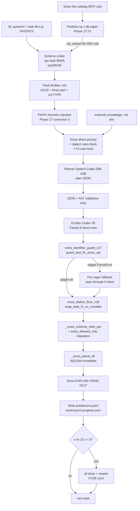

# 4.4 Pipeline для Spider2-Snow (и Spider2-Lite-Snow)

## Lane overview

**Spider2-Snow** + **Spider2-Lite-Snow** share **identical pipeline** — same engine (Snowflake), same dialect, same v28-revert-A stack. Lite-Snow — subset 207 instance_ids from Spider2-Lite jsonl filtered by Snow lane; Spider2-Snow — full 547 tasks across 152 databases.

Этот pipeline — **самый сложный** в всей серии: per-task BM25 partition по `c.db`, three-part identifier guard, NUMBER/VARIANT date-cast wrapper, regex fallback на SQLGlot parse error, custom inline selector (bypasses default `candidate_selector_v18`). Эволюция через Phase 18 → 26 → 27 (F1) → 28 (F4/F4c/revert F2a) — единственный lane, который kept evolving до самого конца проекта.

## Pipeline configuration (commit `ad5493b`, current state)

| Component | Snow configuration |
|---|---|
| **Schema source** | live `INFORMATION_SCHEMA.COLUMNS` snapshot → `outputs/cache/spider2_snow_live_catalog_v18.jsonl` (~587K cols) |
| **Catalog partition** | **Per-task by `c.db.upper()`** (Phase 27 F1). Subset typically 5K-50K columns. |
| **Schema linker** | `schema_linking_v18` BM25, **fresh `SchemaLinker(cat_subset)` per task** |
| **Linker params** | `top_columns=200`, `top_tables=40` (**Phase 27 widened 2.5×** from defaults 80/20) |
| **PK/FK heuristic injection** | `_inject_pk_fk` post-pack (Phase 27 correction 3) — cap 4 cols/table, names matching `id`, `<tbl_singular>_id`, `*_pk`, `*_fk`, `*_id`, `*_key`, `*_sk` |
| **Pack builder** | `max_tables=10`, `max_cols_per_table=22`, three-part name rendering, **col:TYPE annotations** (Phase 28 retained) |
| **Pack rendering — Snow dialect rules block** | injected into planner prompt: three-part identifiers required, LATERAL FLATTEN over UNNEST, IFF / QUALIFY, JSON path syntax, NUMBER→TO_DATE rule (F4 support), VARIANT→::DATE rule |
| **Planner** | Qwen3-Coder-30B-A3B (active) |
| **Emitter** | Qwen2.5-Coder-7B (Family B direct emit) |
| **Candidate factories** | **Family B only**. Family A renderer для Snow NOT implemented (deferred Phase 30). Family C also not Snow-implemented. |
| **F1 AST identifier guard** | **active** — `snow_identifier_guard_v27.guard_and_fix_snow_sql` |
| **F4c regex fallback** | **active** — inside guard, на SQLGlot ParseError |
| **F4 date-cast wrap** | **active** — `snow_dialect_fixer_v28.wrap_date_fn_on_nondate` |
| **F2a mixed-case quoting auto-upper** | **REVERTED** — function exists в module but NOT called в pipeline |
| **Prompt rule "UPPERCASE columns are unquoted"** | **REVERTED** — removed Phase 28 closure |
| **Validators** | All 3: JSON Schema + AST closed-set (`_snow_schema_valid_ast` с `extra_allowed_cols=task_db catalog cols`, Phase 27 relaxation) + Snow EXPLAIN |
| **Selector** | **Custom inline** в `_phase27_snow_runner.py` (NOT `candidate_selector_v18.select`). Single Family B candidate, no multi-candidate selection. |
| **Engine check** | `Snowflake EXPLAIN USING TEXT` (free, no warehouse credit) |
| **Resume scaffolding** | reads existing `predictions.jsonl`, skips done iids, append mode |
| **Periodic file flush** | every 10 tasks `pf.close()+reopen` (Phase 28 hardening) |

## Routing diagram (Snow lane current state)



Highlight relative to other lanes:
- **Per-task BM25 build** — unique to Snow (Spider1/BIRD reuses per-DB; BQ doesn't partition).
- **F1 → F4 → schema_valid sequential** — Snow-only chain.
- **Custom selector inline** — Snow only Family B, no multi-candidate selection needed.
- **Periodic file flush** — Snow lane unique (others don't have long runs requiring это).

## Configuration evolution — timeline

| Phase | run_id / artifact | Pipeline state | Result |
|---|---|---|---|
| **Phase 8-17** | `snow_v8` через `snow_v17_*` | Various v8 renderers, initial Snow setup, model swaps | 0-2/10 pilot10 EX |
| **Phase 18 v18** | `lite_snow_full_v18` (если had) | First v18 stack (live catalog + BM25 + closed-set plan), **`alias_filter` bug — empty alias on Snow catalog rows = no-op filter** | unknown — alias bug not yet identified |
| **Phase 22 STAGE A2** | various pilots | `all_columns` side-channel + join_hints (BQ-targeted; Snow had no Family C) | sv 50-54% bands |
| **Phase 23** | `snow_full_diagnostic_v23` (S1, S3 cancelled) | Concurrent BG inference attempted, OOM | partial, cancelled |
| **Phase 24** | `run_spider2_sequential_v24.py` | GPU lock + sequential runner | reliable execution, но Snow still 0% exec |
| **Phase 25** | `snow_full_v25` | v25 stack on Spider2-Snow FULL 547. **First time FULL Snow attempted seriously.** | 509/547 stopped — **execute_ok = 0/547 (0.0%)** |
| **Phase 26 handoff** | — | Researcher dossier; LinkAlign §1 quote identified cross-DB drift problem | gap diagnostic — Snow 0% root cause = cross-DB drift |
| **Phase 27 F1 — v27** | `lite_snow_pilot10_v27` | + F1 catalog filter + three-part rendering + AST guard | pilot10: sv 2/10, exec 1/10 — schema_valid jumped 12.6% → 20% but most failures still |
| Phase 27 v27b | `lite_snow_pilot10_v27b` | + validator-with-task_db-cols relaxation | pilot10: sv 2/10, exec 1/10 — no measurable diff vs v27 |
| **Phase 27 v27c** | `lite_snow_pilot10_v27c` | + retrieval scale 200/40 + PK/FK injection + SELECT alias fix | **pilot10: sv 8/10, exec 1/10** — schema gate cleared, exec stuck |
| **Phase 28 v28** | `lite_snow_pilot10_v28` | + F2a auto-upper + F4 wrap + F4c fallback + col:TYPE + UPPERCASE prompt rule | **pilot10: sv 7/10, exec 0/10 — REGRESSION** |
| **Phase 28 v28-revert-A** | `lite_snow_pilot10_v28_revertA` | F2a + UPPERCASE prompt rule REVERTED; kept F4 + F4c + col:TYPE | **pilot10: sv 6/10, exec 4/10 — CLOSURE** |
| **Phase 28 FULL run** | `snow_full_v28_revert_a` (CLOSED) / `lite_snow_full_v28_revert_a` (partial n=40/207) | Same v28-revert-A stack on FULL 547 / FULL 207 | Snow FULL: **130/547 = 23.76 % Snowflake EXPLAIN-pass (\*)**, schema_valid 70.02 %, parse_ok 91.96 %, wall 3h 03min; Lite-Snow FULL: partial — deferred to Phase 28b |

Source: combined from `outputs/REPORT_PHASE26_RESEARCHER_HANDOFF.md` §1, `outputs/REPORT_PHASE27_F1_SNOW_GROUNDING.md`, `outputs/REPORT_PHASE28_F2A_F4_DIALECT.md`.

## Pipeline-level metrics

Counters meaningful для Snow lane (from `progress.json`):

| Metric | Definition | Phase |
|---|---|---|
| `schema_valid` | `_snow_schema_valid_ast` returns ok=True | always |
| `parse_ok` | `_snow_parse_ok` returns ok=True (SQLGlot parse) | always |
| `explain_ok` | Snow EXPLAIN USING TEXT returns без exception | always |
| `plan_ok` | JSON + AST validators OK на planner output | always |
| `guard_leaks` | Count `IdentifierLeakError(catalog_leak:...)` raised | Phase 27 |
| `guard_rewrites` | Count auto-fills (catalog missing → fills task_db) | Phase 27 |
| `guard_regex_fallback` | Count SQLGlot ParseError → regex fallback used | Phase 28 |
| `requoted_n` | Count F2a auto-upper applied — **stays 0** since F2a reverted | Phase 28 (reverted) |
| `wrapped_n` | Count F4 NUMBER/VARIANT wraps applied | Phase 28 |
| `pk_fk_injected` | Count PK/FK heuristic injections per task | Phase 27 |
| `pack_unique_dbs` | Distinct catalog/databases в pack tables. Should be `[task_db]` only после F1. | Phase 27 |

## Performance achieved

### Phase 27 closure (pilot10c, on PATENTS subset)
- plan_ok: 4/10
- schema_valid: 8/10 (vs v26 1/10 — 4× lift)
- parse_ok: 9/10
- **execute_ok: 1/10** (same as v26 — schema gate cleared but exec stuck)

### Phase 28 v28 (REGRESSION)
- exec 1/10 → **0/10** (sf_bq211 broke from F2a)

### Phase 28 v28-revert-A (CLOSURE)
- exec 0/10 → **4/10** (sf_bq211 recovered + 3 new exec_ok через F4 date-cast wraps)

### Phase 28 FULL on S1 (in progress)
- **Final closure**: n=547, plan_validation_ok=159 (29.07%), chosen_schema_valid=383 (70.02%), parse_ok=503 (91.96%), **execute_ok (Snowflake EXPLAIN-pass) (\*) = 130 (23.76%)**, guard_rewrites=14, guard_regex_fallback=6, requoted_n=0, wrapped_n=5, wall_sec=10981.7 (~3h 03min).
- **Lite-Snow FULL**: partial n=40/207 — kernel-death interruption; auto-handoff did not fire; full closure deferred to Phase 28b post-defence audit.

## Pipeline timing

| Stage | Wall time per task |
|---|---|
| Catalog partition (per-task BM25 build на 5-50K subset) | ~50-300ms |
| BM25 query (`top_columns=200, top_tables=40`) | ~50-150ms |
| Pack build + PK/FK injection | ~10-50ms |
| Render Snow prompt (with col:TYPE) | <5ms |
| Planner Qwen3-Coder-30B-A3B | ~60-90s |
| JSON + AST validate plan | <50ms |
| Emitter Qwen2.5-Coder-7B | ~10-30s |
| F1 guard | ~50-200ms (SQLGlot parse + AST walk) |
| F4 wrap | ~30-100ms (additional SQLGlot parse + walk) |
| AST validate post-fix | ~50-150ms |
| Parse check | <50ms |
| Snow EXPLAIN call | ~0.5-2s (cached connection) |
| Drive writes + flush | <100ms |
| **Total** | **~70-150s/task** (avg 120s observed) |

Throughput: ~0.5-0.7 tasks/min. FULL 547 ≈ 13-18h cumulative wall (с kernel restarts factored).

## Lane-specific implementation notes

### Per-task BM25 partition — critical fix Phase 27

Pre-Phase-27 issue: Snow catalog rows have `c.alias == ""` (only BQ has alias populated by harvester). `SchemaLinker.query(alias_filter='PATENTS')` was **no-op** because no row matched. → BM25 ranked over entire 587K columns across 152 databases. → top-K hits leaked competitor catalogs into pack. → 90.2% cross-DB drift.

Phase 27 F1 fix at runner level:

```python
full_catalog = sl.load_catalog_jsonl(cat_path, 'snow')
cat_by_db = defaultdict(list)
for c in full_catalog:
    cat_by_db[c.db.upper()].append(c)

for task in tasks:
    task_db = task.get('db').upper()
    cat_subset = cat_by_db.get(task_db, [])   # 5K-50K cols
    linker = sl.SchemaLinker(cat_subset)
    link = linker.query(question, db_filter=task_db, top_columns=200, top_tables=40)
```

Effect on pilot10c+: 0 `guard_leaks` (no cross-DB hits possible на upstream level), `pack_unique_dbs == [task_db]` always.

### Phase 28 F4 wrap — load-bearing после F2a revert

F4 (date-cast wrap) was implemented в Phase 28 alongside F2a. **Initially appeared zero ROI** — pilot10 v28 had 9 wraps but 0 exec. Catalog probe + revert experiment revealed: F2a's regression masked F4's contribution.

After F2a revert (v28-revert-A):
- sf_bq026: F4 wrapped DATE column → exec OK
- sf_bq213: F4 wrapped VARIANT fterm → exec OK
- sf_bq029: model wrote YYYYMMDD math directly (без F4) → exec OK (F4 ne required)
- sf_bq211: восстановился — F4 not relevant к этому task

**F4 = load-bearing condition for 2 of 4 pilot10 v28-revert-A exec_ok**.

### Custom inline selector

Snow runner doesn't call `candidate_selector_v18.select()`. Instead, inline logic в `_phase27_snow_runner.py`:

```python
emit_prompt = _snow_direct_prompt(question, pack, ek)
sql_raw = _gen(emit_prompt, max_new=900)
sql = _extract_sql(sql_raw)

sql_fixed, guard_info = guard.guard_and_fix_snow_sql(sql, task_db)
sql = sql_fixed

if fixer is not None:
    sql_b, info_b = fixer.wrap_date_fn_on_nondate(sql, col_types)
    sql = sql_b

sv_ok, sv_msg = _snow_schema_valid_ast(sql, pack, extra_allowed_cols=task_db_all_cols)
pa_ok, pa_msg = _snow_parse_ok(sql)

if pa_ok:
    ex_ok, ex_class, ex_msg = _snow_explain(sql, db=top_t['db'], schema=top_t['schema'])
```

Single candidate, single path. No multi-candidate tie-break (no Family A/C). Simpler than BQ pipeline.

### Resume scaffolding details

Phase 28 hardening для FULL Snow run (which takes 10+ hours и может hit kernel timeouts):

```python
done_iids = set()
if pf_path.exists():
    with open(pf_path) as f:
        for ln in f:
            p = json.loads(ln)
            iid = p.get('instance_id')
            if iid:
                done_iids.add(iid)
                if p.get('explain_ok'): n_res_exec += 1
                if p.get('schema_valid'): n_res_sv += 1
                if p.get('parse_ok'): n_res_parse += 1

tasks = [t for t in tasks if t.get('instance_id') not in done_iids]
pf = open(out_dir / 'predictions.jsonl', 'a', encoding='utf-8')
tf = open(out_dir / 'traces.jsonl', 'a', encoding='utf-8')
```

Plus periodic `pf.close() + reopen` every 10 tasks → forces Drive FUSE sync to cloud. Without this, kernel death loses unsynced writes (Phase 28 S2 incident: 79 unsynced tasks lost).

## What works on Snow lane

- **F1 per-task partition** — closes cross-DB drift (90.2% → 0%).
- **F1 AST guard** — defensive against any residual drift; rarely fires но valuable insurance.
- **F1 retrieval scale 200/40** — surfaces enough columns for warehouse-scale databases.
- **F4 NUMBER/VARIANT cast wrap** — handles patent-dataset YYYYMMDD encoding и VARIANT date paths.
- **F4c regex fallback** — passes sf_bq210-class LATERAL FLATTEN through guard despite SQLGlot parser gap.

## What doesn't (Phase 29+ targets)

- **Column-name hallucination** dominates remaining failures (Phase 28 §10 per-task table).
- **Hallucinated tables** (sf_bq209-class — CITATIONS не existing).
- **F4 false-positive VARIANT cast** на JSON-object VARIANT columns (sf_bq091: `assignee` is JSON object, F4 wrapped as DATE → GET_PATH(DATE, ...) error).
- **LATERAL FLATTEN downstream parse errors** — F4c fixes guard, но `_snow_schema_valid_ast` ещё fails ParseError on same.
- **No Family A renderer** для Snow — deterministic backup absent.

См. detailed gap analysis в [09_RESULTS_ANALYSIS/03_spider2_snow_analysis.md](../09_RESULTS_ANALYSIS/03_spider2_snow_analysis.md).

## Cross-references

- Benchmark detail: [03_BENCHMARKS/06_spider2_snow.md](../03_BENCHMARKS/06_spider2_snow.md), [03_BENCHMARKS/05_spider2_lite_snow.md](../03_BENCHMARKS/05_spider2_lite_snow.md)
- Architecture overview: [04_ARCHITECTURE/01_overview_single_architecture.md](../04_ARCHITECTURE/01_overview_single_architecture.md)
- Dialect handlers F1/F4: [04_ARCHITECTURE/09_dialect_handlers_f1_f4.md](../04_ARCHITECTURE/09_dialect_handlers_f1_f4.md)
- Snow identifier guard: [08_CUSTOM_TOOLS/05_snow_identifier_guard_v27.md](../08_CUSTOM_TOOLS/05_snow_identifier_guard_v27.md)
- Snow dialect fixer: [08_CUSTOM_TOOLS/06_snow_dialect_fixer_v28.md](../08_CUSTOM_TOOLS/06_snow_dialect_fixer_v28.md)
- Runner orchestration: [08_CUSTOM_TOOLS/08_runner_orchestration.md](../08_CUSTOM_TOOLS/08_runner_orchestration.md)
- Resilience patterns: [08_CUSTOM_TOOLS/09_resilience_patterns.md](../08_CUSTOM_TOOLS/09_resilience_patterns.md)
- Phase 27 F1 narrative: [06_EXPERIMENTAL_PROGRESSION/03_phase27_f1_grounding.md](../06_EXPERIMENTAL_PROGRESSION/03_phase27_f1_grounding.md)
- Phase 28 F2a regression: [06_EXPERIMENTAL_PROGRESSION/04_phase28_f2a_regression_and_revert.md](../06_EXPERIMENTAL_PROGRESSION/04_phase28_f2a_regression_and_revert.md)
- Snow analysis: [09_RESULTS_ANALYSIS/03_spider2_snow_analysis.md](../09_RESULTS_ANALYSIS/03_spider2_snow_analysis.md)
- Snow engine specifics: [04_ARCHITECTURE/10_execution_engines.md](../04_ARCHITECTURE/10_execution_engines.md)

## Источники

| Утверждение | Источник |
|---|---|
| Per-task BM25 partition | `tools/remote_scripts/_phase27_snow_runner.py` lines 336-410 |
| F1 AST guard | `repo/src/evaluation/snow_identifier_guard_v27.py` |
| F4 wrap | `repo/src/evaluation/snow_dialect_fixer_v28.py` |
| F4c regex fallback | `snow_identifier_guard_v27._regex_catalog_leak_check` |
| F2a revert (kept in source) | `outputs/REPORT_PHASE28_F2A_F4_DIALECT.md` §10 |
| Pilot10 progression (v27 → v27c → v28 → v28-revert-A) | `outputs/REPORT_PHASE27_F1_SNOW_GROUNDING.md`, `outputs/REPORT_PHASE28_F2A_F4_DIALECT.md` |
| Pre-Phase-27 baseline 0/547 | `outputs/spider2_snow/runs/snow_full_v25/progress.json` |
| Current FULL run state | `outputs/spider2_snow/runs/snow_full_v28_revert_a/progress.json` (live) |
| Resume + periodic flush | `tools/remote_scripts/_phase27_snow_runner.py` lines 401-450, 547-560 |
