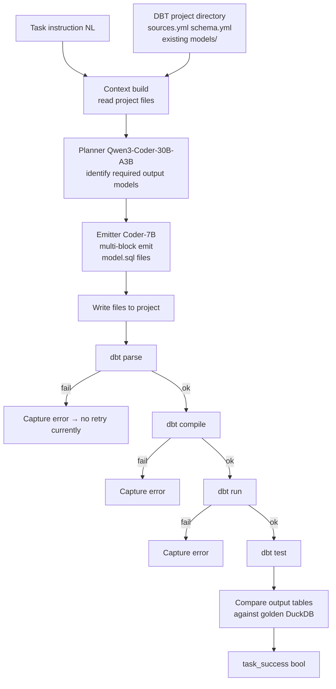

# 4.5 Pipeline для Spider2-DBT

## Lane overview

**Spider2-DBT** — multi-file edit benchmark на DBT-проектах с DuckDB execution (68 tasks, n=68). Pipeline на этом lane — **fundamentally different shape** от других: не single SQL emission, а **agent-style multi-file editing**.

Pipeline **unchanged since Phase 11** baseline reproduction. Phase 12-28 не touched DBT — appropriate scope decision, поскольку DBT-specific scaffold redesign требует full new agent loop (Phase 31 territory, out of dossier scope).

## Pipeline configuration

| Component | DBT configuration |
|---|---|
| **Schema source** | agent reads existing project files (`sources.yml`, `schema.yml`, existing `models/*.sql`) |
| **Catalog** | n/a — no INFORMATION_SCHEMA querying; project source files = schema spec |
| **Schema linker** | BM25 over text representation of existing sources + models (similar pattern к v18 but на project-internal data) |
| **Pack builder** | n/a — DBT context export instead of compact JSON pack |
| **Planner** | Qwen3-Coder-30B-A3B — produces task plan (which files to create/modify) |
| **Emitter** | Qwen2.5-Coder-7B (Family B multi-block emit — emits entire `model.sql` content) |
| **Candidate factories** | Family B only (multi-block whole-file emit format) |
| **F1 / F4 / F4c dialect handlers** | n/a (DBT-compiled SQL targets DuckDB, не Snow) |
| **Validators** | DBT-specific: `dbt parse` → `dbt compile` → `dbt run` → `dbt test` sequential |
| **Selector** | Trivial — single emitted file set |
| **Engine** | `dbt build` execute via subprocess; DuckDB local file backend |
| **Evaluation** | table+column comparison против golden DuckDB output |

## Routing diagram (DBT lane)

## Configuration evolution

| Phase | Change relevant к DBT |
|---|---|
| Phase 8-10 | Initial DBT experimentation. Various scaffold attempts. |
| **Phase 11** | **Baseline established: 9/68 task_success = 13.2%** matching Spider-Agent + GPT-4 ceiling |
| Phase 12-22 | Focus on Lite-BQ / Snow lanes. DBT unchanged. |
| Phase 23 | Concurrent inference experiments — DBT lane BLOCKED (parallel DBT execution complicates state) |
| Phase 24 | Sequential runner. DBT может теперь run reliably but pipeline shape unchanged. |
| Phase 26 handoff | DBT confirmed at **13.2%**, marked structural ceiling = scaffold matter. |
| Phase 27-28 | Snow-only — DBT unchanged. |
| **Phase 31 (planned)** | **Scaffold redesign** — multi-block whole-file emit + read-before-write + staged verifier loop. **Out of dossier scope.** |

## Pipeline-level metrics

DBT-specific counters в `predictions.jsonl`:

| Metric | Definition |
|---|---|
| `dbt_parse_ok` | `dbt parse` returns 0 exit code |
| `dbt_compile_ok` | `dbt compile` returns 0 |
| `dbt_run_ok` | `dbt run` returns 0 |
| `dbt_test_ok` | `dbt test` returns 0 (often optional если tests not defined for task) |
| `output_tables_match` | All expected output tables present с matching columns + values |
| **`task_success`** | Binary — all stages ok + tables match |

Counters **NOT applicable**:
- `schema_valid` / `parse_ok` / `execute_ok` (those are single-SQL metrics)
- `guard_*`, `wrapped_n` (Snow-specific)

## Performance achieved

- **FULL 68**: **task_success = 9/68 = 13.2%**.
- Matches **Spider-Agent + Claude-3.7-Sonnet ceiling 14.7%** and **+ o1-preview 13.24%**.
- Significantly below **Databao 58.82%** (closed top на DBT lane).

См. [03_BENCHMARKS/07_spider2_dbt.md](../03_BENCHMARKS/07_spider2_dbt.md) для leaderboard context.

## Pipeline timing

| Stage | Wall time per task |
|---|---|
| Context build (read project files) | ~100-500ms |
| Planner | ~30-90s (DBT plan typically simpler than SQL plan) |
| Emitter (multi-block) | ~10-60s (multiple files concatenated в single output) |
| Write files | <100ms |
| `dbt parse` | ~5-15s |
| `dbt compile` | ~5-20s |
| `dbt run` (DuckDB execution) | ~30s-5min |
| `dbt test` | ~5-30s |
| Compare output tables | ~1-5s |
| **Total** | **~5-15 min/task** (DBT execution dominates) |

FULL 68 ≈ 6-12h wall.

## Lane-specific implementation notes

### Read-before-write — **absent в current pipeline**

Phase 11 baseline pipeline does **NOT** read existing `models/` files thoroughly before editing. Agent receives task instruction + minimal context (sources.yml summary). Phase 31 plan: explicit read step — show agent existing model dependencies before emitting new model.

### Verifier loop — **absent**

Pipeline does sequential `dbt parse → compile → run → test`, но **no retry on failure**. If `dbt compile` fails, task immediately marked failure. No feedback к agent для self-correction.

Phase 31 plan: staged verifier loop (echoes Databao methodology + SWE-agent edit-linter-revert pattern). Show compile error → re-emit corrected file → retry up to N times.

### Edit format — diff-patch (suboptimal)

Phase 11 pipeline does **diff-patch** edits primarily (90% diff-patches, 0% multi-block whole-file). Per research dossier §4 aider Polyglot finding: *"Qwen2.5-Coder-7B drops ~30% accuracy on Polyglot benchmark when forced into diff vs whole-file format on files <200 LOC"*.

Most DBT model files <200 LOC. Implication: emitter's accuracy systematically reduced ~30% **just from edit format choice**. Phase 31 plan: switch к multi-block whole-file emit (entire `model.sql` regenerated per task, even если "edit" — easier for emitter to ensure consistency).

### Cross-file context awareness — **limited**

Multi-file DBT projects have refs (`{{ ref('upstream_model') }}`) across files. Phase 11 pipeline reads minimal cross-file context. Agent doesn't fully understand dependency chains в complex projects (e.g., `tickit002` which has 10+ models). Phase 31 plan: include compiled DAG metadata в planner context.

### Failure pattern analysis (Phase 11 baseline)

| Failure class | Approximate share |
|---|---|
| `dbt_compile_ok=False` (Jinja syntax / missing ref) | ~30% |
| `dbt_run_ok=False` (DuckDB runtime error: type mismatch, column not exist) | ~25% |
| Output table missing (model not produced) | ~20% |
| Column mismatch (table present, wrong columns) | ~15% |
| Row data mismatch (correct columns, wrong values) | ~10% |

## Why DBT lane plateaus at 13.2%

Per research dossier §3 evidence:
- Spider-Agent + Claude-3.7-Sonnet 14.70%.
- Spider-Agent + o1-preview 13.24%.
- Spider-Agent + наш Qwen3-Coder-30B-A3B 13.2%.

**Three different model classes, ~equal results**. Bottleneck is **scaffold**, не model capability.

Databao blog Feb 2026 quote: *"We made it smarter not by replacing the model, but by changing the environment around it."* Databao 58.82% — **4× lift over Spider-Agent ceiling** через scaffold redesign (up-front DB overview + restricted tool surface + verifier gate).

Phase 31 target band: **22-32%** — partial Databao reproduction. Full Databao 58.82% — requires proprietary engineering.

## What works on DBT lane

- **DBT execution reliable** — DuckDB local engine, no network issues.
- **Phase 11 baseline reproducible** — matches Spider-Agent benchmark numbers.
- **Multi-file write coordination** — agent successfully creates valid DBT structure 30% of time.

## What doesn't (Phase 31 design preview)

This section — **direct preview** для thesis Discussion chapter recommending future work:

### Defect 1: No read-before-write
Agent emits new files без reading existing structure carefully. Phase 31: **explicit read step** — agent first views project structure, sources.yml, existing model deps.

### Defect 2: No verifier loop
Sequential `dbt parse → compile → run → test` immediate fail → task lost. Phase 31: **staged verifier loop** — on each fail, agent receives error message + re-emits corrected version. Similar к SWE-agent edit-linter-revert ablation **+8pp** на SWE-bench Lite.

### Defect 3: Diff-patch edit format
~30% accuracy drop on Coder-7B per aider Polyglot. Phase 31: **multi-block whole-file emit** — regenerate entire `model.sql` per task. Stronger format для Coder-7B.

### Defect 4: Limited cross-file context
DAG dependencies not surfaced. Phase 31: **compiled DAG metadata** included в planner prompt.

### Defect 5: No tool restriction
Spider-Agent provides free bash + filesystem tools. Databao restricts tool surface — focuses agent. Phase 31: **focused tool API** (read_project_file, write_model_file, run_dbt_compile).

Combined estimated lift per research dossier: **13.2% → 25-32%**. Full Databao 58.82% may require additional proprietary tricks not disclosed.

## Cross-references

- Benchmark detail: [03_BENCHMARKS/07_spider2_dbt.md](../03_BENCHMARKS/07_spider2_dbt.md)
- Architecture engines (DuckDB + DBT): [04_ARCHITECTURE/10_execution_engines.md](../04_ARCHITECTURE/10_execution_engines.md)
- Models (Coder-7B edit format limitation): [04_ARCHITECTURE/02_models_qwen3_qwen2.5.md](../04_ARCHITECTURE/02_models_qwen3_qwen2.5.md)
- Agentic frameworks (Databao, SWE-agent, Spider-Agent): [02_RELATED_WORK/04_agentic_frameworks_for_dbt.md](../02_RELATED_WORK/04_agentic_frameworks_for_dbt.md)
- Phase 11 baseline: [06_EXPERIMENTAL_PROGRESSION/01_early_phases_overview.md](../06_EXPERIMENTAL_PROGRESSION/01_early_phases_overview.md)
- DBT analysis: [09_RESULTS_ANALYSIS/04_spider2_dbt_analysis.md](../09_RESULTS_ANALYSIS/04_spider2_dbt_analysis.md)
- Lessons learned (Phase 31 direction): [06_EXPERIMENTAL_PROGRESSION/06_lessons_learned.md](../06_EXPERIMENTAL_PROGRESSION/06_lessons_learned.md)

## Источники

| Утверждение | Источник |
|---|---|
| 13.2% task_success | `outputs/REPORT_SPIDER2_V11.md`; `outputs/REPORT_PHASE26_RESEARCHER_HANDOFF.md` §1 |
| Spider-Agent ceiling 14.7% | research dossier `outputs/REPORT_PHASE27_RESEARCHER_STRATEGY.md` §3 |
| Databao 58.82% + methodology | research dossier §3, §4 |
| Coder-7B diff-patch 30% drop | research dossier §4 aider |
| SWE-agent +8pp from edit-linter-revert | research dossier §4 SWE-agent |
| DBT pipeline shape | `outputs/REPORT_SPIDER2_V11.md` + Phase 11 codebase artifacts |
