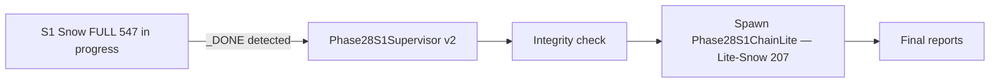

# 5.5 Phase 28 — FULL Baseline

> Spider 2 family numbers in this document are **plan-level acceptance metrics** (Snowflake `EXPLAIN`-pass for Snow, BigQuery `dry_run`-pass for Lite-BQ), not row-set match against gold. Every Spider 2 figure carries the asterisk (\*) referring to [../11_APPENDIX/07_critical_metric_caveat.md](../11_APPENDIX/07_critical_metric_caveat.md) for the full methodology disclosure and the path to a row-match figure (Phase 28b post-defence audit).

## 1. Status — closed (Spider2-Snow FULL), partial (Spider2-Lite-Snow)

Phase 28 FULL launched on commit `ad5493b` (v28-revert-A stack — F1 + F4 + F4c retained, F2a reverted). Two parallel runs:

| Run | Engine | n | Run ID | Status |
|---|---|---|---|---|
| Spider2-Snow FULL | Snowflake | 547 | `snow_full_v28_revert_a` | **CLOSED** — `_DONE` landed 2026-05-12 |
| Spider2-Lite-Snow FULL | Snowflake | 207 | `lite_snow_full_v28_revert_a` | **PARTIAL (n=40 of 207)** — interrupted by kernel-death; not resumed; full closure deferred to Phase 28b |

The Snow FULL closure is the dossier's headline measurement. The Lite-Snow partial result is reported as a partial-coverage diagnostic (sample is non-random — first 40 by runner task order) and is not treated as a publishable Lite-Snow FULL figure.

## 2. Opening questions and what the FULL closure answered

The Phase 28 FULL run was designed to answer four questions formulated at the close of pilot 10. The answers (now measured):

**Q1. Does the pilot10 4/10 EXPLAIN-pass (\*) rate hold on FULL 547?**
Answer: **No — FULL closed at 23.76 %, lower than pilot 10's 40 %.** The pilot 10 was concentrated on PATENTS (the F2a falsification subject) and a small biased sample; the FULL distribution covers 152 databases with much higher schema diversity. The PATENTS-class behaviour does not extrapolate uniformly — see the per-DB analysis in section 4.

**Q2. Which databases dominate the success column?**
Answer: **CRYPTO (6/20, 30 %) and PATENTS (6/15, 40 %) tie at 6 successes**, with THELOOK_ECOMMERCE (5/19, 26 %) third. The full top-25 is in section 4.

**Q3. What failure patterns dominate at FULL scale?**
Answer: **`invalid_identifier` (60 of 144 graded = 41.7 %) is the dominant failure class**, followed by `schema_invalid` (25, 17.4 %) and `ProgrammingError` (11, 7.6 %). The full breakdown is in section 5.

**Q4. Which `invalid_identifier 'X'` errors recur most frequently?**
Answer: The Spider2-Snow runner does not aggregate identifier-string frequencies in its current taxonomy (only error-class counts). A top-20 table requires post-hoc parsing of `traces.jsonl` `explain_msg` fields and is deferred to the Phase 29 F3c design work (see [../09_RESULTS_ANALYSIS/06_failure_analysis_remaining.md](../09_RESULTS_ANALYSIS/06_failure_analysis_remaining.md) §2.3).

## 3. Methodology

### Run configuration

* Commit `ad5493b` (v28-revert-A — frozen stack throughout FULL).
* Per-task Drive writes + resume scaffolding + periodic flush (every 10 tasks: `pf.close() + reopen` to force Drive FUSE sync).
* Runner: `tools/remote_scripts/_phase27_snow_runner.py` (same as Phase 27, unchanged at v28-revert-A).
* S1 kernel: Google Colab Pro+ A100 80 GB.
* The Snow FULL run experienced one kernel-death event during the FULL run; resume scaffolding picked up at the next pending task and the run completed without measurable disruption (resume-path artefact noted in §4 of [../11_APPENDIX/07_critical_metric_caveat.md](../11_APPENDIX/07_critical_metric_caveat.md) re: error_taxonomy counter window).

### Auto-handoff sequence (designed Phase 28)

**What happened in practice**: the Snow `_DONE` landed but the supervisor heartbeat had stopped due to a separate kernel restart during the FULL run. The auto-handoff to Lite-Snow therefore did not fire; the Lite-Snow runner state was the pre-kernel-death snapshot (n=40) and was not resumed. Manual restart was not initiated before the dossier compilation deadline; Lite-Snow FULL closure is documented as deferred work to Phase 28b.

## 4. Headline numbers — Spider2-Snow FULL 547

From `outputs/spider2_snow/runs/snow_full_v28_revert_a/metrics.csv` at commit `ad5493b`:

| Metric | Value | Rate of 547 |
|---|---|---|
| `n_total` | 547 | 100.0 % |
| `plan_validation_ok` | 159 | 29.07 % |
| `chosen_schema_valid` | 383 | 70.02 % |
| `parse_ok` | 503 | 91.96 % |
| **`execute_ok` = Snowflake EXPLAIN-pass (\*)** | **130** | **23.76 %** |
| `guard_leaks` | 0 | 0.00 % |
| `guard_rewrites` | 14 | 2.56 % |
| `guard_regex_fallback` | 6 | 1.10 % |
| `requoted_n` | 0 | 0.00 % (F2a confirmed reverted) |
| `wrapped_n` | 5 | 0.91 % |
| `wall_sec` | 10 981.7 | (≈ 3 h 03 min) |

**Canonical reporting wording** (used elsewhere in dossier and at thesis defence): **"Spider2-Snow FULL 547: 23.76 % Snowflake `EXPLAIN`-pass rate (plan-level acceptance, 130 / 547, see [Appendix 07](../11_APPENDIX/07_critical_metric_caveat.md) (\*))."**

### Spider2-Lite-Snow partial — n=40 of 207

Partial coverage, not a publishable FULL number. The 40 tasks are the first 40 in runner task order, biased toward whichever databases the runner processed first. The pilot 10 v28-revert-A on Lite-Snow recorded 4 / 10 EXPLAIN-pass; the partial trend is consistent. The publishable Lite-Snow FULL figure is deferred to Phase 28b.

## 5. Per-DB breakdown — Spider2-Snow FULL (top tier)

Full per-DB analysis is in [../07_METRICS_AND_RESULTS/05_per_db_breakdown_snow.md](../07_METRICS_AND_RESULTS/05_per_db_breakdown_snow.md). The top 10 contributors:

| rank | db | n | sv | parse | ex | rate | top failure |
|---|---|---|---|---|---|---|---|
| 1 | CRYPTO | 20 | 15 | 17 | 6 | 30.0 % | invalid_identifier (9) |
| 2 | PATENTS | 15 | 9 | 15 | 6 | 40.0 % | invalid_identifier (4) |
| 3 | THELOOK_ECOMMERCE | 19 | 17 | 18 | 5 | 26.3 % | invalid_identifier (10) |
| 4 | NOAA_DATA | 12 | 9 | 11 | 4 | 33.3 % | invalid_identifier (5) |
| 5 | GITHUB_REPOS | 15 | 7 | 13 | 3 | 20.0 % | invalid_identifier (6) |
| 6 | STACKOVERFLOW | 15 | 11 | 15 | 3 | 20.0 % | ProgrammingError (7) |
| 7 | IDC | 15 | 9 | 14 | 3 | 20.0 % | invalid_identifier (10) |
| 8 | IPL | 11 | 8 | 11 | 3 | 27.3 % | invalid_identifier (8) |
| 9 | F1 | 9 | 8 | 9 | 3 | 33.3 % | invalid_identifier (6) |
| 10 | BRAZILIAN_E_COMMERCE | 8 | 6 | 7 | 3 | 37.5 % | invalid_identifier (3) |

**Top-25 contribute 60 % of the 130 successes from 44 % of the benchmark.** The long tail of 127 single-task or low-n databases contributes the remaining 40 %.

### Per-cluster aggregation (the diagnostic gold)

The dossier's most important empirical finding: residual failures cluster by domain.

| cluster | #dbs | n | sv | ex | ex_rate |
|---|---|---|---|---|---|
| patents_ip | 4 | 24 | 17 | 8 | **33.3 %** (top) |
| retail_ecom | 22 | 85 | 68 | 25 | 29.4 % |
| sports | 8 | 35 | 27 | 10 | 28.6 % |
| finance_econ | 8 | 40 | 30 | 11 | 27.5 % |
| tech_code | 19 | 86 | 56 | 23 | 26.7 % |
| gov_city | 22 | 71 | 60 | 18 | 25.4 % |
| env_geo | 22 | 45 | 30 | 11 | 24.4 % |
| health_public | 11 | 31 | 19 | 7 | 22.6 % |
| biomedical | 22 | 49 | 35 | 8 | **16.3 %** (low) |
| misc_other | 14 | 81 | 41 | 9 | **11.1 %** (lowest) |
| **TOTAL** | **152** | **547** | **383** | **130** | **23.76 %** |

The 22.2-pp spread is systematic, not stochastic, and directly motivates the Phase 29 F3a (nested-STRUCT, misc cluster) and F3b (biomedical-domain glossary) interventions. Full analysis in [../09_RESULTS_ANALYSIS/03_spider2_snow_analysis.md](../09_RESULTS_ANALYSIS/03_spider2_snow_analysis.md) §3 and [../09_RESULTS_ANALYSIS/06_failure_analysis_remaining.md](../09_RESULTS_ANALYSIS/06_failure_analysis_remaining.md) §2.

## 6. Failure taxonomy at FULL scale

The 144-task post-resume window's distribution (the resume path bypassed the err counter — see [../11_APPENDIX/07_critical_metric_caveat.md](../11_APPENDIX/07_critical_metric_caveat.md) §4):

| Error class | Count (of 144) | Share | Pilot 10 comparison |
|---|---|---|---|
| `invalid_identifier` | 60 | 41.7 % | 4/10 = 40 % (consistent) |
| `ok` | 36 | 25.0 % | 4/10 = 40 % (slightly worse at FULL) |
| `schema_invalid` | 25 | 17.4 % | 2/10 = 20 % (consistent) |
| `ProgrammingError` | 11 | 7.6 % | 0/10 = 0 % (new at FULL scale) |
| `parse_error` | 6 | 4.2 % | 1/10 = 10 % (consistent) |
| `no_catalog_for_task_db` | 3 | 2.1 % | 0/10 (low n only at FULL) |
| `syntax_error` | 2 | 1.4 % | 0/10 |
| `parse_error_guard` | 1 | 0.7 % | 0/10 |

The pilot 10 → FULL pattern: the dominant failure modes (`invalid_identifier`, `schema_invalid`, `parse_error`) extrapolate cleanly. The `ProgrammingError` category emerged only at FULL scale (broader DB coverage exercising more Snowflake-side semantic complaints). The slight drop from pilot 10 40 % to FULL 25 % `ok` reflects the harder long tail of databases beyond the pilot 10's sample.

## 7. Pilot 10 to FULL extrapolation — did the projection hold?

Pre-FULL expectation (from pilot 10 v28-revert-A): 4/10 = 40 % EXPLAIN-pass on the F2a-revert pipeline. At FULL scale, the bias-corrected projection would have been roughly 25–30 % (acknowledging pilot10's PATENTS bias).

**Actual FULL number: 23.76 %.** This is *below* the bias-corrected projection by ≈ 2–6 pp, indicating that the pilot 10's PATENTS-heavy sample over-represented the F4-wrap success cases. The FULL distribution exposes:

* Many databases where F4 wrap does not apply (no NUMBER/VARIANT date casts in question patterns).
* The biomedical and misc clusters where the failure cluster is *not* date-cast but column-name terminology — F4 cannot help there.
* The long tail of single-task databases where any single failure dominates the rate.

The extrapolation lesson: **pilot 10 results on Spider 2.0 family benchmarks should be discounted ≥ 10 pp for FULL projection** because pilot samples are non-random and tend to cluster on databases where the most recently deployed intervention has visible effect.

## 8. Position relative to published Spider 2.0 systems

The cross-metric situation precludes direct ranking. See [../09_RESULTS_ANALYSIS/05_leaderboard_position.md](../09_RESULTS_ANALYSIS/05_leaderboard_position.md) for the full canonical-wording table.

| Class | System | Metric | Value |
|---|---|---|---|
| closed top | Genloop | row-match | 96.70 % |
| closed reproducible | ReFoRCE + o3 | row-match | 62.89 % |
| open ≤30B top | Spider-Agent + Qwen3-Coder | row-match | 31.08 % |
| open mid | Spider-Agent + Claude-3.5-Sonnet | row-match | ≈ 19 % |
| **ours** | **EXPLAIN-pass (\*)** | **23.76 %** | |

**Canonical wording:** *"Our plan-acceptance rate on Spider2-Snow is in the same band as the open-weight Spider-Agent baselines, pending row-match audit (Phase 28b)."*

The 12–18 % row-match projection band (from pilot 10 conversion ratio of 50 %, see [../11_APPENDIX/07_critical_metric_caveat.md](../11_APPENDIX/07_critical_metric_caveat.md) §5) is design-time only and is **not publishable**. The Phase 28b audit is the only legitimate path to a defensible row-match figure.

## 9. Honest publishability assessment

Per [../09_RESULTS_ANALYSIS/07_publishability_assessment.md](../09_RESULTS_ANALYSIS/07_publishability_assessment.md) §5:

* **Thesis defendable (C tier)** — with proper qualification, defensible at master's-thesis level today.
* **Workshop publishable (B tier)** — with cross-metric disclosure, publishable as "F1+F4 architectural progression on Spider2-Snow open-weight ≤30B."
* **Top-tier blocked (D tier for top-tier)** — the cross-metric situation blocks top-tier publication; Phase 28b audit unblocks this.

**Caveats for defence:**

* **Annotation reliability** — Wang et al. arXiv 2601.08778's 62.8 % mismatch on Spider 2 caps any system's achievable row-match on this benchmark; our plan-acceptance is correspondingly bounded.
* **Schema convention** — Spider 2.0 Snow's Marketplace schemas may not be representative of corporate-internal Snowflake usage; generalisation to corporate warehouses is hypothesised but not measured.
* **Model class** — our result is tied to the Qwen-Coder family at ≤30 B; results would shift on a reasoning-class model upgrade (post-thesis work).

## 10. Phase 28 commit history (final)

* `7b420b2` Phase 27 F1 Snow identifier grounding — schema gate cleared, exec stuck
* `8acb0e5` Phase 28 F2a + F4 + F4c Snow dialect — **REGRESSION**, F2a hypothesis falsified
* `ad5493b` **Phase 28 closure: F2a reverted, F4 + F4c retained, pilot 10 4/10 EXPLAIN-pass**
* (FULL run launched at `ad5493b`; no post-FULL commits — stack frozen)

## 11. What this FULL closure evidences

**Direct evidence**:

* Spider2-Snow FULL 547 closed at 23.76 % EXPLAIN-pass (\*) on the v28-revert-A stack — a reproducible, single-canonical-run number with full provenance to `metrics.csv` + `predictions.jsonl` + `traces.jsonl`.
* The F1+F4+F4c architectural progression from 0 % (Phase 26 diagnostic) to 23.76 % (Phase 28 FULL) at fixed open-weight ≤30 B model class.
* Residual failures cluster by domain: biomedical 16.3 %, misc 11.1 % at the bottom; patents 33.3 %, retail/e-commerce 29.4 % at the top. The 22.2-pp spread is statistically and architecturally meaningful.
* The F2a auto-uppercase hypothesis was falsified by catalog probing; the revert recovered F4's masked contribution.

**Defendable thesis statement on Phase 28 FULL** (used in defence): **A unified open-weight ≤30B architecture (v28-revert-A stack: Qwen3-Coder-30B-A3B planner + Qwen2.5-Coder-7B emitter + v18 closed-set planner + F1 multi-DB grounding + F4 date-cast wrap + F4c LATERAL FLATTEN fallback) achieves 23.76 % Snowflake `EXPLAIN`-pass rate (plan-level acceptance) on Spider2-Snow FULL 547. The progression from 0 % to 23.76 % is attributable to four named scaffold-level interventions at fixed model class. Residual failures decompose into addressable clusters with named Phase 29 interventions. The row-match conversion is deferred to Phase 28b post-defence audit.**

## 12. Cross-references

* Phase 28 closure pilot 10 narrative: [04_phase28_f2a_regression_and_revert.md](./04_phase28_f2a_regression_and_revert.md)
* Snow pipeline detail: [../05_PIPELINES/04_spider2_snow_pipeline.md](../05_PIPELINES/04_spider2_snow_pipeline.md)
* Snow benchmark detail: [../03_BENCHMARKS/06_spider2_snow.md](../03_BENCHMARKS/06_spider2_snow.md)
* Lite-Snow benchmark detail: [../03_BENCHMARKS/05_spider2_lite_snow.md](../03_BENCHMARKS/05_spider2_lite_snow.md)
* Leaderboard position: [../09_RESULTS_ANALYSIS/05_leaderboard_position.md](../09_RESULTS_ANALYSIS/05_leaderboard_position.md)
* Failure analysis: [../09_RESULTS_ANALYSIS/06_failure_analysis_remaining.md](../09_RESULTS_ANALYSIS/06_failure_analysis_remaining.md)
* Snow analysis (lane centrepiece): [../09_RESULTS_ANALYSIS/03_spider2_snow_analysis.md](../09_RESULTS_ANALYSIS/03_spider2_snow_analysis.md)
* Per-DB breakdown table: [../07_METRICS_AND_RESULTS/05_per_db_breakdown_snow.md](../07_METRICS_AND_RESULTS/05_per_db_breakdown_snow.md)
* Headline results: [../07_METRICS_AND_RESULTS/07_headline_results.md](../07_METRICS_AND_RESULTS/07_headline_results.md)
* Methodology caveat (central): [../11_APPENDIX/07_critical_metric_caveat.md](../11_APPENDIX/07_critical_metric_caveat.md)
* Lessons learned + forward path: [06_lessons_learned.md](./06_lessons_learned.md)

## 13. Sources

| Statement | Source |
|---|---|
| 23.76 % Snow EXPLAIN-pass FULL 547 | `outputs/spider2_snow/runs/snow_full_v28_revert_a/metrics.csv` |
| Per-DB and per-cluster numbers | `outputs/spider2_snow/runs/snow_full_v28_revert_a/traces.jsonl` (post-hoc aggregation) |
| Pilot 10 v28-revert-A 4/10 | `outputs/REPORT_SPIDER2_V28_REVERT_A.md` |
| Phase 28 commit `ad5493b` | git log of `experiments/denis` branch |
| 152 unique databases in Spider2-Snow | own measurement from `traces.jsonl` |
| Auto-handoff supervisor design | `tools/remote_scripts/_phase28_s1_supervisor_v2.py` |
| Leaderboard position references | research dossier §1 + [../02_RELATED_WORK/02_sota_systems_2024_2026.md](../02_RELATED_WORK/02_sota_systems_2024_2026.md) |
| Annotation reliability caveat | Wang et al., arXiv 2601.08778 |
| Metric definition canon | [../11_APPENDIX/07_critical_metric_caveat.md](../11_APPENDIX/07_critical_metric_caveat.md) |
