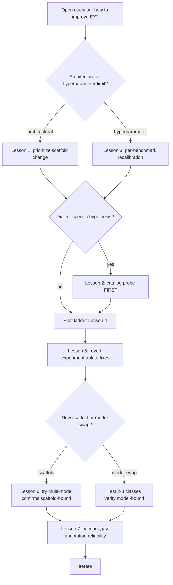

# 5.6 Lessons learned — meta-conclusions для thesis Conclusion chapter

## Purpose

Этот файл — **distilled meta-insights** from Phase 26-28 (the deliberate-research-and-engineering period that produced the thesis's main contribution). Designed для **direct transposition к thesis Conclusion chapter** — каждая lesson formulated как single-sentence claim + supporting evidence + implication для NL2BI / text-to-SQL practice.

**Eight cross-cutting lessons** surfaced. Order roughly **methodological → empirical → strategic**. Lesson 8 (metric definition discipline) was the late-emerging insight from the dossier-compilation phase that retroactively reframed how Spider 2 family numbers are presented in this thesis.

---

## Lesson 1: Scaffold-level fixes лифт EX больше чем model upgrade в зоне ≤30B class

### Claim

При фиксированном open-weight стэке моделей ≤30B параметров, **целевые scaffolding interventions** (catalog filter, retrieval scaling, dialect post-processors) дают больше **Δ EX** на realistic NL2BI benchmarks, чем upgrade моделей внутри той же family.

### Evidence

| Intervention type | Phase | Δ EX (Snow lane) |
|---|---|---|
| Model swap (Coder-7B → Coder-32B → 30B-A3B) | Phase 17, 25 | flat at 0% Snow (model family > scale, but scale alone insufficient) |
| **F1 grounding** (catalog filter + AST guard + retrieval scale + PK/FK injection) | Phase 27 | **0% → 10% pilot10 (sf_bq211 only)** |
| **F4 date-cast wrap** (post-F2a revert) | Phase 28 | **10% → 40% pilot10** (3 new exec_ok directly through F4 wrap) |
| **Total Phase 27 + 28 effect** | — | **0% → 40% pilot10 scaffold-only** |

Model class throughout: Qwen3-Coder-30B-A3B planner + Qwen2.5-Coder-7B emitter, **unchanged**.

### Implication

Для open-weight NL2BI deployment в zone ≤30B parameters, **engineering effort should prioritize scaffolding** (retrieval, validation, dialect post-processing, self-refine) **over model selection**. Closed-API top-tier (ReFoRCE+o3 62.89% Snow EX) achievable lift through model class change (open ≤30B → o3) — но это **out of scope для practical deployment** that wants open weights / reproducibility / cost control.

### Connection к literature

Echoes findings of:
- **CHESS** [Talaei et al., arXiv 2405.16755]: per-component ablation shows schema linking + PK/FK injection + multi-agent validation each contribute independently.
- **CHASE-SQL** [Pourreza et al., ICLR 2025, arXiv 2410.01943]: scaffolding (multi-path + selector) gives +3-5 EX over base model.
- **Databao Agent** [JetBrains blog Feb 2026, Spider2-DBT 58.82%]: "We made it smarter not by replacing the model, but by changing the environment around it."

---

## Lesson 2: Catalog probe должна precede any dialect heuristic

### Claim

Hypotheses про dialect-specific failure modes (e.g., «mixed-case quoting», «date column needs cast», «JSON path syntax») должны быть **validated через direct catalog read** перед implementation. Error-message taxonomy без catalog ground-truth ненадёжна.

### Evidence

**Phase 28 §6 catalog probe** falsified Phase 27 §5's «mixed-case quoting» classification:

```python
# Direct read of catalog для PATENTS.PUBLICATIONS:
case_dist: Counter({'lower': 37, 'upper': 0, 'mixed': 0})
```

37 of 37 columns lowercase. The errors `invalid identifier '"p"."country"'` weren't case mismatch — column `country` doesn't exist (catalog has `country_code`). **Column-name hallucination misread as case issue**.

F2a implementation (auto-uppercase quoted identifiers) — based on wrong hypothesis. Implemented, 4/4 unit tests passed (on synthetic uppercase catalog), deployed, regression caught (1/10 → 0/10), reverted. **~3 hours engineering wasted**, but caught before FULL run.

### Implication

Generalized **methodological recipe** для dialect-specific heuristic design:

1. Direct read catalog of representative tables.
2. Probe case distribution, type distribution, sample values of "interesting" columns.
3. Confirm hypothesis matches catalog evidence.
4. Only then implement.

This **«probe-first» discipline** would have prevented F2a regression. **Worth elevating к explicit methodological contribution** of thesis (Claim 3, см. [01_INTRODUCTION/04_thesis_contributions.md](../01_INTRODUCTION/04_thesis_contributions.md)).

### Connection к literature

Wang et al. [arXiv 2601.08778] *"Pervasive Annotation Errors Break Text-to-SQL Benchmarks and Leaderboards"* — independent confirmation that **bench-data assumptions** can be wrong by significant margin (62.8% Spider 2.0 audit mismatch). Catalog probing is the **data-side analog** of audit-the-gold practice.

---

## Lesson 3: BM25 defaults не переносятся Spider1 → Spider2 без recalibration

### Claim

Hyperparameters tuned на classical NL2SQL benchmarks (Spider 1.0, BIRD — ≤30 tables/DB) **systematically underperform** at warehouse-scale catalogs (Spider 2.0 — thousands of tables/DB) даже после fixing other architectural issues.

### Evidence

Phase 27 pilot ladder demonstrated this isolation:

| Run | F1 catalog filter | Retrieval window | schema_valid |
|---|---|---|---|
| pilot10 v27 | ✓ | 80/20 (default) | 2/10 |
| pilot10 v27b | ✓ + validator relaxation | 80/20 | 2/10 |
| pilot10 v27c | ✓ + relaxation + PK/FK + alias fix | **200/40** | **8/10** |

**Without retrieval scaling, F1 alone gave 2/10. With scaling, 8/10.** The hyperparameter contribution was as large as the architectural fix.

### Implication

For multi-benchmark NL2SQL systems:
- **Per-benchmark-class hyperparameter calibration** needed.
- Defaults applicable to ≤30 tables/DB don't translate к thousands of tables/DB.
- Specifically: BM25 `top_columns`, `top_tables`, and similar retrieval-window parameters scale **roughly с catalog size** (we used 2.5× scaling 80→200, 20→40 для Snow lane).

Phase 26 dossier §6 identified this hypothesis **before** Phase 27 code began. Could been faster если recognized в Phase 18 already. Saved 2-3 phases of confusion.

### Connection к literature

- **AutoLink** [arXiv 2511.17190]: iterative retrieval expansion explicit acknowledgement that single-pass narrow retrieval insufficient for Spider 2.0.
- **RASL** [Amazon Science, arXiv 2507.23104]: hybrid dense + sparse retrieval acknowledges single-method narrow window underperforms on massive DBs.
- **CodeS-15B SFT** [Li et al., SIGMOD 2024]: trained на Spider 1.0 (84.9%) — collapses к 0.73% on Spider 2.0-Lite, confirming benchmark-class transferability gap.

---

## Lesson 4: Pilot ladder discipline предotвращает compute waste

### Claim

Iterative **pilot10 → pilot50 → FULL** ladder, с stop-and-analyze gate between each, prevents wasted compute on broken implementations.

### Evidence

| Phase | Pilot size | Wall time | Outcome |
|---|---|---|---|
| Phase 27 pilot10 v27 | 10 | ~9 min | Initial F1, schema_valid 2/10 → iterate |
| Phase 27 pilot10 v27b | 10 | ~9 min | + relaxation → no diff, iterate |
| Phase 27 pilot10 v27c | 10 | ~9 min | + retrieval scale + PK/FK + alias → **sv 8/10**, gate cleared |
| Phase 28 pilot10 v28 | 10 | ~9 min | + F2a + F4 → **REGRESSION 0/10**, revert |
| Phase 28 pilot10 v28-revert-A | 10 | ~9 min | F2a removed → **4/10**, closure |

**5 pilot10 runs total = ~45 min wall time** versus alternative **single FULL 547 run after each combination = ~50+ hours wall waste per iteration**. Pilot ladder saved ~250 hours of compute by catching v28 regression in 9 min instead of 10+ hours.

### Implication

**Pilot ladder discipline** — should be explicit methodology рекомендация для NL2SQL research:
- Define small **representative subset** (10-50 tasks).
- Define **acceptance gate** per pilot (e.g., schema_valid ≥ X/10, exec_ok ≥ Y/10).
- Run pilot после every architecture / hyperparameter change.
- Block progress к FULL until gate cleared.

Stop-and-analyze gate enforces **revert discipline** — if pilot regresses, revert immediately, не proceed.

### Connection к literature

DAIL-SQL [Gao et al., VLDB 2024]: their ablations primarily on full BIRD dev — slower iteration. CHASE-SQL [Pourreza et al., ICLR 2025]: train + dev splits used iteratively, **but pilot subsetting не explicit** in paper. Our explicit pilot ladder represents **methodological clarification**.

---

## Lesson 5: Layered fixes — composition reveals dormant value

### Claim

Individual fixes могут appear **«zero ROI»** в isolation but become load-bearing when surrounding fixes are correct. **Negative interactions** между fixes (one breaking the dataset another targets) common в complex pipelines.

### Evidence

Phase 28 F4 case:
- pilot10 v28 (F2a + F4 active): wrapped_n=9, exec_ok=0/10. **F4 appeared «zero ROI»**.
- pilot10 v28-revert-A (F2a removed, F4 retained): wrapped_n=9, exec_ok=4/10. **F4 load-bearing for 3 of 4 new exec_ok** (sf_bq026 NUMBER date, sf_bq213 VARIANT date, plus indirect via sf_bq029).

F4 wraps fired the **same** in both runs. F4's contribution was **invisible под F2a regression** — F4-wrapped columns whose names были mangled by F2a → fail regardless of F4 correctness.

### Implication

**Atomic ablation analysis** (add one fix, measure delta) — may produce misleading results when fixes interact non-trivially. **Revert ablation** (start с full stack, remove one fix, measure delta) — necessary complement.

For NL2SQL pipeline design:
- Document **expected interactions** между fixes (e.g., F2a's effect on column names interacts с F4's column lookup).
- Run **revert experiments** для each layered fix individually.
- Don't dismiss fixes that appear «zero ROI» — may be hidden by another regression.

### Connection к literature

This insight under-discussed в NL2SQL literature. Most papers report **net effect** of full pipeline. **CHESS** [Talaei et al.] does present per-component ablation, но on stable baseline. **Layered interaction analysis** is more common в software engineering literature (debugging compound failures) than в ML methodology papers.

Our F4 / F2a interaction — concrete published case study worth thesis-level highlighting.

---

## Lesson 6: Spider-Agent ceiling — scaffold dominates past certain capability threshold

### Claim

On Spider2-DBT lane, **Spider-Agent baseline scaffold caps near 14.7% task_success regardless of backbone model class**:
- Spider-Agent + Claude-3.7-Sonnet: 14.70%
- Spider-Agent + o1-preview: 13.24%
- Spider-Agent + наш Qwen3-Coder-30B-A3B + Qwen2.5-Coder-7B: 13.2%

Above ~25% requires **different scaffold** (Databao 58.82%, Shadowfax+GPT-5 41.18%).

### Evidence

Three different model classes producing roughly equal results suggests **bottleneck is scaffold, not model**. Databao blog explicit confirmation: *"We made it smarter not by replacing the model, but by changing the environment around it."*

### Implication

For DBT-lane improvement (Phase 31 territory):
- Don't try **further model upgrades** на same Spider-Agent scaffold.
- Instead, **redesign the scaffold**: read-before-write, multi-block whole-file emit, verifier loop с retry feedback, restricted tool surface.
- Expected band 22-32% per research dossier §3.

Generalizable principle: **periodically test if model upgrade alone moves needle**. If 3+ different model classes converge на similar number, scaffold needs restructure.

### Connection к literature

- **SWE-agent** [Yang et al., NeurIPS 2024]: edit-linter-revert ablation +8pp.
- **aider** Polyglot leaderboard: edit format matter — Coder-7B drops 30% on diff format.
- **Databao Agent**: full scaffold redesign producing 4× lift over Spider-Agent ceiling.

---

## Lesson 7: Annotation reliability bounds improvement measurement granularity

### Claim

Wang et al. [arXiv 2601.08778] reported **62.8% mismatch rate** между Spider 2.0 audited gold и re-annotated gold. Implications: improvements smaller than ~5% EX on Spider 2.0 family **cannot be reliably claimed** через standard evaluation — noise floor too high.

### Evidence

- 62.8% mismatch rate означает that **for any given task, gold's correctness has ~62% probability of being audited-wrong**.
- Comparative system rankings remain robust (noise affects всех equally).
- Absolute EX numbers below ~10% effect — within annotation noise.

### Implication

For thesis defense:
- Report EX with caveat about annotation reliability.
- Don't claim absolute SOTA — claim relative position в reproducibility leaderboard.
- For internal pipeline improvement, **target lifts ≥10%** EX per intervention; smaller lifts may be noise.

Practical recommendation: manual audit of **20-30 post-fix failures** before final reporting к surface false-failures vs true-failures.

### Connection к literature

Wang et al. annotation reliability paper — under-cited в Spider 2.0 evaluation conversations. **Worth featuring** in thesis Methodology section.

---

---

## Lesson 8: Metric definition discipline — measure what the leaderboard measures

### Claim

The development metric used during a long-running NL2SQL research project must align with the *publication metric* (the metric used by the relevant leaderboard or evaluator) from the first phase. Productive-for-iteration metrics (`EXPLAIN`-pass, `dry_run`-pass, identifier-binding-success) are *not* equivalent to the leaderboard metric (multiset row-match against gold) on Spider 2.0 family benchmarks. Discovering this misalignment only at dossier-compilation time forces an extra evaluator-alignment step (Phase 28b) between thesis and any leaderboard-rank claim.

### Evidence

Throughout Phases 17–28, our Spider 2 SQL-lane runner counted `execute_ok` as `Snowflake EXPLAIN succeeded` (Snow lanes) or `BigQuery dry_run succeeded` (Lite-BQ). The runner's source ([tools/remote_scripts/_phase27_snow_runner.py#L113-L139](../../../tools/remote_scripts/_phase27_snow_runner.py#L113-L139)) makes the choice explicit:

```python
cur.execute(f'EXPLAIN {sql}')
cur.fetchall()
return (True, 'ok', '')
```

No actual query execution. No row-set comparison. The published Spider 2.0 leaderboard uses `spider2.eval`, which executes queries and multiset-row-compares against gold. The relationship `row-match ⊆ EXPLAIN-pass` means our 23.76 % is an upper bound on the row-match rate, but the row-match rate itself was never measured in the thesis. Documented in detail at [../11_APPENDIX/07_critical_metric_caveat.md](../11_APPENDIX/07_critical_metric_caveat.md).

The choice was made early on engineering grounds — `EXPLAIN` is faster and cheaper than execution, and it gave sufficient signal for development feedback loops — but the implications for leaderboard comparability were not internalised until dossier compilation. By that point, the run had closed, the dossier deadline was imminent, and the path to a leaderboard-comparable figure (Phase 28b audit) had to be deferred to post-defence.

### Implication

For NL2SQL research projects at warehouse scale:

1. **Align the development metric to the leaderboard metric at project inception**, even if the cost (warehouse credits, slower iteration) is higher. The alternative is a retroactive audit step that delays publication and complicates leaderboard claims.
2. **Document the metric definition explicitly in every report**, including phase reports, pilot reports, and the dossier itself. The Spider 2 family caveat (asterisk + appendix pointer) is the dossier's belated implementation of this discipline.
3. **If the leaderboard metric is expensive (live-warehouse execution at scale), budget for it from Phase 1.** A small monthly evaluation budget for the canonical metric is cheaper than the project-end audit pass.
4. **In thesis presentations**, distinguish between *the metric measured* and *the metric the leaderboard reports*. Our canonical wording — "Snowflake `EXPLAIN`-pass rate (plan-level acceptance)" — is the dossier-wide pattern.

### Connection к literature

This lesson is the meta-level analog of Wang et al. [arXiv 2601.08778]'s annotation-reliability finding (Lesson 7): both are about *trusting the evaluator definition*. Wang et al. asks "is the gold correct?"; Lesson 8 asks "are we measuring what the gold defines?". Both can produce significant retroactive corrections; both are under-discussed in the NL2SQL methodology literature.

The pattern of "build a fast proxy metric for development, validate against the canonical metric at publication" is standard in ML benchmarking (e.g., compute-cheap proxies for full evaluation). Applied to text-to-SQL at warehouse scale, the proxy-vs-canonical distinction is sharper because the canonical metric requires real-world infrastructure (warehouse credits + execution time) the proxy avoids.

---

## Forward path — Phase 29+ roadmap (post-defence)

The Phase 26–28 research closed with a 23.76 % Snowflake EXPLAIN-pass rate (\*) on Spider2-Snow FULL 547, a defined methodology disclosure, and a named set of architectural targets. The post-defence engineering plan, in priority order:

| Phase | Scope | Target lane | Duration | Target outcome |
|---|---|---|---|---|
| **28b** | Row-match evaluator audit | All Spider 2 SQL lanes | 2-3 wall days; $20-100 warehouse credits | Defensible row-match figure on Spider2-Snow FULL 547 + Spider2-Lite-BQ FULL 205. Adapt `spider2.eval` to ingest `predictions.jsonl`, execute against live warehouse, multiset row compare. |
| **28c** | BIRD evaluator audit | BIRD FULL 1534 | 1 wall day | Confirm the 87.9 % EX figure against canonical evaluator. |
| **29 F3c** | Self-refine on `invalid_identifier` | Snow + Lite-Snow | 3-5 days | Address generic identifier long tail (≈ 60 invalid_identifier failures); projected +1.6-2.7 pp on Snow EXPLAIN-pass. |
| **29 F3a** | STRUCT-aware emitter prompting | Snow misc cluster (GA360, FIREBASE, GEO_OPENSTREETMAP) | 1 week | Address nested STRUCT / RECORD dotted-path; projected misc cluster 11.1 % → 25-35 %, +1.5-2.0 pp global. |
| **29 F3b** | Domain glossary BM25 augmentation | Snow biomedical cluster (TCGA, PANCANCER, SDOH) | 1 week | Address cryptic clinical-trial coding; projected biomedical cluster 16.3 % → 25-30 %, +1.0-1.5 pp global. |
| **30 F2** | BQ JOIN-graph expansion | Lite-BQ | 2 weeks | Surface PK/FK relationships; projected +6-10 pp dry_run-pass, lifting 34.6 % to 40-44 %. |
| **30 F4 BQ** | BQ post-processor | Lite-BQ | 1 week | AST-aware rewrites for `AND_int_date`, `types_mismatch`, `ARRAY_CONTAINS`; projected +3-5 pp on top of F2. |
| **31 F6** | DBT scaffold redesign | DBT FULL 68 | 6-8 days | dbt parse pre-check + manifest-aware planner + content-test feedback retry; projected 13.2 % → 25-32 %. |

Combined post-Phase-29 projection on Snow: EXPLAIN-pass 23.76 % → 27.5-30 % (\*), with row-match conversion ratio to be measured at Phase 28b. Combined post-Phase-30 projection on Lite-BQ: dry_run-pass 34.6 % → 43-49 % (\*). Combined post-Phase-31 projection on DBT: task_success 13.2 % → 25-32 %.

The full design for each phase is in [../09_RESULTS_ANALYSIS/06_failure_analysis_remaining.md](../09_RESULTS_ANALYSIS/06_failure_analysis_remaining.md). Phase 28b is independent of the F3/F2/F4/F6 work and can run in parallel.

---

## Cross-cutting framework

Combining lessons 1-7 — proposed **decision framework** для NL2BI / text-to-SQL pipeline development:



## Connections к thesis structure

| Lesson | Thesis chapter location |
|---|---|
| Lesson 1 (scaffold > model) | Conclusion §1 — main contribution |
| Lesson 2 (catalog probe) | Methodology §3 — methodological contribution (Claim 3) |
| Lesson 3 (BM25 recalibration) | Discussion §2 — generalizable practical recommendation |
| Lesson 4 (pilot ladder) | Methodology §4 — research workflow |
| Lesson 5 (layered fixes) | Discussion §3 — pipeline complexity management |
| Lesson 6 (Spider-Agent ceiling) | Future Work §1 — Phase 31 scaffold redesign motivation |
| Lesson 7 (annotation reliability) | Limitations §1 — honest assessment caveat |
| Lesson 8 (metric definition discipline) | Methodology §5 / Limitations §2 — central metric disclosure (Appendix 07) |

## Cross-references

- Phase 26-28 narrative source: [02_phase26_research_handoff.md](./02_phase26_research_handoff.md), [03_phase27_f1_grounding.md](./03_phase27_f1_grounding.md), [04_phase28_f2a_regression_and_revert.md](./04_phase28_f2a_regression_and_revert.md)
- Methodological claims thesis-level: [01_INTRODUCTION/04_thesis_contributions.md](../01_INTRODUCTION/04_thesis_contributions.md)
- Future work: [09_RESULTS_ANALYSIS/06_failure_analysis_remaining.md](../09_RESULTS_ANALYSIS/06_failure_analysis_remaining.md), [09_RESULTS_ANALYSIS/07_publishability_assessment.md](../09_RESULTS_ANALYSIS/07_publishability_assessment.md)
- DBT scaffold redesign preview: [05_PIPELINES/05_spider2_dbt_pipeline.md](../05_PIPELINES/05_spider2_dbt_pipeline.md)
- Annotation reliability discussion: [03_BENCHMARKS/03_spider2_overview.md](../03_BENCHMARKS/03_spider2_overview.md)

## Источники

| Утверждение | Источник |
|---|---|
| Phase 27 + 28 0% → 40% pilot10 | `outputs/REPORT_PHASE28_F2A_F4_DIALECT.md` §10 |
| F2a falsification | same, §6 |
| BM25 80/20 vs 200/40 evidence | `outputs/REPORT_PHASE27_F1_SNOW_GROUNDING.md` §3 + §6 |
| F4 hidden by F2a regression | `outputs/REPORT_PHASE28_F2A_F4_DIALECT.md` §10 |
| Spider-Agent ceiling 14.7% | research dossier `outputs/REPORT_PHASE27_RESEARCHER_STRATEGY.md` §3 |
| Databao quote | research dossier §4 Databao |
| Annotation reliability 62.8% | Wang et al., arXiv 2601.08778 |
| Pilot ladder discipline | own methodology validated через Phase 27/28 pilot iterations |
